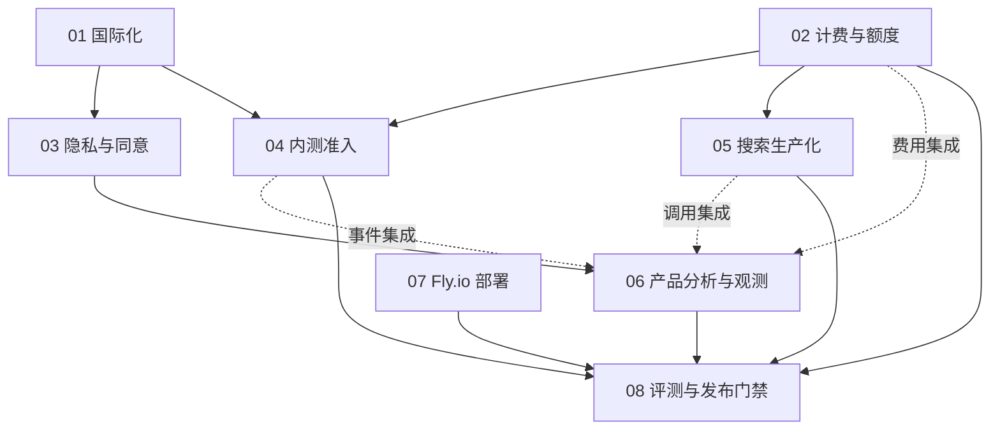

# ThreadChat Beta：实施依赖与开放验收

日期：2026-09-18。核查基线：main@5731a9d0fd293ab47b35152842517dc7ae0f956a。本批仅 OpenSpec 方案，未实现功能、购买服务或修改生产配置。

## 八个工作包

| 顺序 | Change | 分支 | Git 父分支 | 功能依赖 |
| --- | --- | --- | --- | --- |
| 01 | internationalization | spec/beta-01-internationalization | main | 无 |
| 02 | usage-billing-and-quota | spec/beta-02-billing-quota | main | 既有 Generation/Auth；展示接入 01 |
| 03 | cookie-consent-and-privacy | spec/beta-03-consent-privacy | spec/beta-01-internationalization | 01 |
| 04 | private-beta-access | spec/beta-04-access | spec/beta-02-billing-quota | 01、02；公开开放前 03 |
| 05 | add-web-search-provider-routing | spec/beta-05-search-production | spec/beta-02-billing-quota | 02；错误展示 01 |
| 06 | product-analytics-and-observability | spec/beta-06-analytics | spec/beta-03-consent-privacy | 03；01/02/04/05 事件集成 |
| 07 | flyio-production-deployment | spec/beta-07-flyio | main | 可并行设计；上线集成 02/04/05/06 |
| 08 | evaluation-and-release-gates | spec/beta-08-release-gates | spec/beta-06-analytics | 01–07 的真实验收证据 |

Git 只有一个直接父分支；表中的其他依赖是跨分支的契约/集成依赖，不用伪造合并提交把兄弟 PR 塞入差异。PR 描述记录对应前置 PR。子 PR 先审查；父 PR 合入 main 后再将子 PR 更新到 main 并核对差异。父 PR 使用 squash/rebase 合并时，子分支必须先去掉已合并的父提交再重定向，避免重复提交；没有用户授权不合并任何 PR。

## 不重建已有模块

复用 user_credits、usage_records、chargeUsageOnce、Generation 状态、lib/observability、反馈及 feedback_score_outbox、evals/agent 和 Resend。搜索更新已有 add-web-search-provider-routing，不创建第二套路由器。方案中的拟议模块名在实现时与现有目录对齐，公共类型只定义一次，见 contracts.md。

## 交付规则

每个 change 包含 proposal、design、specs、tasks 与 .openspec.yaml；design 包含模块/组件/类型/状态/异常/观测/迁移。Requirement 使用 SHALL/MUST，Scenario 使用 WHEN/THEN。所有实现任务保持未勾选；规格验证与业务验收是两回事。

功能分支不生成或修改 drizzle migration；仅在独立数据库 db:push。develop 统一生成迁移并在上一版本结构上验证，main 只接收已验证产物。本批不触发数据库操作。

## 上线前的采购与运营清单

- [ ] 模型：实际渠道允许目标商用用途，开放模型逐项有有效价格/缓存计量/usage 证据；缺价不得按免费处理。
- [ ] 搜索：一个付费主服务与一个按量备用，确认额度、并发、计费单位、数据保留、提额及告警；不依赖匿名免费容量。
- [ ] 邮件：验证域名、投递/退信/投诉、抑制与重发；邀请通知不自动等于营销订阅。
- [ ] 隐私：发布双语政策、条款、处理商/区域清单、分类保留期及经身份验证的导出/删除路径；完成适用地区审核。
- [ ] 基础设施：Fly/Neon/对象存储区域与预算、密钥权限、备份恢复、外部告警渠道、DNS/TLS。
- [ ] 运营：Owner-only 的个人 PAT/私有仓库/未隔离沙箱不向 Beta 用户开放；充值创建入口和后端禁用，历史已支付回调仍安全对账。

具体报价不作为此文档常量。采购人员记录核价时间、官方页面/合同、实际 account 限额；上游未知不能写成无限或免费。

## 放量门槛

准入与两账号越权、幂等赠额与扣费、跨实例预占、真实模型/搜索及备用、停止/刷新/恢复、隐私网络检查、双语、告警送达、部署与恢复均必须有证据。最终清单由 evaluation-and-release-gates 维护在 docs/beta/release-checklist.md。

建议邀请批次为 10 → 30 → 100 人，属于运营试行值而非容量保证。放量依据成功任务、核心分支体验、留存、费用、支持负担与基线质量，不仅是注册数量。
