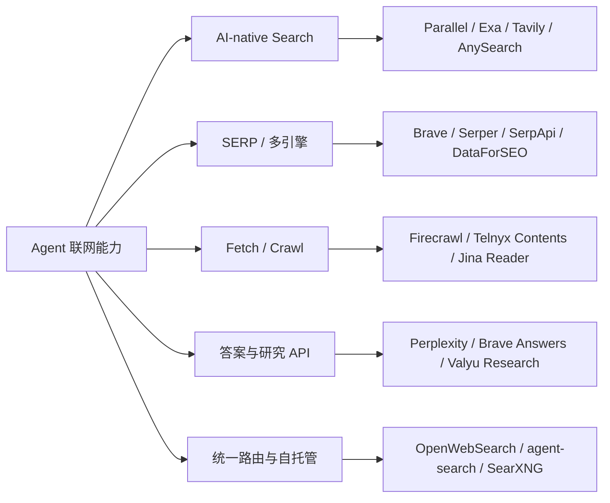
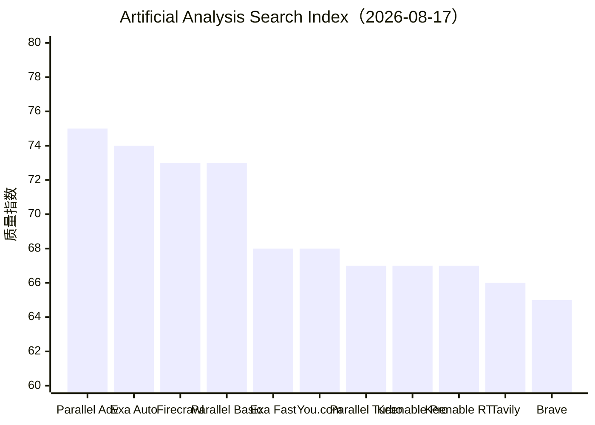
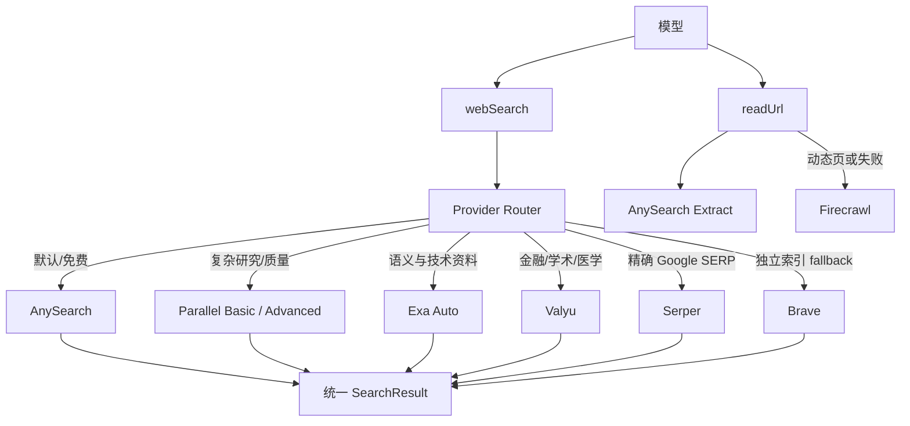

# Web Search / Fetch API 竞品调研报告

> 调研日期：2026-08-19  
> 适用项目：thread-chat  
> 报告版本：v1.0  
> 研究范围：公网 Web Search、SERP API、网页抓取、答案合成、搜索路由层与开源自托管方案

## 执行摘要

本轮调研的核心结论是：**不存在同时在质量、延迟、价格、免费额度和抓取能力上全面领先的单一服务商**。对于 thread-chat，最合理的方案不是把十几个 provider 作为十几个工具暴露给模型，而是继续保留 `webSearch` 与 `readUrl` 两个语义工具，在服务端增加统一 provider router。

推荐组合如下：

1. **AnySearch 继续作为默认搜索和抽取 provider**：免费层为 1,000 requests/day，学生计划为 2,000 requests/day，20 QPS/key；当前项目已经完成接入。
2. **Parallel Basic 或 Exa Auto 作为高质量 fallback**：在 Artificial Analysis 的统一 Agent 基准中，两者分别取得 73 和 74 分，明显高于 Brave 与 Tavily。
3. **Firecrawl 作为动态网页和复杂抓取 fallback**：不建议作为默认搜索，因为统一基准中的端到端耗时最高，但它的页面抓取能力更完整。
4. **Valyu 只在金融、学术、SEC、医学等垂直查询中启用**。
5. **Brave 或 Serper 作为低成本、精确 SERP 备用层**。
6. **不建议通过多个账号绕过同一厂商的额度或 QPS**。可以合法聚合不同服务商的额度，但应遵守各服务的账户聚合、fair-use 和限流条款。

如果目标是 **5,000 次/月**，AnySearch 单独的理论月额度已经约 30,000 次，无需多账号；如果目标是 **5,000 次/天**，免费额度不足，需要付费套餐或多 provider 的正规容量池。

## 1. 研究范围与口径

### 1.1 市场边界

本报告覆盖五类产品：



以下产品不应直接与通用公网搜索 API 混为一类：

- Cloudflare AI Search 更偏向自有数据和 RAG 检索。
- x402 是 HTTP 原生支付协议，不是搜索引擎。
- Bright Data、Apify 更偏 SERP、代理和网页数据基础设施。
- Perplexity Sonar、Brave Answers 更偏答案合成，计费单位与原始搜索请求不同。

### 1.2 证据等级

| 等级 | 定义 | 使用方式 |
|---|---|---|
| A：一手可核验 | 官网定价、官方 API 文档、官方 rate-limit 文档 | 可用于价格、额度、接口和限制结论 |
| B：独立横向基准 | 固定模型、任务与 harness，只替换 provider 的第三方测试 | 可用于相对质量、成本和延迟比较 |
| C：厂商自测 | 厂商自报准确率、延迟、成功率 | 仅作为产品信号，不与独立基准混算 |
| D：社区与发布信号 | X/Twitter、Product Hunt、新闻、YC 页面 | 仅用于判断活跃度与市场关注度 |
| E：未核实 | 名称歧义、没有稳定官网、没有公开文档 | 不进入生产选型 |

### 1.3 价格口径限制

不同服务的 `request`、`credit`、`retrieval`、`task run` 和 `page` 并不等价。例如：

- Tavily basic search 通常消耗 1 credit，但其他深度可能消耗更多。
- Firecrawl Search 可能按搜索和抓取结果共同扣 credit。
- Valyu 的价格以 retrieval 计，不等同于一次 query。
- Artificial Analysis 的 `Search $/1k tasks` 是完成 1,000 个 Agent 任务的搜索成本，不是 1,000 次 API 请求价格。

因此，报告不把所有数字强行换算成单一“每千次查询成本”。

## 2. 主流产品价格、额度与能力

价格与免费额度抓取日期为 2026-08-19。

| 产品 | 免费额度 | 公开基础价格 | QPS / 并发 | 主要优势 | 主要限制 |
|---|---:|---:|---:|---|---|
| **AnySearch** | 1,000 requests/day；学生计划 2,000/day | Professional 尚未公开；Enterprise 询价 | 20 QPS/key | 免费额度大；Search + Extract + MCP；接入简单 | 独立基准覆盖不足；付费价格未公开 |
| **Parallel** | 每月最多 5,000 requests；另有 credits 与注册奖励 | Turbo/Fast $1/千；Basic/Advanced $5/千；Extract $1/千 URL | Search/Extract 600/min；Tasks 2,000/min | Agent 搜索、研究任务、质量领先、完整 MCP | 模式较多；深度任务成本高 |
| **Exa** | 注册 $20 credits；Free Tier 每月 $10 credits | Search $7/千；Deep $12–15/千；Contents $1/千页；Answer $5/千 | 免费 Search 5 QPS；付费 10 QPS；Contents 100 QPS | 语义搜索、技术资料、相似内容、Agent 与 Monitor | 通用搜索单价高于 Parallel Turbo、Brave、Serper |
| **Tavily** | 1,000 credits/month | PAYG $0.008/credit，即 $8/千 basic credits | 本轮未核实 | Agent-ready 摘要、Search/Extract/Crawl、研究工作流 | 独立基准中质量、延迟和成本均未领先 |
| **Brave Search API** | 每月 $5 credits，约 1,000 次基础查询 | $5/千 requests | 约 2 queries/s | 独立索引、稳定、低成本、传统 Web Search | 复杂研究质量低于 Parallel、Exa、Firecrawl |
| **Firecrawl** | 1,000 credits/month | 按 credits；Search 通常 2 credits/10 results | 免费层约 2 并发 | Scrape、Search、Crawl、Interact；动态网页与 Markdown | 若只做 10-result Search，免费层约 500 次；统一基准中最慢 |
| **You.com Search API** | 本轮未核实 | 本轮未核实 | 本轮未核实 | 通用 Web Search 与结果聚合 | 定价和 MCP 信息不足 |
| **Keenable** | 未公开 | 未公开 | 未公开 | Realtime 模式在独立基准中延迟最低 | 官网价格和成熟度资料不足 |
| **Serper** | 2,500 queries 试用额度 | $1/千起；大规模约 $0.30/千 | 50–300 QPS | 实时 Google SERP；Scholar、Patents、Maps、Shopping | 主要依赖 Google；无官方 MCP |
| **SerpApi** | 250 searches/month；50 throughput/hour | Starter $25/月含 1,000 次；Developer $75/5,000 次 | 200–6,000 throughput/hour，视套餐 | 100+ 搜索引擎和垂直 SERP，产品成熟 | 低套餐单位成本和吞吐量不占优势 |
| **SearchAPI.io** | 100 requests 试用 | 10k 档约 $4/千；规模后约 $2/千 | 每小时最多套餐额度的 20% | Google AI Mode、Maps、Flights、Jobs、Shopping | 无独立性能基准；官网成功率宣传口径不一致 |
| **DataForSEO** | 免费试用额度未公开；最低充值 $50 | Standard Queue 约 $0.60/千 SERP；Live 约 $2/千 | 本轮未核实 | 大规模 SERP、SEO、JSON/HTML/截图、批处理 | 接口和计费模型较复杂；不专门为 Agent 设计 |
| **Valyu** | 注册 $10 credits；工作邮箱可到 $20 | Web Search $1.50/千 retrievals；Contents $1/千成功 URL | 企业可定制；公开值未核实 | 金融、SEC、arXiv、PubMed、临床试验、专利 | 厂商自测不能代替独立横评；retrieval 不等于 query |
| **Telnyx Web Search** | 未发现公开免费层 | Search、Contents、Research 均 $5/千 calls | 未公开 | 搜索、批量 URL 抓取、深度研究；适合语音 Agent | 产品刚于 2026-08-12 发布，长期稳定性待观察 |

### 2.1 价格与额度解读

#### 免费额度优先

1. AnySearch：1,000/day，理论约 30,000/month。
2. Parallel：最多 5,000 requests/month。
3. Serper：2,500 次试用额度，不能按长期月度额度计算。
4. Tavily：1,000 credits/month。
5. Brave：约 1,000 次基础查询/month。
6. Firecrawl：1,000 credits/month，不等于 1,000 次 Search。

#### 低价搜索优先

- DataForSEO 的队列模式账面最低，但更偏批量 SERP 数据，不适合对话中的低延迟 Agent。
- Serper 在 Google SERP 场景中价格和 QPS 很有竞争力。
- Parallel Turbo/Fast 的 $1/千 requests 兼顾 Agent 友好接口和低价格。
- Valyu 的 $1.50/千 retrievals 对垂直资料有吸引力，但计费单位需要单独监控。

#### 高质量研究优先

- Parallel Advanced、Exa Auto 和 Firecrawl 在 Artificial Analysis 的统一基准中位居前三。
- Firecrawl 的优势更多来自搜索后内容获取，但为此付出了更高延迟。
- 深度研究 API 往往不是“每千次搜索”的生意，单次任务成本可以从几美分上升到数美元。

## 3. 独立质量与速度基准

### 3.1 Artificial Analysis Search Index

Artificial Analysis 页面标注的最新数据日期是 **2026-08-17**。测试固定以下变量：

- Candidate model 与 grader：GPT-5.6 Luna，medium reasoning。
- 最大 25 个 Agent turns，turn 内工具调用不限。
- 每次搜索最多返回 10 个结果，保留 provider 原生 payload。
- 工具固定为 `web_search`、统一的 `web_fetch` 与 `finish`。
- 质量指数为 DeepSearchQA F1、BrowseComp Accuracy 和 AA-Omniscience Accuracy 的等权平均。

| 排名 | Provider 模式 | 综合质量指数 | 相对无搜索基线提升 | 单任务总时间 |
|---:|---|---:|---:|---:|
| 1 | Parallel Advanced | 75 | +42 | 37.5s |
| 2 | Exa Auto | 74 | +41 | 27.8s |
| 3 | Firecrawl Search | 73 | +40 | 56.9s |
| 4 | Parallel Basic | 73 | +40 | 22.2s |
| 5 | Exa Fast | 68 | +35 | 22.6s |
| 6 | You.com Search | 68 | +35 | 35.8s |
| 7 | Parallel Turbo | 67 | +34 | 20.7s |
| 8 | Keenable Pro | 67 | +34 | 24.8s |
| 9 | Keenable Realtime | 67 | +34 | 16.8s |
| 10 | Tavily Basic | 66 | +33 | 38.6s |
| 11 | Brave Search | 65 | +32 | 28.9s |
| — | Model Only | 33 | 基线 | 15.9s |



### 3.2 基准结论

- **最高质量**：Parallel Advanced。
- **质量与速度平衡较好**：Parallel Basic、Exa Auto。
- **最低端到端耗时**：Keenable Realtime，16.8 秒；官网 FAQ 同时给出平均单次搜索约 0.34 秒。
- **抓取增强但延迟最高**：Firecrawl，质量 73，但单任务总时间 56.9 秒。
- **低价高速模式**：Parallel Turbo，质量 67、单任务 20.7 秒。
- **Brave 的定位**：便宜、独立索引、传统搜索可靠，但复杂 Agent 任务质量相对较低。

### 3.3 基准限制

该基准适合比较“成功完成任务后的相对质量”，但不等于生产 SLA：

- Search provider 的 429、5xx 和 timeout 被视为 fatal error，会重试到成功后才发布结果。
- 因此，榜单不能直接衡量实际错误率、限流稳定性和最差延迟。
- 固定模型是 Luna；换成项目当前模型后，搜索次数、payload 消化能力和排序可能变化。
- `web_fetch` 使用统一抽取层，因此没有完整测试各厂商自带抓取功能的差异。

## 4. 厂商自测与宣传数据

以下数据只能作为 C 级证据：

| 产品 | 厂商公开说法 | 报告处理方式 |
|---|---|---|
| AnySearch | 300 题、同一 GLM-5.1；整体准确率 76.4%，端到端延迟 47.8s | 不与 Artificial Analysis 分数直接比较 |
| Parallel | Turbo p50 约 200ms；Search 约 200ms–3s | 作为接口延迟范围，不代表 Agent 任务耗时 |
| Exa | Search 可配置约 180ms–1s；Deep Search 约 4–40s | 作为产品配置参考，不当作第三方证明 |
| Serper | 约 1–2 秒返回 Google SERP | 厂商宣传；未找到独立统一基准 |
| SearchAPI.io | 示例 `request_time_taken` 约 1.25；宣传 99.9% success | 示例与宣传，不能代表所有引擎和地区 |
| DataForSEO | Live 模式平均最多约 6 秒 | 仅反映厂商口径 |
| Telnyx | 缓存内容低于 1 秒；新抓取每 URL 数秒；Research 数十秒至约 120 秒 | 产品刚发布，需项目实测 |
| Valyu | SimpleQA 94%、FreshQA 79% | 自有/营销 benchmark，不能代替独立横评 |

## 5. 新兴产品、路由层与开源方案

### 5.1 OpenWebSearch / Interfaze

OpenWebSearch 是 Interfaze（YC P26）推出的统一搜索 gateway，定位是使用一个 API 连接 Exa、Parallel、Brave、Perplexity、Tavily、Bing、Valyu、Apify SERP、Octen 等 provider，并按查询选择或 fallback。

优点：

- 已经解决 provider 接口统一、凭据管理和 fallback。
- 对需要快速覆盖大量 provider 的团队有价值。

风险：

- 公开价格、免费额度、QPS 和独立性能基准尚未核实。
- 增加一层供应商依赖、成本和故障点。
- thread-chat 当前适配层已经较薄，短期接入收益可能低于自建简单 router。

### 5.2 agent-search

`paperfoot/search-cli` 是真实的 Rust 单二进制项目，聚合 Brave、Serper、Exa、Linkup、Jina、Firecrawl、Tavily、SerpApi、Perplexity、Parallel、xAI 等 provider。

它适合作为：

- 本地 CLI 与 Agent 工具。
- provider 接口设计与 rank fusion 的实现参考。
- 开发阶段对多个 key 进行手工比较的工具。

它不提供统一的商业额度或 SLA，仍需分别申请 provider key。

### 5.3 Octen 与 Monid

- Octen 是真实的 AI search infrastructure，提供 Search、Broad Search、Extract、Embeddings、Model Gateway 与 Research Workflows。
- Monid 是单独的通用 API/tool 聚合层，自称连接大量工具并提供 OAuth、proxy 和 master API key。
- 本轮没有找到两者存在同公司、收购或品牌重命名关系的一手证据，不应写成“Octen via Monid”。

### 5.4 SearXNG

SearXNG 是成熟的开源元搜索引擎，软件本身免费，可以聚合大量上游搜索服务并提供 JSON API。

适合：

- 对隐私、自托管和引擎控制有强需求。
- 有代理池、运维、监控和限流能力的团队。

不适合：

- 希望零运维、稳定 SLA 的个人项目。
- 通过自托管绕过上游搜索引擎条款或访问限制。

### 5.5 SoSearch 与 x402

- SoSearch 是规模较小的 Rust 社区项目，通过多路请求模拟部分 SerpAPI/Tavily 能力。它没有统一商业 SLA，存在上游条款、风控和稳定性风险。
- x402 是 HTTP 原生支付协议，不是搜索引擎。某些搜索或抓取服务可以通过 x402 收费，但协议本身没有统一价格、免费额度或准确率。

## 6. Product Hunt 与 X/Twitter 信号

### 6.1 Product Hunt

已确认以下页面真实存在：

- AnySearch：定位为面向 Agent 的结构化搜索工具。
- SerpApi：定位为通过 API 提供 100+ 搜索引擎的结构化实时数据。

Product Hunt 可以证明产品已经公开发布并具有一定社区曝光，但不能证明：

- 准确率或召回率。
- QPS、SLA 与错误率。
- 免费额度可长期持续。
- 在统一 Agent 任务中的真实成本。

### 6.2 X/Twitter

本轮执行了 agent-reach 后端体检。Twitter 显示 `twitter-cli` 可用，但实际读取时缺少可用登录态，未获得足够的可引用推文正文。因此：

- 不把“X 上很多人在讨论”写成量化结论。
- 不用推文替代官网定价和独立 benchmark。
- Telnyx、OpenWebSearch 等新品的真实性主要由官方发布说明、文档和 YC 页面确认。

## 7. 未充分核实或名称歧义项目

| 名称 | 当前判断 | 建议 |
|---|---|---|
| TinyFish | 未核实到与本报告对应的公开 Search/Fetch API 定价与文档 | 暂不进入生产选型 |
| CatchAll | 名称歧义，无法确认是独立 AI Web Search 产品 | 需要提供官网 URL 后复核 |
| NeuroAPI | 名称歧义，未核实官方搜索产品 | 暂不进入生产选型 |
| CrawlForge | 未核实稳定官网、价格与 API 文档 | 暂不进入生产选型 |
| Keiro | 名称歧义，可能与其他产品混淆 | 需要官网 URL |
| fastCRW | 未核实为公开商业产品 | 可能是早期或内部项目名 |
| AnyCap | 未核实为独立 Search/Fetch API | 暂不进入生产选型 |
| Linkup | 可以确认存在 Web Search API 方向，但本轮未稳定核实最新价格与 QPS | 后续单独复核 |
| Bright Data SERP | 真实且成熟，但本轮未稳定核实最新价目 | 只在大规模 SERP/代理场景考虑 |
| Apify SERP | 真实生态产品，但 actor 定价和运行成本不宜与统一 API 简单比较 | 只在已有 Apify 工作流时考虑 |
| Perplexity Sonar / Agent API | 真实答案型产品，本轮未稳定核实最新价格 | 作为答案合成层单独评估 |
| Jina Search / Reader | 真实搜索与读取组件，本轮未稳定核实商业额度 | 可作为 readUrl 或低成本实验备选 |
| Google Programmable Search | 传统可编程搜索，不是 AI-native Search | 仅在 Google 自定义站点范围中考虑 |
| Kagi | 产品真实，本轮未稳定核实最新 API 价格与政策 | 暂不作为默认 provider |
| Cloudflare AI Search | 更偏自有数据检索，不是完整公网 Web Search 替代品 | 不纳入本次默认 provider 池 |

## 8. 竞争格局分析

### 8.1 战略分组

| 战略组 | 代表产品 | 竞争维度 | 主要买家 |
|---|---|---|---|
| AI-native 通用搜索 | Parallel、Exa、Tavily、AnySearch、You.com | 结果质量、Agent payload、研究能力 | Agent 与 AI 应用开发者 |
| 独立/传统 SERP | Brave、Serper、SerpApi、SearchAPI.io、DataForSEO | 覆盖面、稳定性、地区、价格、QPS | SEO、数据产品、搜索应用 |
| 抓取与网页数据 | Firecrawl、Telnyx Contents、Bright Data、Apify | JS 渲染、Markdown、并发、反爬处理 | RAG、研究 Agent、数据管道 |
| 垂直数据搜索 | Valyu | 权威数据源、领域覆盖、引用 | 金融、学术、医药 Agent |
| 路由与聚合 | OpenWebSearch、agent-search、Monid | 多 provider、fallback、统一鉴权 | 多供应商 Agent 平台 |
| 自托管开源 | SearXNG、SoSearch | 可控性、隐私、运维成本 | 技术团队、自托管用户 |

### 8.2 五力简析

| 力量 | 评级 | 依据 |
|---|---|---|
| 现有竞争强度 | 高 | 供应商多、价格透明、API 切换成本逐渐降低 |
| 新进入者威胁 | 中 | 接口层容易进入，但索引、抓取网络、质量评测和规模较难复制 |
| 买方议价能力 | 高 | 多数 API 可按量购买，且统一路由层进一步降低切换成本 |
| 供应方议价能力 | 中高 | Google/Bing 等上游、代理网络和浏览器基础设施仍是重要依赖 |
| 替代品威胁 | 高 | SERP、自建 SearXNG、浏览器 Agent、模型原生搜索均可替代部分能力 |

### 8.3 关键趋势

1. **从单次搜索向完整研究任务扩张**：Parallel Tasks、Exa Agent、Telnyx Research、Valyu DeepResearch 都在把计费单位提升为完整任务。
2. **路由层开始独立成为产品**：OpenWebSearch、agent-search 等解决 provider 数量快速增长带来的接口与凭据复杂度。
3. **搜索与抓取逐渐拆分**：高质量搜索 provider 不一定具有最佳动态网页抓取能力。
4. **垂直权威数据成为差异点**：Valyu 用金融、学术、医学与专利数据避开通用 Web Search 的同质化竞争。
5. **独立 benchmark 刚刚成熟**：Artificial Analysis 提供了更可比的数据，但生产错误率和不同模型适配仍需项目自测。

## 9. 对 thread-chat 的推荐架构

当前项目已经拥有稳定的语义工具层：

- `webSearch(query)`：返回标题、URL 与轻量摘要。
- `readUrl(url)`：返回清洗后的 Markdown 正文。

不建议将 provider 名称直接变成模型工具。模型不应承担额度、QPS、成本和错误恢复决策。



### 9.1 推荐的路由规则

| 场景 | 首选 | 备用 | 原因 |
|---|---|---|---|
| 普通实时查询 | AnySearch | Brave / Serper | 充分利用免费额度，控制成本 |
| 复杂多跳研究 | Parallel Basic | Exa Auto | 独立基准中质量与延迟平衡较好 |
| 极高质量任务 | Parallel Advanced | Exa Auto | 当前统一基准质量第一 |
| 低延迟搜索 | Parallel Turbo | Keenable Realtime | Turbo 价格低；Keenable 延迟最低但成熟度待验证 |
| 语义/相似内容 | Exa Auto | Parallel Basic | Exa 的核心差异化能力 |
| 金融、SEC、论文、医学 | Valyu | Exa | 垂直权威数据源 |
| 动态页面、复杂抓取 | Firecrawl | AnySearch Extract | Firecrawl 抓取能力更完整 |
| 精确 Google SERP | Serper | SerpApi | Serper 价格/QPS 更优；SerpApi 引擎覆盖更广 |

### 9.2 Router 必须具备的能力

- provider 级 token bucket 或滑动窗口限流。
- 日/月额度账本，区分 request、credit、page、retrieval 与 task run。
- 429、5xx、timeout 的指数退避、熔断和 fallback。
- 查询归一化、短期缓存、URL 去重和结果去重。
- 统一 `SearchResult` 数据结构，隐藏各家 payload 差异。
- 按领域、预算、延迟目标和请求模式选择 provider。
- 记录 p50/p95 延迟、错误率、空结果率、点击/引用率与真实单次成本。
- 对敏感查询保留 provider allowlist 与审计日志。

### 9.3 不建议第一阶段实现的能力

- 不要同时接入十几家 provider。
- 不要先做复杂 rank fusion；两家结果去重与简单 fallback 足够验证价值。
- 不要让模型自行选择具体厂商名称。
- 不要用多账号或多 key 绕过同一账户的聚合限额。
- 不要把 OpenWebSearch 与自建 router 同时引入，避免重复抽象。

## 10. 容量与成本场景

### 10.1 5,000 次/月

结论：免费额度已经足够。

- AnySearch 理论月额度约 30,000 次，但受 1,000/day 限制。
- Parallel 公开免费层最多约 5,000 requests/month。
- Tavily、Brave 可再提供约 1,000 量级的月度备用容量。
- Serper 的 2,500 次应视作试用额度，不作为长期月度容量。

建议只接 AnySearch，并增加一家 fallback；无需为了额度接入全部产品。

### 10.2 5,000 次/天

结论：不能依赖免费层长期实现。

合理方式是：

1. 购买一个低价主 provider 的付费额度。
2. 保留 AnySearch 免费流量作为一部分容量。
3. 使用第二家 provider 做故障与限流 fallback，而不是把所有查询平均轮询。
4. 用缓存和查询去重降低重复搜索。

### 10.3 深度研究任务

不要按“搜索次数”单独估算。一次研究任务可能产生多次搜索、多个页面抓取和大量模型 token。项目需要记录：

```text
任务总成本
= 搜索 API 成本
+ 页面抓取成本
+ 模型输入/推理/输出成本
+ 重试与失败请求成本
```

Artificial Analysis 显示，搜索 payload 质量还会影响模型继续搜索的次数和模型 token 成本。因此，最便宜的 API 请求不一定带来最低任务总成本。

## 11. 风险登记与缓解措施

| 风险 | 概率 | 影响 | 缓解措施 |
|---|---|---|---|
| 免费额度或价格调整 | 高 | 中 | provider 配置化；保留至少一家 fallback；定期复核价格 |
| 多账号绕限导致封禁 | 中 | 高 | 只聚合不同服务商的正规额度；遵守账户条款 |
| 429、5xx、timeout | 高 | 中高 | provider 级限流、熔断、重试预算和降级 |
| 搜索结果质量漂移 | 中 | 高 | 建立项目自己的固定查询集与周期性评测 |
| 动态网页抽取失败 | 高 | 中 | AnySearch Extract 失败后转 Firecrawl；保留失败原因 |
| 成本口径不统一 | 高 | 中 | 分别记录 request、credit、page、retrieval 与 task |
| 单一供应商故障 | 中 | 高 | 主备架构，不做无状态随机轮询 |
| 数据隐私和日志泄露 | 中 | 高 | 查询脱敏、provider allowlist、日志保留策略 |
| 开源自托管被上游封禁 | 中高 | 中 | 不把 SearXNG/SoSearch 作为默认生产 SLA 来源 |
| 厂商 benchmark 误导 | 高 | 中 | 独立基准、官网宣传和社区信号分级展示 |

## 12. 实施路线图

### 阶段 1：当前状态

- 保持 AnySearch `webSearch` 与 `readUrl` 主链路。
- 配置正式 API key 后记录实际额度和 429 响应。
- 建立当前 provider 的 p50/p95 延迟、错误率和空结果率基线。

### 阶段 2：加入一个搜索 fallback

优先选择：

- **Parallel Basic**：偏重复杂研究和独立基准表现。
- **Exa Auto**：偏重语义搜索、技术资料和 Vercel 原生集成便利性。

验收条件：

- 主 provider 429/5xx 时可以自动切换。
- 不改变模型侧 `webSearch` 工具 schema。
- 每次调用能记录选择原因、成本单位与最终 provider。

### 阶段 3：拆分抓取 fallback

- 保持 AnySearch Extract 为默认。
- 只在 JS 动态页、抽取为空或明确需要 crawl 时调用 Firecrawl。
- 避免一次 Search 自动抓取所有结果，控制上下文和 credits。

### 阶段 4：领域路由与自有评测

- 加入 Valyu 金融/学术路由。
- 建立 50–100 条符合 thread-chat 实际使用方式的固定评测集。
- 同时评估：答案正确率、引用正确率、搜索次数、页面抓取次数、任务总成本和 p95 延迟。

## 13. 最终选型建议

| 优先级 | 决策 | 建议 |
|---:|---|---|
| P0 | 保持当前默认层 | AnySearch |
| P1 | 增加高质量搜索 fallback | Parallel Basic 或 Exa Auto，先选一家 |
| P1 | 增加抓取 fallback | Firecrawl，仅在需要时调用 |
| P2 | 增加精确 SERP | Serper 或 Brave，按实际查询类型决定 |
| P2 | 增加垂直数据 | Valyu，仅在领域需求明确后 |
| P3 | 参考而不接入 | OpenWebSearch、agent-search |
| 不建议 | 额度扩容方式 | 多账号绕过同一服务商限制 |
| 不建议 | 第一阶段范围 | 同时接入十几家或直接做复杂 rank fusion |

对于当前项目，最稳妥的近期决策是：**AnySearch + Parallel Basic/Exa Auto + Firecrawl fallback**。这一组合覆盖免费流量、复杂研究质量和动态页面抓取，同时保持工具层简单。

Vercel Marketplace 当前 `Searching` 类的前列结果包含 Exa 与 Parallel，`Web Automation` 类包含 Firecrawl。因此，如果后续希望使用 Vercel 原生集成、统一环境变量和计费，这三家也是最顺手的扩展路径。

## 附录 A：主要来源

### 通用与 AI-native Search

- [AnySearch Pricing](https://www.anysearch.com/pricing)
- [AnySearch Documentation](https://www.anysearch.com/docs)
- [Parallel Pricing](https://parallel.ai/pricing)
- [Parallel Pricing Documentation](https://docs.parallel.ai/getting-started/pricing)
- [Parallel Rate Limits](https://docs.parallel.ai/getting-started/rate-limits)
- [Exa Pricing](https://exa.ai/pricing)
- [Exa Pricing Documentation](https://exa.ai/docs/reference/pricing)
- [Exa Rate Limits](https://exa.ai/docs/reference/rate-limits)
- [Tavily Pricing](https://www.tavily.com/pricing)
- [Brave Search API](https://brave.com/search/api/)
- [Firecrawl Pricing](https://www.firecrawl.dev/pricing)
- [Valyu Pricing](https://docs.valyu.ai/pricing)
- [Valyu MCP](https://docs.valyu.ai/mcp)
- [Telnyx Web Search Release Notes](https://telnyx.com/release-notes/web-search-api)
- [Telnyx Web Search Documentation](https://developers.telnyx.com/docs/web-search)

### SERP API

- [Serper](https://serper.dev/)
- [SerpApi Pricing](https://serpapi.com/pricing)
- [SearchAPI.io Pricing](https://www.searchapi.io/pricing)
- [DataForSEO SERP API](https://dataforseo.com/apis/serp-api)
- [DataForSEO Pricing](https://dataforseo.com/pricing/)

### 独立基准

- [Artificial Analysis Search API Benchmark](https://artificialanalysis.ai/agents/search-api)
- [Artificial Analysis Search API Methodology](https://artificialanalysis.ai/methodology/search-api)

### 路由层与开源方案

- [OpenWebSearch](https://openwebsearch.ai/)
- [Interfaze - Y Combinator](https://www.ycombinator.com/companies/interfaze)
- [agent-search GitHub](https://github.com/paperfoot/search-cli)
- [Octen Documentation](https://docs.octen.ai/overview/introduction)
- [Monid](https://monid.ai/)
- [SearXNG Documentation](https://docs.searxng.org/)
- [SearXNG GitHub](https://github.com/searxng/searxng)
- [SoSearch GitHub](https://github.com/NetLops/SoSearch)
- [x402](https://x402.org/)

### 市场发布信号

- [AnySearch on Product Hunt](https://www.producthunt.com/products/anysearch)
- [SerpApi on Product Hunt](https://www.producthunt.com/products/serpapi)

## 附录 B：研究限制

- 调研时间点为 2026-08-19，价格、免费额度和限流可能随时变化。
- X/Twitter 实际读取受登录态限制，本报告没有以不可复核的推文摘要支撑性能结论。
- Product Hunt 只作为发布与关注度信号。
- Bright Data、Apify、Perplexity、Jina、Google PSE、Kagi、Cloudflare 等项目的最新价格未在本轮稳定核实，因此没有填入未经验证的数字。
- Artificial Analysis 固定使用 GPT-5.6 Luna medium；thread-chat 使用自己的模型、提示和工具循环，最终生产排序需要项目自有评测确认。
- 本报告没有估算市场规模、厂商收入或市场份额，因为未取得可靠、可交叉验证的数据。

