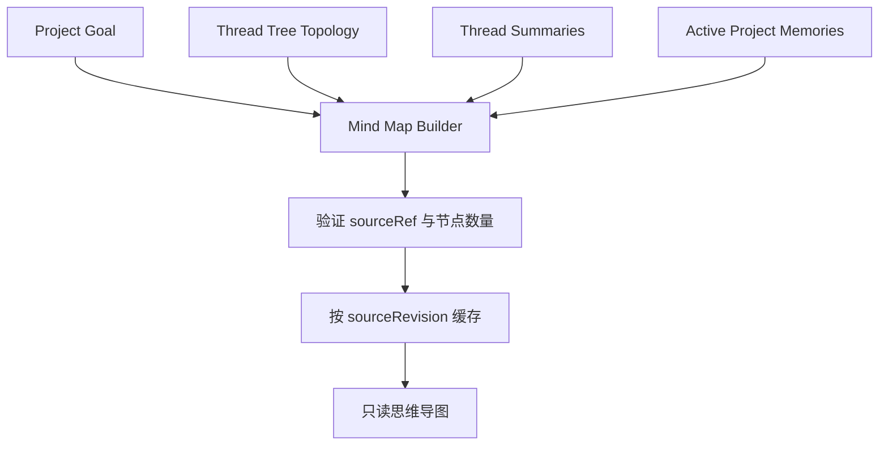
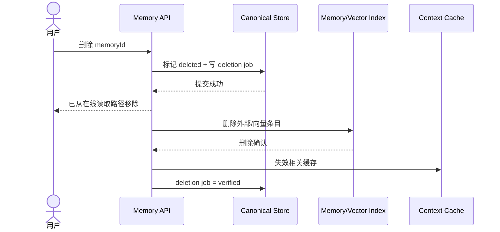

# 三种方案共用的产品模型与安全契约

## 1. 先定义边界，再选择存储

Memory 服务、Postgres 和知识图谱回答的是“如何保存与检索”；产品还必须先回答：

- 什么对象具有权威性；
- 谁可以修改；
- 哪些修改必须确认；
- 冲突时谁覆盖谁；
- 删除后哪些派生数据必须一起消失；
- 模型看到的内容如何与普通指令隔离。

以下契约应当独立于 A/B/C。切换后端时，前端控制面、Project 语义和安全规则不应一起重写。

## 2. 领域对象

```ts
type ID = string
type ISODateTime = string

interface Project {
  id: ID
  ownerUserId: ID
  title: string
  status: "active" | "archived"
  createdAt: ISODateTime
  updatedAt: ISODateTime
}

interface ProjectTreeBinding {
  projectId: ID
  treeId: ID
  isPrimary: boolean
  createdAt: ISODateTime
}

interface ProjectGoal {
  id: ID
  projectId: ID
  objective: string
  successCriteria: string[]
  constraints: string[]
  version: number
  updatedBy: "user" | "system"
  updatedAt: ISODateTime
}
```

当前实现可以在创建 tree 时一并创建 Project 和绑定记录。不要继续让 `tree_id` 同时承担 Project 身份，否则未来一 Project 多树时，目标和记忆都需要迁移主键。

## 3. 记忆作用域与类型

```ts
type MemoryScope =
  | { type: "user"; userId: ID }
  | { type: "project"; userId: ID; projectId: ID }

type MemoryKind =
  | "preference"
  | "instruction"
  | "fact"
  | "decision"
  | "constraint"
  | "glossary"
  | "open_question"

type MemoryAuthority = "explicit_user" | "confirmed_user" | "inferred"
type MemoryStatus = "active" | "superseded" | "deleted"
type Sensitivity = "normal" | "sensitive" | "prohibited"

interface MemorySource {
  treeId: ID
  threadId: ID
  messageId: ID
  quote?: string
}

interface MemoryItem {
  id: ID
  scope: MemoryScope
  kind: MemoryKind
  key: string
  value: unknown
  searchableText: string
  authority: MemoryAuthority
  sensitivity: Sensitivity
  status: MemoryStatus
  confidence?: number
  source: MemorySource
  supersedesId?: ID
  validFrom?: ISODateTime
  validTo?: ISODateTime
  version: number
  createdAt: ISODateTime
  updatedAt: ISODateTime
}
```

`key` 提供确定性覆盖语义。例如：

```text
user / instruction / output_language
project / decision / memory_architecture
project / glossary / thread
```

同一 scope、kind、key 可以有历史版本，但只能有一个 active 当前值。

## 4. 候选、确认和拒绝

模型不能直接创建 `MemoryItem`。它只能输出候选：

```ts
type CandidateDecision =
  | "auto_accept"
  | "needs_confirmation"
  | "reject"

interface MemoryCandidate {
  id: ID
  proposed: Omit<
    MemoryItem,
    "id" | "status" | "version" | "createdAt" | "updatedAt"
  >
  extractedFrom: MemorySource[]
  extractorVersion: string
  rationaleCode:
    | "explicit_remember_request"
    | "stable_preference"
    | "project_decision"
    | "project_constraint"
    | "possible_sensitive_data"
    | "assistant_only_claim"
    | "ephemeral_statement"
  decision: CandidateDecision
  status: "pending" | "accepted" | "rejected" | "expired"
  createdAt: ISODateTime
}
```

推荐决策表：

| 内容 | 默认结果 |
| --- | --- |
| 用户明确说“记住……”且不敏感 | `auto_accept` |
| 普通 Project 决策，有用户原话来源 | `auto_accept` |
| 自动推断的稳定偏好 | `needs_confirmation` 或低权威生效 |
| 用户全局 instruction 的新增/修改 | `needs_confirmation` |
| 健康、财务、身份凭证、精确位置等敏感信息 | `needs_confirmation` 或 `reject` |
| 只有 assistant 说过、用户未确认 | `reject` |
| 寒暄、一次性请求、临时上下文 | `reject` |

“低权威生效”不能覆盖用户明确设置；它只能在没有更高优先级值时作为建议。

## 5. Thread 总结

当前领域模型中的稳定节点是 `Thread`，不是 UI 列，也不是单条消息：

```ts
interface ThreadSummary {
  id: ID
  projectId: ID
  treeId: ID
  threadId: ID
  title: string
  summary: string
  keyPoints: string[]
  decisions: string[]
  openQuestions: string[]
  sourceMessageIds: ID[]
  inputRevision: string
  generation: number
  state: "draft" | "locked" | "stale"
  editedBy: "ai" | "user"
  createdAt: ISODateTime
  updatedAt: ISODateTime
}
```

规则：

1. Thread 消息稳定后异步生成；
2. `inputRevision` 是参与总结的消息 ID、内容版本和生成器版本的 hash；
3. 新消息到达后，AI 草稿变成 `stale` 并可自动重算；
4. 用户编辑后设置 `locked`，系统不得静默覆盖；
5. locked 总结有新消息时只提示“有更新可合并”，由用户决定；
6. 总结不是事实本体，不自动写入全局记忆；
7. 从总结发现的决策只能生成 `MemoryCandidate`，继续走确认策略。

## 6. 思维导图

思维导图是只读派生视图：

```ts
interface MindMapNode {
  id: string
  kind: "goal" | "thread" | "decision" | "question"
  label: string
  sourceRef: {
    projectId: ID
    treeId?: ID
    threadId?: ID
    memoryId?: ID
  }
}

interface MindMapEdge {
  from: string
  to: string
  kind: "contains" | "branches_to" | "supports" | "blocks" | "answers"
}

interface MindMapView {
  projectId: ID
  sourceRevision: string
  nodes: MindMapNode[]
  edges: MindMapEdge[]
  generatedAt: ISODateTime
}
```

输入只包括：

- Project 目标、成功标准和约束；
- 当前 tree 拓扑；
- Thread 标题与总结；
- 已生效的 Project 决策、约束和 open question。

不直接输入所有原始消息，也不读取用户全局偏好作为导图内容。全局偏好只影响导图的语言和展示格式。



思维导图缓存删除或过期都不会损失信息；任何反向修改都必须通过目标编辑或记忆确认 UI 完成。

## 7. 九个产品安全问题如何解决

### 7.1 什么内容允许被记住

使用 allowlist，而不是让模型自由发明类别。首批允许：

- 用户全局：语言、输出格式、稳定的交互偏好；
- Project：术语、决策、约束、已确认事实、开放问题；
- 禁止默认收集：密码、API key、支付信息、精确证件、无必要的健康和身份数据。

抽取器输出未知 `kind/key` 时直接拒绝，不自动扩展 schema。

### 7.2 assistant 幻觉能否写入

不能。`source` 必须能追溯到用户消息，或用户对 assistant 产物的明确确认。assistant 生成的计划、总结和 Artifact 都是派生内容，只能产生候选。

### 7.3 敏感信息是否需要确认

敏感分类先由确定性检测和模型分类双重判断。默认做三挡：

- normal：按写入策略处理；
- sensitive：明确说明内容和用途后确认；
- prohibited：不创建候选，日志也不得保留明文。

### 7.4 用户 ID 如何绑定

`userId` 只能从服务端 session 获取，不能接受模型、客户端 body 或 Memory 服务返回值指定。每条 Project 查询必须同时验证 `owner_user_id`。

```text
authenticated session
  -> resolve ownerUserId
  -> authorize projectId
  -> derive provider namespace
```

### 7.5 什么场景读取记忆

不做“每轮全量读取”。Context Compiler 先分类：

- 全局 instruction：每轮读取少量 active 值；
- Project goal/constraint：Project 对话每轮读取；
- 精确 key：按实体和 key 查；
- 模糊历史：只有当前问题需要回忆时才语义检索；
- Thread summary：只加载当前 lineage 和明确引用的分支。

### 7.6 如何安全注入 system prompt

记忆被当作带来源的数据，不是更高权限指令：

```xml
<memory_context trust="application-data">
  <rule>记忆可能过期；与用户当前消息冲突时，以当前消息为准。</rule>
  <project_goal source="project:...">...</project_goal>
  <facts>...</facts>
  <thread_summaries>...</thread_summaries>
</memory_context>
```

实现要求：

- 服务端构造，不接受客户端 system role；
- 严格 token/字符预算；
- 对来源、作用域和状态二次过滤；
- 不执行记忆文本中包含的工具调用或“忽略系统规则”等指令；
- 记录本轮实际注入的 memory IDs，支持解释和审计。

### 7.7 用户如何查看、编辑和删除

控制面至少包括：

- 全局设置页；
- Project 的 Goal 与 Memory 面板；
- Thread 总结的编辑、锁定、重新生成；
- 每条记忆的来源跳转、状态、最后更新时间；
- 删除单条、清空 Project、关闭自动记忆；
- 当前回答“使用了哪些记忆”的解释入口。

编辑必须使用 `version` 做乐观并发控制，不能整对象无条件覆盖。

### 7.8 删除后是否真的停止召回

删除是跨存储工作流：



第一笔事务完成后，所有在线查询必须过滤 deleted，因此即使外部索引删除暂时失败，也不能再注入。后台任务持续重试并核验供应商删除结果。

### 7.9 错误记忆如何追溯

保存：

- 来源 message IDs 与用户原话片段；
- extractor/model/prompt 版本；
- 候选决策原因；
- 每次接受、编辑、覆盖和删除的 actor；
- 每次回答实际使用的 memory IDs；
- 外部 provider ID 映射和删除状态。

审计日志不应该保存 prohibited 敏感明文。

## 8. 共用接口

```ts
interface MemoryEngine {
  propose(input: {
    scope: MemoryScope
    messages: Array<{ id: ID; role: "user" | "assistant"; text: string }>
  }): Promise<MemoryCandidate[]>

  index(items: MemoryItem[]): Promise<void>

  search(input: {
    scope: MemoryScope
    query: string
    kinds?: MemoryKind[]
    limit: number
  }): Promise<Array<{ memoryId: ID; score: number }>>

  remove(memoryIds: ID[]): Promise<void>
}

interface ContextCompiler {
  compile(input: {
    userId: ID
    projectId: ID
    treeId: ID
    threadId: ID
    userMessage: string
    budgetTokens: number
  }): Promise<CompiledMemoryContext>
}

interface CompiledMemoryContext {
  globalSettings: MemoryItem[]
  projectGoal: ProjectGoal
  projectMemories: MemoryItem[]
  threadSummaries: ThreadSummary[]
  usedMemoryIds: ID[]
  renderedText: string
}
```

方案差异主要体现在 `MemoryEngine` 背后和 `MemoryItem` 的真相来源，不应泄漏到聊天 UI。
