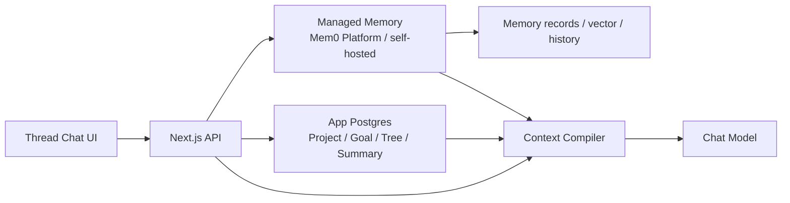
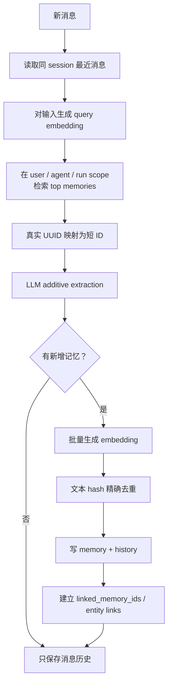
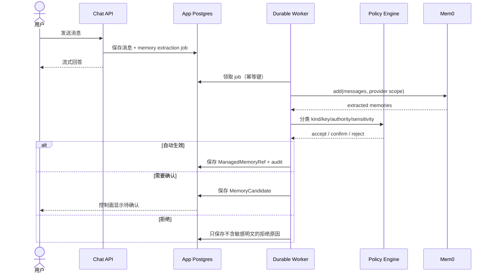
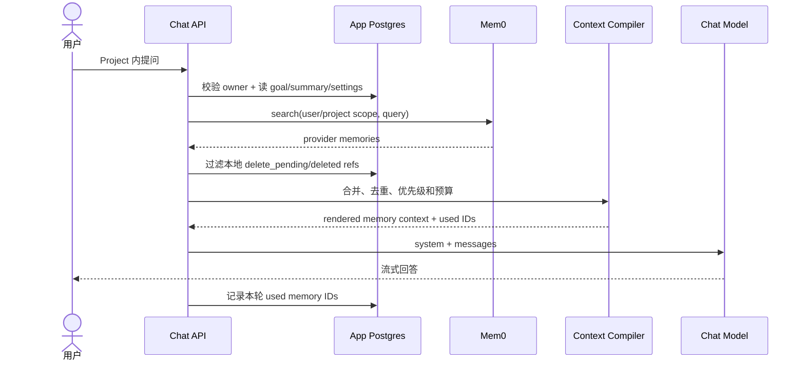
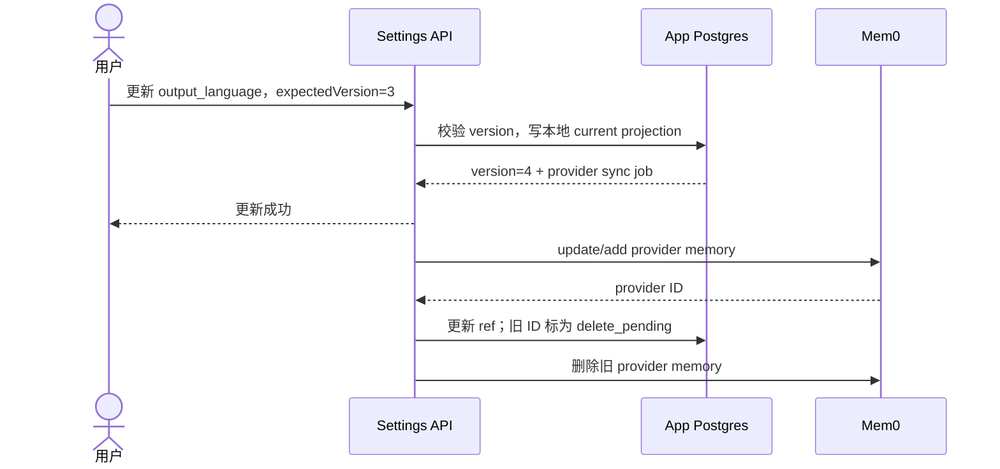
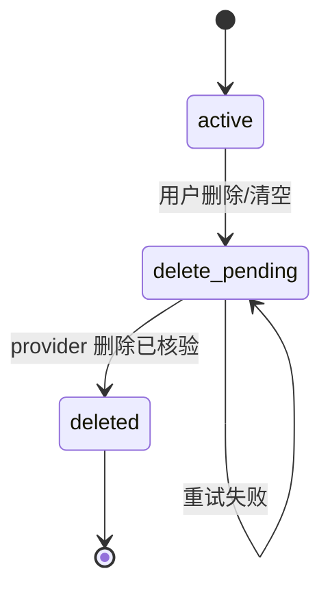
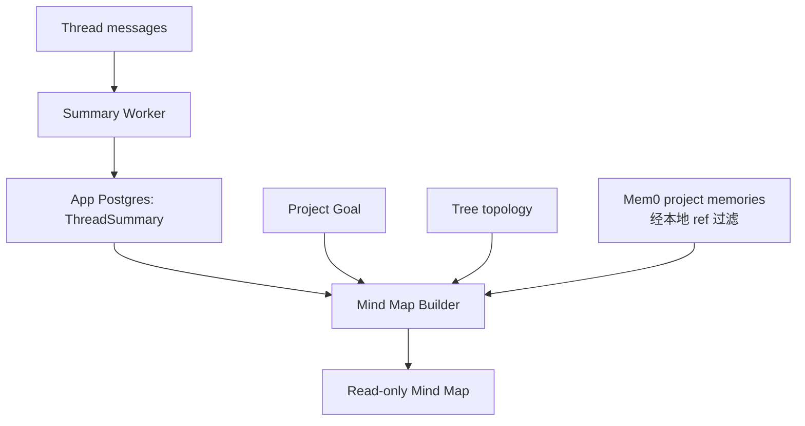

# 方案 A：以成熟 Memory 服务为主要记忆后端

## 1. 方案定义

方案 A 选择 Mem0 一类成熟 Memory 服务/库作为长期记忆的主要存储和检索系统。应用自己的 Postgres 仍然保存 Project、目标、tree 绑定和 Thread 总结，因为这些对象不是通用 Memory API 可以替代的。



这里的“服务为主”指：

- 用户全局偏好和 Project 事实/决策以 provider memory ID 为主要记录；
- 应用只保存 provider 映射、审计和必要的本地投影；
- 检索排序、相似度、记忆压缩和供应商内部更新语义由 provider 决定。

## 2. Mem0 的位置与当前实现语义

Mem0 提供 `user_id`、`agent_id`、`run_id` 作用域，以及 add/search/update/delete 一类 API。根据本项目阶段 2 使用的源码快照：

[`mem0ai/mem0@d6d89c987bddf580870db14c69db974edfc5263c`](https://github.com/mem0ai/mem0/tree/d6d89c987bddf580870db14c69db974edfc5263c)

OSS 主路径已经从旧的 ADD/UPDATE/DELETE/NONE 管线转为 V3 ADD-only + memory linking。完整源码笔记见[Mem0 深入](../02-deep-dives/02-mem0.md)。

### Mem0 V3 写入图



它适合作为高召回的语义记忆层，但 ADD-only 意味着“杭州 → 新加坡”可能同时存在。若产品必须稳定返回当前值，应用仍需：

- 在 metadata 中保存 key、authority、valid time；
- 或维护本地当前值投影；
- 或在读取时增加确定性 reducer。

这也是方案 A 最重要的边界：即使采用成熟服务，Project 产品语义仍然不能全部外包。

## 3. 作用域映射

推荐把 provider namespace 视为服务端派生值：

```ts
interface ProviderScope {
  userId: string
  agentId: string
  runId?: string
}

function toProviderScope(
  scope:
    | { type: "user"; userId: string }
    | { type: "project"; userId: string; projectId: string }
): ProviderScope {
  return scope.type === "user"
    ? {
        userId: scope.userId,
        agentId: "global-preferences",
      }
    : {
        userId: scope.userId,
        agentId: `project:${scope.projectId}`,
      }
}
```

不能让客户端直接传 `agentId`。服务端先验证 Project owner，再生成 provider scope。

Thread ID 不建议直接作为一级 provider namespace。Thread 总结本身已经是派生知识；如果每个 Thread 都建独立记忆空间，跨分支检索会变得困难。可以把 `treeId/threadId/messageId` 放进 metadata，供过滤、来源跳转和删除。

## 4. 本地数据模型

即使 provider 是主要记忆后端，本地仍需要以下表：

```ts
interface ManagedMemoryRef {
  id: string
  ownerUserId: string
  projectId?: string
  provider: "mem0"
  providerMemoryId: string
  kind:
    | "preference"
    | "instruction"
    | "fact"
    | "decision"
    | "constraint"
    | "glossary"
    | "open_question"
  key: string
  authority: "explicit_user" | "confirmed_user" | "inferred"
  sensitivity: "normal" | "sensitive"
  sourceTreeId: string
  sourceThreadId: string
  sourceMessageId: string
  providerState: "active" | "delete_pending" | "deleted" | "error"
  lastSyncedAt: string
  createdAt: string
  updatedAt: string
}
```

另外还要有：

- `projects`
- `project_tree_bindings`
- `project_goals`
- `thread_summaries`
- `memory_candidates`
- `memory_audit_events`
- `memory_provider_jobs`

本地 ref 不是完整真相副本，但必须足够完成：

- 身份授权；
- 来源展示；
- provider 删除失败时阻止在线召回；
- 查询某 Project 有哪些 provider IDs；
- 迁移供应商。

## 5. Provider Adapter

应用不能在 route 中直接散落 Mem0 SDK 调用：

```ts
interface ManagedMemoryProvider {
  add(input: {
    scope: ProviderScope
    messages: Array<{
      id: string
      role: "user" | "assistant"
      content: string
    }>
    metadata: Record<string, string>
    infer: boolean
  }): Promise<Array<{ providerMemoryId: string; text: string }>>

  search(input: {
    scope: ProviderScope
    query: string
    limit: number
    filters?: Record<string, string>
  }): Promise<
    Array<{
      providerMemoryId: string
      text: string
      score: number
      metadata: Record<string, unknown>
    }>
  >

  update(input: {
    providerMemoryId: string
    text: string
    metadata: Record<string, string>
  }): Promise<void>

  remove(providerMemoryId: string): Promise<void>

  removeScope(scope: ProviderScope): Promise<void>
}
```

生产实现还需要：

- timeout 和 retry；
- 限流与熔断；
- provider request ID 日志；
- SDK/API 版本固定；
- 请求和响应 schema 验证；
- 内容长度限制；
- 禁止把 API key 或 prohibited 内容发给 provider。

## 6. 写入流程

成熟产品不应该在聊天响应前同步等待 Memory 服务。



这里存在一个现实问题：Mem0 可能已经写入内容，应用 Policy Engine 才决定拒绝。为避免 prohibited 内容短暂进入外部服务，有两种实现：

1. **先本地预分类，再调用 Mem0 infer**：推荐；敏感/禁止内容在出站前拦截；
2. 调用自有抽取器生成候选，确认后用 `infer=false` 写 Mem0：控制更强，但方案已经向 B 靠近。

方案 A 若要保持安全，至少必须有出站前的 deterministic + model risk classifier。

## 7. 读取流程



### Provider 故障降级

如果 Mem0 search 超时：

- 聊天继续成功；
- 仍注入本地全局设置、Project 目标和 Thread 总结；
- 不使用过期的任意 provider cache，除非 cache 中保存了 scope 和删除 epoch；
- 记录 degraded 状态，但不向用户伪装“已使用完整记忆”。

## 8. 冲突处理

方案 A 有三个可选层级：

### A1. 完全相信 provider

优点是简单，缺点是无法保证当前值。只适合开放式回忆，不适合 Project instruction 和关键决策。

### A2. Provider memory + metadata key

应用为每条返回结果补充 `key/valid_from/status`，查询后按 key 选择最新有效值。需要本地 ref 或 provider 支持强 metadata filtering。

### A3. Provider 保存全文，本地保存 current projection

所有语义历史在 Mem0；本地表保存每个 scope/kind/key 的当前 provider ID。这是方案 A 中最成熟的实现，但已经引入小型关系型真相层。

建议至少采用 A3，否则无法可靠实现全局输出语言和 Project 覆盖规则。

## 9. 用户编辑

用户编辑“输出语言 = 中文”时，不应该只更新一段自然语言：



用户体验不能被 provider 同步阻塞。本地 projection 已更新后，Context Compiler 应立即使用新值，同时后台完成 provider 对齐。

## 10. 删除语义



规则：

1. 本地 ref 进入 `delete_pending` 后立即从读取路径排除；
2. provider 删除使用持久 job 重试；
3. 清空 Project 时按本地 ref 枚举并删除，不能只依赖一次不透明的 provider `delete_all`；
4. provider 返回成功后再次 search 验证，或使用官方删除状态接口；
5. 相关 Context cache 和思维导图 cache 一并失效；
6. 原始聊天消息是否删除是独立产品操作，不能暗中级联。

## 11. Thread 总结和思维导图

这两部分不交给 Mem0：



原因：

- 总结的锁定、stale 和用户编辑状态是本产品语义；
- 思维导图必须保留 `threadId/sourceRef`；
- provider 的相似检索不能替代真实 tree 拓扑。

## 12. 建议模块边界

```text
lib/memory/
  contracts.ts
  policy.ts
  context-compiler.ts
  provider.ts
  providers/mem0.ts
  provider-scope.ts
  audit.ts

lib/projects/
  repository.ts
  goal.ts
  tree-bindings.ts
  thread-summary.ts
  mind-map.ts

app/api/
  projects/[projectId]/goal/route.ts
  projects/[projectId]/memories/route.ts
  projects/[projectId]/mind-map/route.ts
  threads/[threadId]/summary/route.ts
  user/memory-settings/route.ts
```

数据库写入、provider 调用和 UI 类型不要共享一个巨大 `memory.ts` 文件。

## 13. 分阶段落地

### A-1：Project 身份与权威配置

- 新增 `projects` 和 `project_tree_bindings`；
- 新增 `project_goals`；
- 用户全局 instruction 和 Project override 先保存在本地；
- Context Compiler 先只处理确定性设置和目标。

### A-2：接入 provider

- 实现 `ManagedMemoryProvider`；
- 服务端作用域映射；
- durable extraction/sync jobs；
- 本地 provider refs 与审计；
- 超时降级。

### A-3：控制面与删除核验

- 全局设置和 Project Memory 面板；
- 候选确认；
- 来源跳转；
- 删除状态和清空；
- provider deletion reconciliation。

### A-4：Thread 总结和思维导图

- Thread summary revision/lock；
- 只读 mind map；
- cache key 使用 goal、tree、summary、memory revisions。

### A-5：供应商退出演练

- 导出所有 provider memories；
- 用本地 ref 校验数量和 scope；
- 导入替代 provider；
- 随机抽样验证删除项没有复活；
- 在 staging 完成一次真实切换。

没有退出演练，“provider 可替换”只是文档声明。

## 14. 适用与不适用

选择 A 的前提：

- 供应商在本项目 fixture 上通过准确性和删除测试；
- 可以接受数据处理和成本模型；
- provider SLA 满足要求；
- 团队愿意让语义检索和记忆演进部分依赖供应商；
- 已完成出口和删除核验。

不应选择 A 的信号：

- 大量记忆必须作为确定性的业务状态；
- provider ADD-only/更新语义造成当前值错误；
- 必须对每次写入提供完整本地证据链；
- 敏感数据不能发送到外部服务；
- provider 故障会让产品核心工作流不可用。

## 15. 结论

方案 A 并不是“接一个 SDK 就完成记忆”。成熟版本仍需本地 Project 模型、Policy Engine、provider ref、审计、删除 job、Context Compiler、Thread 总结和思维导图。

它真正节省的是通用的抽取、Embedding、索引和语义检索基础设施。若这些能力在统一评测中稳定可靠，而且供应商边界可接受，A 是合理的产品选择；否则它会变成一套难以调试的第二真相来源。
