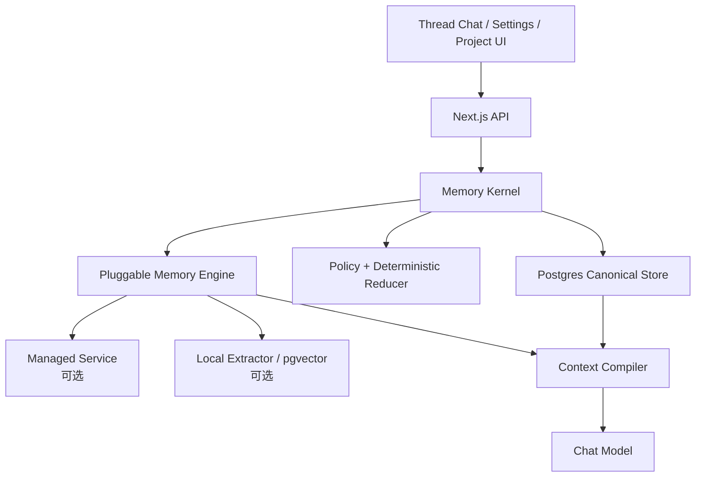
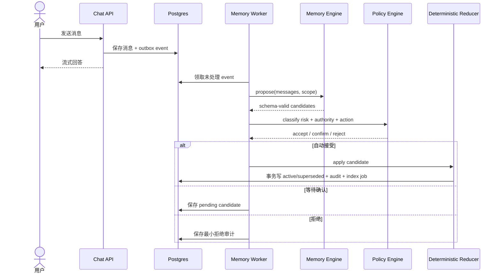
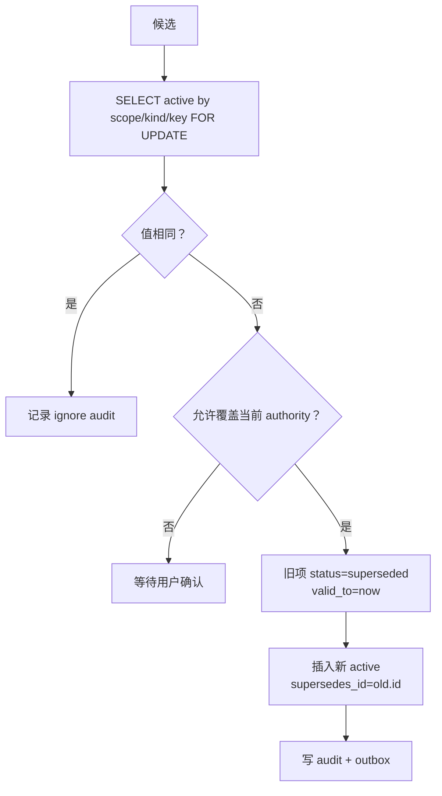
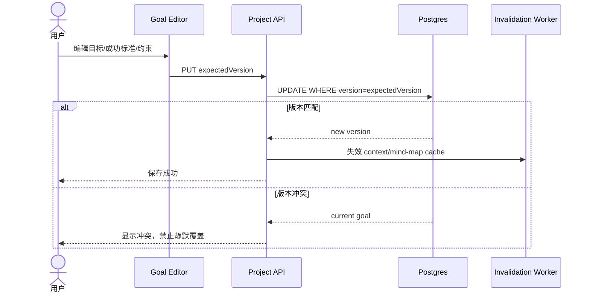
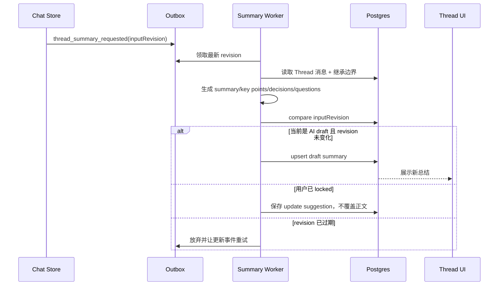
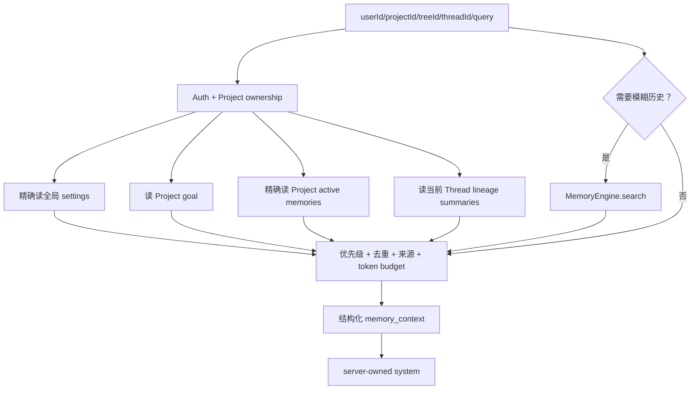
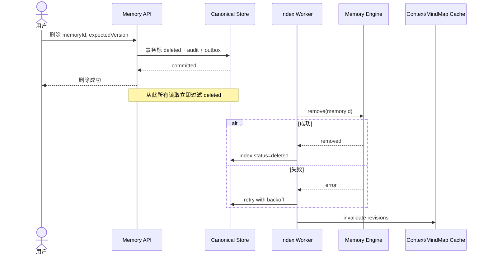
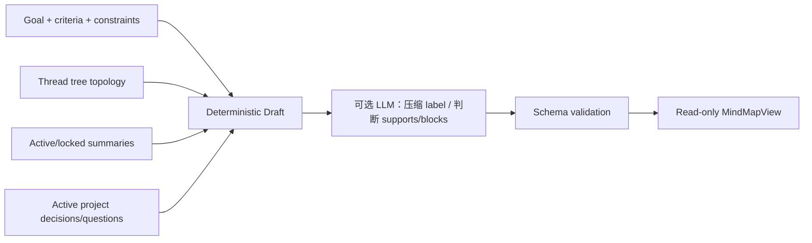

# 方案 B：关系型记忆内核 + 可插拔 Memory 引擎

## 1. 方案定义

方案 B 把产品必须准确理解的内容保存在本地 Postgres，把通用的候选抽取、Embedding、语义召回和聚类放在可替换的 `MemoryEngine` 后面。



权威状态包括：

- 用户全局设置；
- Project 目标；
- 已确认的 Project 事实、决策、约束和术语；
- 事实的当前版本、来源、确认和删除状态；
- Thread 总结及其锁定状态。

Memory Engine 的结果只能是候选或索引命中，不能直接覆盖权威状态。

## 2. 为什么称为“内核”

Memory Kernel 是一组稳定的领域规则，而不是某个 LLM prompt：

```ts
interface MemoryKernel {
  propose(input: ExtractionInput): Promise<MemoryCandidate[]>
  decide(candidate: MemoryCandidate): PolicyDecision
  apply(command: MemoryCommand): Promise<MemoryItem>
  delete(command: DeleteMemoryCommand): Promise<void>
  compileContext(input: CompileContextInput): Promise<CompiledMemoryContext>
}
```

它保证：

1. 所有作用域都从服务端身份派生；
2. 模型输出必须通过 schema；
3. 同一 scope/kind/key 只有一个 active 当前值；
4. 高权威值不被低权威候选覆盖；
5. 删除项不会因外部索引延迟再次出现；
6. 每次状态变化都有来源和审计。

这些规则不依赖使用 Mem0、其他服务还是本地模型。

## 3. 数据模型

### 3.1 Project 与 tree

```text
projects
  id
  owner_user_id
  title
  status
  created_at
  updated_at

project_tree_bindings
  project_id
  tree_id
  is_primary
  created_at

project_goals
  id
  project_id
  objective
  success_criteria_json
  constraints_json
  version
  updated_by
  updated_at
```

现有 `branch_trees` 继续保存完整 `ThreadTreeState`。第一阶段一棵 tree 创建一个 Project；未来新增 tree 只增加 binding，不迁移目标和记忆。

### 3.2 权威记忆

```text
memory_items
  id
  owner_user_id
  scope_type            user | project
  project_id            nullable
  kind
  key
  value_json
  searchable_text
  authority
  sensitivity
  status
  confidence
  source_tree_id
  source_thread_id
  source_message_id
  source_quote
  supersedes_id
  valid_from
  valid_to
  version
  created_at
  updated_at
  deleted_at
```

约束：

```text
scope_type = user    => project_id IS NULL
scope_type = project => project_id IS NOT NULL
```

active current-value 唯一性用 partial unique index 表达：

```sql
unique (
  owner_user_id,
  scope_type,
  coalesce(project_id, ''),
  kind,
  key
)
where status = 'active'
```

具体迁移需要按 PostgreSQL/Drizzle 支持方式实现；这里表达的是数据库不变量，不是可直接执行的最终 migration。

### 3.3 候选、事件和索引

```text
memory_candidates
  id
  owner_user_id
  project_id
  proposed_json
  source_message_ids_json
  extractor_version
  rationale_code
  policy_decision
  status
  expires_at
  created_at

memory_audit_events
  id
  memory_id
  action                 proposed | accepted | edited | superseded | deleted
  actor_type             user | system | worker
  actor_id
  before_json
  after_json
  source_message_id
  created_at

memory_index_entries
  memory_id
  provider
  external_id
  embedding_model
  index_version
  status                 pending | ready | delete_pending | deleted | error
  last_error
  updated_at
```

### 3.4 Thread 总结

```text
thread_summaries
  id
  project_id
  tree_id
  thread_id
  title
  summary
  key_points_json
  decisions_json
  open_questions_json
  source_message_ids_json
  input_revision
  generation
  state                  draft | locked | stale
  edited_by
  created_at
  updated_at
```

`(project_id, tree_id, thread_id)` 唯一。

## 4. 写入架构

### 4.1 消息进入系统

聊天成功与记忆写入解耦：



### 4.2 Outbox

不要依赖 Next.js 请求结束后的内存任务作为生产队列。聊天事务内同时写：

```ts
interface MemoryOutboxEvent {
  id: string
  type:
    | "messages_appended"
    | "memory_index_requested"
    | "memory_delete_requested"
    | "thread_summary_requested"
    | "mind_map_invalidated"
  aggregateId: string
  payload: unknown
  idempotencyKey: string
  attempts: number
  availableAt: string
  processedAt?: string
}
```

`idempotencyKey` 示例：

```text
extract:{projectId}:{threadId}:{lastMessageId}:{extractorVersion}
index:{memoryId}:{version}:{indexVersion}
summary:{threadId}:{inputRevision}:{summaryVersion}
delete-index:{memoryId}:{indexVersion}
```

Worker 可以由独立进程、平台队列或定时领取器实现；领域层只依赖持久 outbox 契约。

## 5. 确定性 Reducer

LLM 只提出候选，Reducer 决定状态：

```ts
type ReduceAction =
  | { type: "ADD" }
  | { type: "SUPERSEDE"; currentMemoryId: string }
  | { type: "IGNORE"; reason: string }
  | { type: "REQUIRE_CONFIRMATION"; reason: string }

function decideMutation(
  current: MemoryItem | null,
  candidate: MemoryCandidate
): ReduceAction {
  // 伪代码：最终规则需要单元测试覆盖
  if (candidate.proposed.sensitivity === "prohibited") {
    return { type: "IGNORE", reason: "prohibited" }
  }
  if (candidate.proposed.authority === "inferred" && current?.authority) {
    return {
      type: "REQUIRE_CONFIRMATION",
      reason: "inferred-cannot-overwrite-authoritative",
    }
  }
  if (!current) return { type: "ADD" }
  if (deepEqual(current.value, candidate.proposed.value)) {
    return { type: "IGNORE", reason: "same-current-value" }
  }
  return { type: "SUPERSEDE", currentMemoryId: current.id }
}
```

事务更新：



## 6. 全局设置与 Project override

指令类记忆不走语义 top-k，而是精确读取：

```ts
interface EffectiveSetting<T> {
  key: string
  value: T
  source: "current_turn" | "project" | "user_global" | "inferred"
  memoryId?: string
}
```

解析算法：

```text
1. 当前消息是否明确设置本轮要求；
2. Project scope 是否有 active instruction/key；
3. user scope 是否有 active instruction/key；
4. 是否存在 inferred preference；
5. 否则使用产品默认值。
```

示例：

```text
全局：output_language = zh-CN
Project：deliverable_language = en-US
当前消息：这次请先用中文解释

聊天解释：中文
Project 最终交付物：英文
```

这里需要区分 `output_language` 和 `deliverable_language`，不能让模型把自然语言冲突临场解释成同一个 key。

## 7. Project 目标

Project Goal 是独立权威对象，不作为普通向量记忆：



AI 可以调用 `proposeGoalChange`，但工具结果只能创建候选，不直接修改 Goal。

## 8. Thread 总结

### 8.1 生成触发

建议触发条件：

- assistant 回复完成且 Thread 有新增稳定消息；
- Thread 一段时间无新消息；
- 用户切出 Thread；
- 用户主动点击重新生成。

不要每个 token 或每条短消息都重算。



### 8.2 锁定规则

| 当前状态 | 新消息到达 | Worker 行为 |
| --- | --- | --- |
| draft | 是 | 标 stale，重算后替换 |
| stale | 是 | 合并到最新 revision，旧 job 放弃 |
| locked | 是 | 不覆盖；生成“有更新”提示或候选 diff |
| locked | 用户点重新生成 | 创建新 draft preview，确认后替换 |

### 8.3 总结与记忆的关系

总结中的 `decisions` 不是正式 Project 决策。Summary Worker 可以发出候选：

```text
ThreadSummary.decisions
  -> MemoryCandidate(kind=decision, scope=project)
  -> policy/confirmation
  -> active Project memory
```

这条单向边界可以防止总结幻觉污染长期行为。

## 9. 读取与 Context Compiler



### 9.1 是否需要语义检索

第一版可以使用规则 + 小模型分类：

- “我们之前为什么……”：需要；
- “另一个分支讨论了什么……”：需要；
- “按照项目约束继续……”：只需精确 Project memory；
- 普通概念问题：可能不需要；
- 当前 Thread 已包含全部相关消息：不需要重复召回。

分类失败时可以少召回，不应默认把全 Project 历史塞满 prompt。

### 9.2 注入预算

示例预算不是固定最终值：

```text
Project goal + hard constraints    20%
Effective settings                10%
Current lineage summaries         30%
Exact project memories            20%
Semantic long-tail recall         20%
```

某类为空时预算可以让给其他类。每条内容必须保留 ID/source，便于回答后解释。

## 10. Memory Engine 的可插拔位置

```ts
interface MemoryEngine {
  propose(input: {
    scope: MemoryScope
    messages: Array<{ id: string; role: "user" | "assistant"; text: string }>
  }): Promise<MemoryCandidate[]>

  index(items: MemoryItem[]): Promise<void>

  search(input: {
    scope: MemoryScope
    query: string
    kinds?: MemoryKind[]
    limit: number
  }): Promise<Array<{ memoryId: string; score: number }>>

  remove(memoryIds: string[]): Promise<void>
}
```

可以有三种实现：

```text
LocalStructuredEngine
  propose: 自有 schema extraction
  index/search: pgvector

Mem0Engine
  propose/search: Mem0
  index: 写 provider，并保留 canonical memoryId metadata

NoSemanticEngine
  propose: 规则或模型
  search: 空结果
```

聊天和 UI 只依赖 `MemoryKernel`，不直接知道 provider。

## 11. 删除与一致性

Canonical Store 是读取闸门：



如果索引返回已删除 ID，Context Compiler 必须回查 canonical active 状态并丢弃。这条防线也处理索引延迟和 provider 数据复活。

## 12. 思维导图

思维导图不调用 Memory Engine 自由生成结构。先由应用构造受限输入，再允许模型补充边标签：



确定性草稿保证：

- 每个 Thread 至少一个 node；
- `branches_to` 来自真实 parent/children；
- 所有 node 都有 `sourceRef`；
- 模型不能生成不存在的 threadId/memoryId；
- 超过节点上限时按 subtree 做分层折叠。

缓存键：

```text
hash(
  goal.version,
  tree.updatedAt,
  threadSummary generations,
  projectMemory revision
)
```

## 13. 建议 API

```text
POST   /api/projects
GET    /api/projects/:projectId
PUT    /api/projects/:projectId/goal

GET    /api/user/memories
POST   /api/user/memories
PATCH  /api/user/memories/:memoryId
DELETE /api/user/memories/:memoryId

GET    /api/projects/:projectId/memories
POST   /api/projects/:projectId/memories
PATCH  /api/projects/:projectId/memories/:memoryId
DELETE /api/projects/:projectId/memories/:memoryId

GET    /api/projects/:projectId/memory-candidates
POST   /api/memory-candidates/:candidateId/accept
POST   /api/memory-candidates/:candidateId/reject

GET    /api/projects/:projectId/threads/:threadId/summary
PATCH  /api/projects/:projectId/threads/:threadId/summary
POST   /api/projects/:projectId/threads/:threadId/summary/regenerate

GET    /api/projects/:projectId/mind-map
```

所有 project route 都从 session 取 userId 并验证 owner，不能只按不可猜 UUID 判断授权。

## 14. 建议代码边界

```text
lib/memory/
  contracts.ts
  repository.ts
  policy.ts
  reducer.ts
  context-compiler.ts
  prompt-renderer.ts
  audit.ts
  outbox.ts
  engines/
    engine.ts
    local.ts
    mem0.ts

lib/projects/
  repository.ts
  goals.ts
  tree-bindings.ts
  thread-summaries.ts
  mind-map.ts

app/api/projects/
app/api/user/memories/
app/api/memory-candidates/

constants/
  memory.ts
  memory-policy.ts
```

`constants/` 中保存 token 预算、允许 kind、敏感策略和重试上限；不要把 magic strings 分散到 route 和 worker。

## 15. 分阶段落地

### B-1：Project 身份与 Context Compiler 骨架

- 新增 Project 和 tree binding；
- tree 创建时自动创建 Project；
- 目标编辑和版本控制；
- 全局 output language 与 Project override；
- chat request 带 `projectId/treeId/threadId`，服务端重新授权；
- 编译并记录 `CompiledMemoryContext`，暂不自动抽取。

### B-2：权威记忆 CRUD

- memory_items 和 audit；
- Project Memory 控制面；
- 来源跳转；
- optimistic concurrency；
- 删除与清空；
- 只允许用户显式创建。

### B-3：候选抽取与 Reducer

- outbox/worker；
- schema extraction；
- policy table；
- auto/confirm/reject；
- current-value supersede；
- 失败重试和幂等。

### B-4：Thread 总结

- revision hash；
- draft/stale/locked；
- 用户编辑；
- decision candidates；
- lineage summary 注入。

### B-5：语义引擎

- 实现统一 `MemoryEngine`；
- 先接一个 provider 或本地 index；
- canonical recheck；
- semantic recall gating；
- provider failure 降级；
- 删除 reconciliation。

### B-6：只读思维导图

- deterministic tree nodes；
- LLM 可选压缩；
- schema validation；
- revision cache；
- sourceRef 跳转。

### B-7：产品化

- 自动记忆开关与临时聊天；
- 敏感确认；
- “本次使用的记忆”解释；
- 数据导出和清空；
- 监控抽取误报、删除积压和 provider 错误；
- 回归 fixture 进入 CI。

## 16. 运维指标

```text
memory_candidate_accept_rate
memory_false_write_rate
memory_supersede_conflict_rate
memory_extraction_job_lag
memory_index_job_lag
memory_index_delete_backlog
memory_context_compile_p50/p95
memory_context_tokens
thread_summary_stale_count
thread_summary_locked_update_count
provider_error_rate
```

安全告警：

- tenant scope mismatch 必须为 0；
- deleted memory 被 Context Compiler 选中必须为 0；
- prohibited 内容出站必须为 0；
- assistant-only claim 自动生效必须为 0。

## 17. 优点与代价

优点：

- 产品真相、删除和优先级可验证；
- Memory 服务可以替换或移除；
- 全局设置、目标、总结和思维导图具有清晰边界；
- 外部服务故障不会破坏权威状态；
- 可以逐步演进到事件图，而不推翻 API。

代价：

- 需要维护 schema、Reducer、outbox 和控制面；
- provider 与 canonical store 存在索引一致性工作；
- 团队必须持续维护记忆 taxonomy；
- 抽取质量仍需要自己的 fixture 和观测。

## 18. 结论

方案 B 的核心不是“自己实现一切”，而是明确区分：

```text
产品必须准确拥有的状态 -> 自己保存
通用的语义能力           -> 成熟引擎
可重新生成的展示         -> 派生视图
```

对于 Project 驱动、需要全局设置覆盖、目标、Thread 总结和用户控制面的成熟产品，这是当前最平衡的方案。
