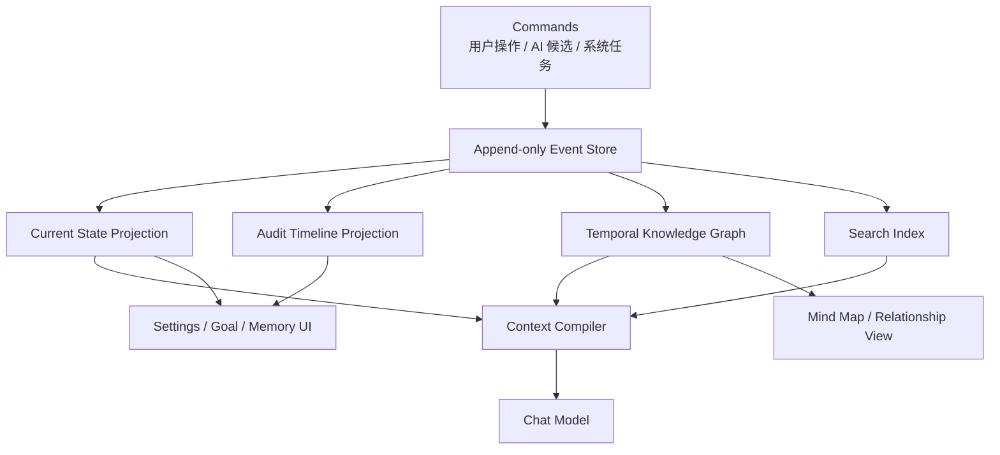
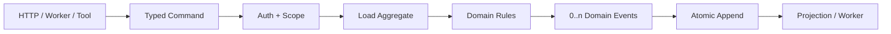
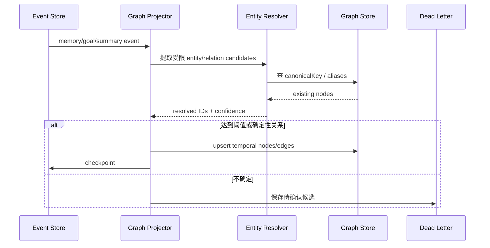
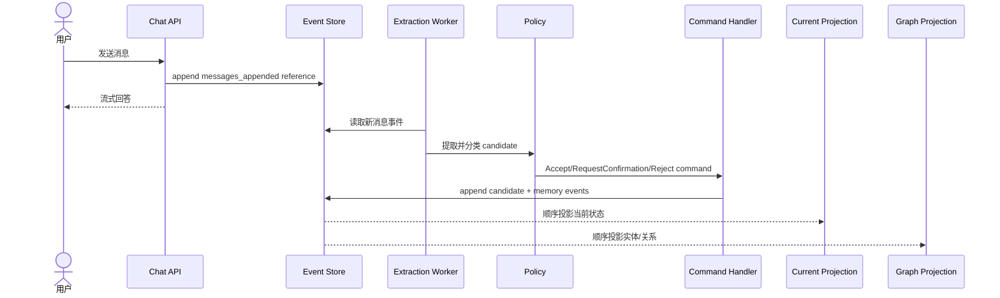
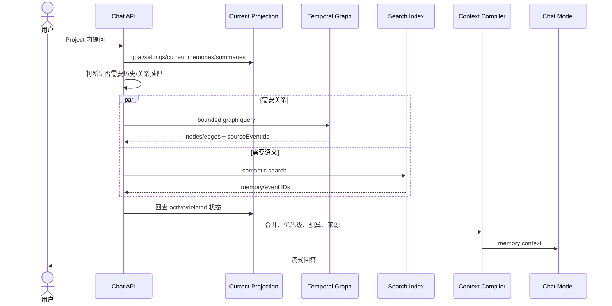
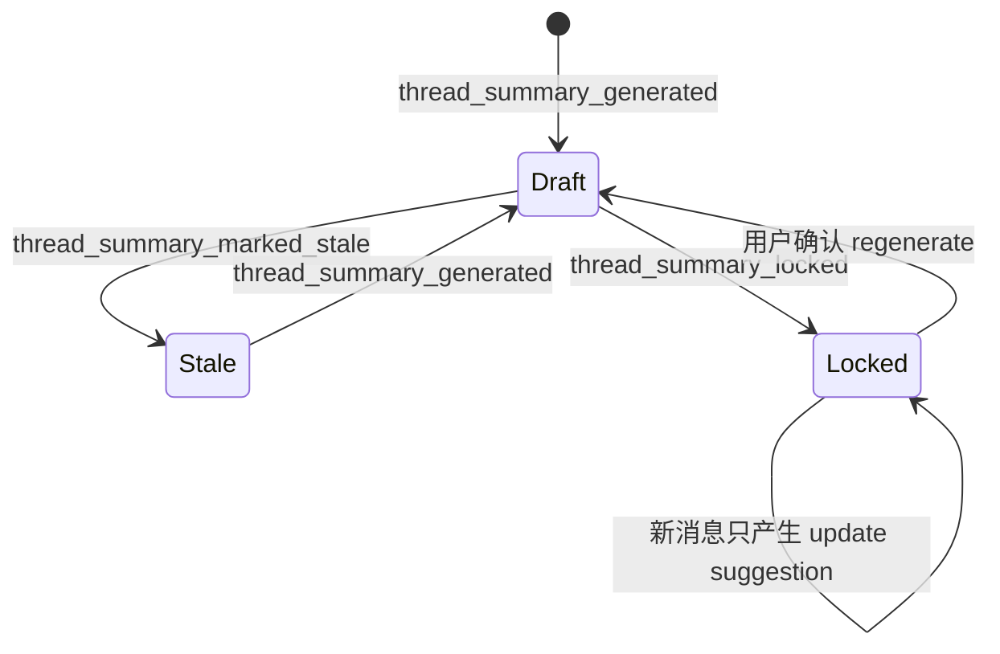
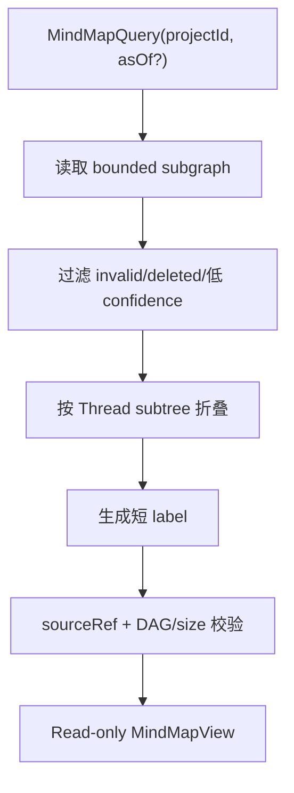
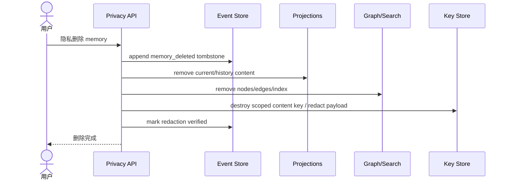

# 方案 C：事件溯源 + 时序知识图谱

## 1. 方案定义

方案 C 不直接把“当前记忆”作为唯一真相，而是把所有有意义的变化先写入不可变事件日志，再投影出：

- 当前用户设置；
- 当前 Project 目标；
- 当前 Project 事实和决策；
- 时间版本；
- Thread 总结；
- 实体和关系图。



事件是事实记录；投影可以删除后重建。图不是聊天消息的简单向量化，而是从事件中形成有时间语义的 entity/relation。

## 2. 适用问题

方案 C 擅长回答：

- 某个 Project 决策经历了哪些变化？
- 这个结论基于哪些分支和证据？
- 哪些约束阻塞了哪些目标？
- 用户偏好从何时开始生效？
- 某次回答在当时看到了哪些版本的记忆？
- 删除、编辑或修正是由谁、在什么时间发生的？

如果产品只需要“默认用中文”和“记住当前项目”，事件图会明显过度设计。只有关系、时间和可追溯推理成为核心产品能力时，复杂度才有回报。

## 3. 三层真相

```text
Level 1: Event Store
  不可变的业务事件，是最终审计真相

Level 2: Projections
  为读取优化的当前状态、历史、搜索和图

Level 3: Derived Views
  Prompt context、Thread 总结、思维导图
```

删除是特殊情况：审计事件可以保留“发生过删除”，但 prohibited 或隐私删除的原文必须从 payload、投影和索引中物理清除，事件只留下不含内容的 tombstone。

## 4. 事件模型

```ts
type MemoryEventType =
  | "project_created"
  | "tree_bound_to_project"
  | "project_goal_set"
  | "project_goal_revised"
  | "memory_candidate_proposed"
  | "memory_candidate_accepted"
  | "memory_candidate_rejected"
  | "memory_added"
  | "memory_superseded"
  | "memory_deleted"
  | "thread_summary_generated"
  | "thread_summary_edited"
  | "thread_summary_locked"
  | "thread_summary_marked_stale"

interface DomainEvent<T = unknown> {
  eventId: string
  eventType: MemoryEventType
  aggregateType: "user_memory" | "project" | "project_memory" | "thread_summary"
  aggregateId: string
  ownerUserId: string
  projectId?: string
  aggregateVersion: number
  occurredAt: string
  actor: {
    type: "user" | "system" | "worker"
    id?: string
  }
  correlationId: string
  causationId?: string
  payload: T
  metadata: {
    schemaVersion: number
    modelId?: string
    extractorVersion?: string
    sourceTreeId?: string
    sourceThreadId?: string
    sourceMessageId?: string
  }
}
```

`aggregateVersion` 用于乐观并发。写事件时要求：

```sql
expected_version = current aggregate version
```

不匹配就返回冲突，调用方重新加载状态后再决定。

## 5. Command 与 Event 分离

外部输入先成为命令：

```ts
type MemoryCommand =
  | {
      type: "AcceptMemoryCandidate"
      candidateId: string
      expectedVersion: number
    }
  | {
      type: "ReviseProjectGoal"
      projectId: string
      objective: string
      successCriteria: string[]
      constraints: string[]
      expectedVersion: number
    }
  | {
      type: "DeleteMemory"
      memoryId: string
      expectedVersion: number
      reason: "user_request" | "privacy" | "correction"
    }
  | {
      type: "LockThreadSummary"
      summaryId: string
      expectedVersion: number
    }
```

Command Handler 完成身份验证、业务校验和 policy 后，才产生事件：



LLM 永远不能直接 append 任意事件。它只能产生 `ProposeMemoryCandidate` 命令，事件类型和 payload 由应用生成。

## 6. Event Store

最小 PostgreSQL 表：

```text
memory_domain_events
  sequence_id            bigserial，全局排序
  event_id               uuid unique
  aggregate_type
  aggregate_id
  owner_user_id
  project_id
  aggregate_version
  event_type
  occurred_at
  actor_json
  payload_json
  metadata_json
  correlation_id
  causation_id

unique (aggregate_id, aggregate_version)
index  (owner_user_id, sequence_id)
index  (project_id, sequence_id)
```

另有：

```text
projection_checkpoints
  projection_name
  last_sequence_id
  status
  updated_at

projection_dead_letters
  event_id
  projection_name
  error
  attempts
  next_retry_at
```

Event Store 不是普通日志表：

- 只允许 append；
- schema version 必须显式；
- 事件发布与 append 在同一事务，使用 outbox/顺序轮询；
- 事件 payload 需要数据保留和隐私策略；
- 备份、恢复和 projection rebuild 必须演练。

## 7. 当前状态投影

为在线查询维护关系型 projection：

```text
current_user_settings
current_project_goals
current_project_memories
current_thread_summaries
```

投影器示例：

```ts
function projectMemory(
  state: MemoryProjection | null,
  event: DomainEvent
): MemoryProjection | null {
  switch (event.eventType) {
    case "memory_added":
      return fromAddedEvent(event)
    case "memory_superseded":
      return applySupersede(state, event)
    case "memory_deleted":
      return state ? { ...state, status: "deleted" } : null
    default:
      return state
  }
}
```

投影必须幂等：

- 记录最后处理的 `sequence_id`；
- 同一 event 重放不会重复产生记录；
- 新版本投影使用新 projection name，从头重建并切换；
- 不能让在线请求依赖每次重放全部事件。

## 8. 时序知识图谱

### 8.1 图模型

```ts
type EntityKind =
  | "user"
  | "project"
  | "goal"
  | "thread"
  | "decision"
  | "constraint"
  | "concept"
  | "artifact"

interface TemporalNode {
  id: string
  kind: EntityKind
  canonicalKey: string
  properties: Record<string, unknown>
  validFrom: string
  validTo?: string
  sourceEventIds: string[]
}

interface TemporalEdge {
  id: string
  fromNodeId: string
  toNodeId: string
  relation:
    | "HAS_GOAL"
    | "HAS_THREAD"
    | "BRANCHES_TO"
    | "DECIDED"
    | "CONSTRAINS"
    | "SUPPORTS"
    | "BLOCKS"
    | "ANSWERS"
    | "SUPERSEDES"
  validFrom: string
  validTo?: string
  sourceEventIds: string[]
  confidence: number
}
```

### 8.2 双时间

成熟时间模型可以区分：

- `valid time`：事实在业务世界何时有效；
- `transaction time`：系统何时知道/记录它。

```text
用户 7 月 10 日说：
“我从 7 月 1 日起，Project 输出改用英文。”

valid_from       = 7 月 1 日
recorded_at      = 7 月 10 日
```

若产品没有“回到历史时点回答”的需求，可以先只在事件层保留 `occurred_at` 和 memory `valid_from/valid_to`，不急于引入完整双时间数据库。

### 8.3 图写入



`Project HAS_THREAD`、`Thread BRANCHES_TO Thread` 来自确定性 tree 数据，不经过 LLM。`Decision SUPPORTS Goal` 等语义边才允许模型提议。

## 9. 写入时序



如果 projection 落后，在线读取可能暂时看不到刚写事件。解决方式：

- 用户显式编辑返回后，把新 aggregate version 放进 read-your-writes token；
- API 在投影未追上 token 时短暂等待或从 aggregate events 局部 fold；
- 后台自动候选允许 eventual consistency。

## 10. 读取时序



图查询必须 bounded：

- 最大 hop；
- 最大节点/边数；
- 允许的 relation；
- Project scope；
- 时间范围；
- 每条结果必须能回到 sourceEvent。

不能让模型生成任意 Cypher/SQL 直接访问全库。

## 11. Thread 总结

Thread 总结仍是派生知识，但在方案 C 中它的所有变化都形成事件：



`thread_summary_edited` 保存用户编辑后的完整新版本或受保护的 diff。不要只保存自然语言“用户修改了总结”，否则 projection 无法重建。

## 12. 思维导图

方案 C 最容易生成关系丰富的思维导图，但仍然必须区分：

```text
真实 tree 关系        -> BRANCHES_TO，确定性
Project Goal 结构     -> HAS_GOAL / CONSTRAINS，确定性
确认的 Project 记忆  -> DECIDED / glossary，权威
LLM 推断关系          -> SUPPORTS / BLOCKS，带 confidence
```



当前产品不需要 `asOf` 历史导图，可以不暴露 UI，但事件结构允许未来增加。

## 13. 删除与隐私

事件不可变与隐私删除存在天然张力。不能用“事件溯源”作为永不删除用户数据的借口。

推荐 crypto-shredding + redaction：

1. 敏感 payload 使用每用户/Project data key 加密；
2. 普通删除追加 `memory_deleted`，projection 立即移除；
3. 隐私删除同时清除 projection、search、graph、cache；
4. 对原事件 payload 做受控 redaction，或销毁专属 data key；
5. 保留不含原文的 tombstone：event ID、删除时间、原因代码；
6. 重建 projection 时，redacted 事件只能产生 deleted 状态，不能恢复内容。



这比 B 的删除复杂得多，必须在选 C 前验证法规和审计需求是否真的需要事件不可变性。

## 14. 存储选择

### C1. PostgreSQL 事件 + PostgreSQL 投影 + 图表

先用关系表存 node/edge：

```text
knowledge_nodes
knowledge_edges
```

优点是单一数据库、事务和备份简单；有限 hop 可以递归 CTE。适合作为 C 的最小成熟起点。

### C2. PostgreSQL 事件 + 专用 Graph Store

Postgres 是 event source，Neo4j/其他图存储只是 projection。

优点是复杂 traversal 和图工具丰富；缺点是：

- 双系统一致性；
- 删除核验；
- 备份和重建；
- 新运维能力；
- scope 查询安全。

没有实际图查询压力前，不建议先引入专用图数据库。

## 15. 建议代码边界

```text
lib/events/
  contracts.ts
  event-store.ts
  command-bus.ts
  aggregate.ts
  projector.ts
  checkpoints.ts

lib/memory/
  commands.ts
  events.ts
  aggregate.ts
  current-projection.ts
  context-compiler.ts
  policy.ts

lib/knowledge-graph/
  contracts.ts
  projector.ts
  entity-resolver.ts
  repository.ts
  query.ts
  mind-map.ts

lib/projects/
  commands.ts
  events.ts
  aggregate.ts

workers/
  event-projector.ts
  memory-extractor.ts
  graph-projector.ts
  search-projector.ts
```

各 aggregate 和 projection 分文件，避免把所有 event switch 堆进单文件。

## 16. 分阶段落地

### C-1：事件基础设施

- Event Store、aggregate version 和 append transaction；
- Project/tree/goal 事件；
- checkpoint 和 dead letter；
- projection rebuild 工具；
- 备份恢复演练。

### C-2：当前状态 projection

- user settings；
- project goal；
- project memories；
- Context Compiler 只读 projection；
- read-your-writes token。

### C-3：候选与审计

- extraction events；
- policy command handler；
- accept/reject/supersede/delete；
- 完整 correlation/causation；
- 控制面时间线。

### C-4：Thread summary events

- revision、draft/stale/locked；
- summary projection；
- Project 决策候选；
- rebuild 验证。

### C-5：关系图 projection

- 先投影确定性 Project/Thread/Goal 边；
- 再引入受限 entity resolver；
- confidence 和人工确认；
- bounded graph query；
- 性能与 scope 安全测试。

### C-6：思维导图

- 从图 projection 读取；
- subtree folding；
- sourceRef；
- 只读缓存；
- 可选历史 `asOf`。

### C-7：隐私与灾备

- payload encryption/redaction；
- graph/search deletion reconciliation；
- projection 全量重建；
- provider/graph store 丢失恢复；
- deletion 不复活测试。

## 17. 测试重点

除了方案 B 的共同 fixture，C 必须额外测试：

- 相同 aggregate 并发写只接受一个 version；
- 事件重复投递不重复投影；
- 任意 checkpoint 重启后结果一致；
- 从空 projection 全量重建结果一致；
- 旧 schema event 经过 upcaster 后可读取；
- graph edge 都有 sourceEventIds；
- 删除后重建不会复活；
- owner/project scope 不会跨图遍历；
- projection lag 可观测且不会无限增长；
- redacted event 不含可恢复明文。

## 18. 优点与代价

优点：

- 最完整的演化历史和审计；
- 当前状态、历史状态和关系视图边界清楚；
- 投影可按新需求重建；
- 非常适合未来的因果、时间和关系分析；
- 思维导图可以直接利用真实关系。

代价：

- Command/Event/Projection 心智负担高；
- eventual consistency 和 read-your-writes 更难；
- schema 演进、重放和死信需要长期维护；
- 隐私删除复杂；
- 图抽取和 entity resolution 仍会出错；
- 对当前个人 Project 需求可能是显著过度设计。

## 19. 结论

方案 C 应当由真实查询需求触发，而不是由“成熟产品”四个字触发。以下信号同时出现时值得选择：

- 用户经常跨大量分支追踪决策演化；
- 产品需要时间点回放或完整审计；
- 关系推理和图导航成为核心体验；
- 数据量和查询已经证明关系表 + 简单版本链难以维护；
- 团队具备事件溯源和图投影的长期运维能力。

如果这些信号尚未出现，方案 B 的 audit event + version chain 已经覆盖大部分成熟产品需要，并保留向 C 演进的路径。
