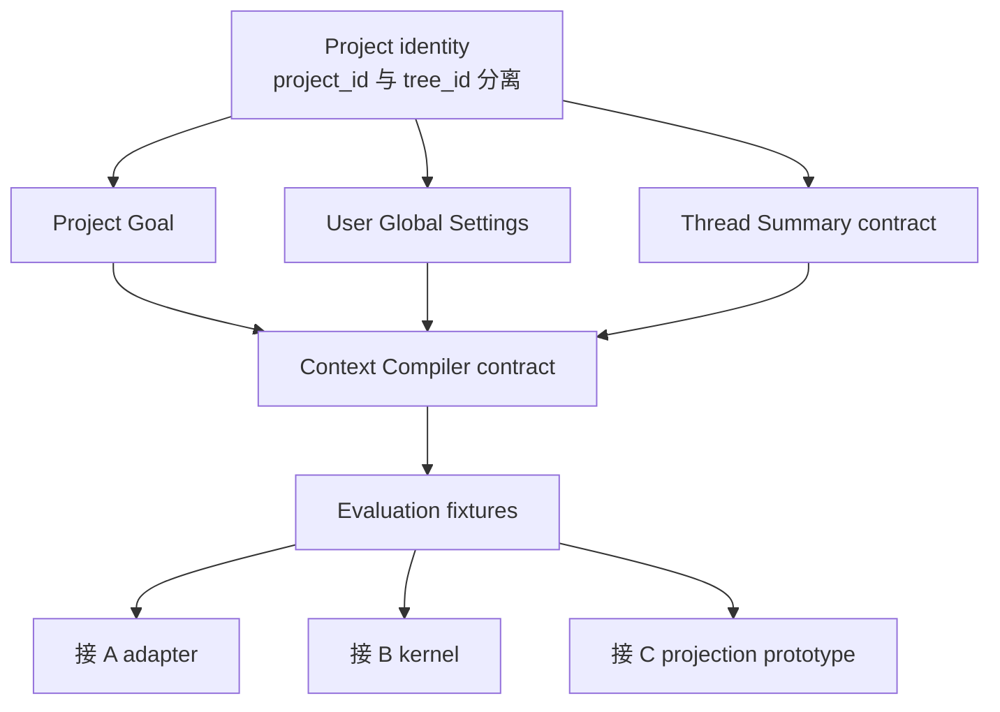
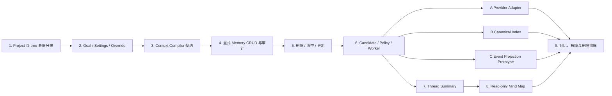
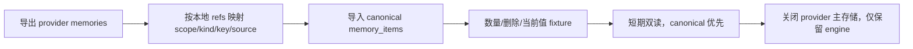
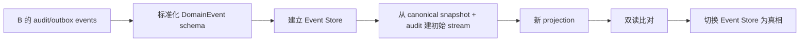

# A / B / C 决策方法与统一落地计划

## 1. 不用“成熟度”代替选择标准

三个方案都可以做成成熟产品，区别是复杂度放在哪里：

```text
A：复杂度主要交给供应商，应用承担集成、一致性和退出成本
B：复杂度主要在本地域模型，语义能力可外包
C：复杂度主要在事件、投影、时间和关系基础设施
```

最终选择需要回答：

- 哪些状态绝不能依赖 LLM 或供应商临场判断？
- 产品是否真的需要复杂时间和图关系查询？
- 团队是否愿意长期运维事件投影或外部服务一致性？
- 删除、导出和供应商退出能否验证？
- 哪个方案在本项目数据上得到更好的正确性与总拥有成本？

## 2. 必须先交付的共同基础

以下工作不是某个方案特有，因此可以在最终选型前完成：



共同基础包括：

1. `projects` 和 `project_tree_bindings`；
2. Goal 的主目标、成功标准、约束和版本；
3. 全局 instruction 与 Project override；
4. 服务端 `ContextCompiler` 接口；
5. ThreadSummary 的 draft/stale/locked 契约；
6. 统一 MemoryCandidate、MemoryItem 和 source 类型；
7. 固定 fixture 与观测格式。

这部分不会迫使团队选择某个 provider，也不会提前引入图数据库。

## 3. 统一对比矩阵

### 3.1 功能与语义

| 维度 | A：托管服务 | B：混合内核 | C：事件图 |
| --- | --- | --- | --- |
| 用户全局设置 | 需要本地 current projection | 原生关系表 | 当前状态 projection |
| Project override | 需要本地规则 | 原生规则 | Command + projection |
| Project Goal | 本地对象 | 本地对象 | Goal aggregate |
| Project 事实/决策 | provider 为主，本地 refs | 本地权威 | event + projection |
| Thread 总结 | 本地派生 | 本地派生 | event + projection |
| 思维导图 | 本地 tree + provider memories | 本地 tree + summaries + memories | graph projection |
| 当前值冲突 | 依赖 provider + 本地补充 | deterministic reducer | event fold |
| 时间历史 | provider 能力决定 | version chain | 原生强项 |
| 多跳关系 | 弱—中 | 弱—中 | 强 |
| 用户控制面 | 仍需自建 | 自建 | 自建 |

### 3.2 工程与运维

| 维度 | A | B | C |
| --- | ---: | ---: | ---: |
| 领域代码量 | 中 | 高 | 最高 |
| 基础设施代码量 | 低 | 中 | 最高 |
| 外部依赖 | 高 | 可选 | 图存储可选 |
| 故障模式数量 | 中 | 中 | 高 |
| 数据迁移难度 | provider 导出决定 | 低—中 | 事件 schema 演进高 |
| 删除工作流 | 跨系统 | canonical + index | event + projection + graph |
| 本地可调试性 | 中 | 高 | 中；需要事件工具 |
| 重建能力 | provider 决定 | 可重建索引 | 可重建全部 projection |
| 团队学习成本 | 中 | 中 | 高 |

### 3.3 产品风险

| 风险 | A | B | C |
| --- | --- | --- | --- |
| 供应商锁定 | 高 | 低 | 低 |
| LLM 候选污染权威状态 | 中—高 | 低 | 低 |
| 架构过度设计 | 低—中 | 中 | 高 |
| 关系需求增长后受限 | 高 | 中 | 低 |
| 隐私删除实现错误 | 中 | 中 | 高 |
| 在线读延迟 | provider 网络影响 | 可本地优先 | projection 快，图查询需控 |

## 4. 建议加权评分

权重必须由产品目标决定。针对当前已确认的“个人 Project + 全局设置 + 目标 + Thread 总结 + 只读思维导图”，可以先使用：

| 维度 | 权重 |
| --- | ---: |
| 当前值、覆盖和删除的确定性 | 25% |
| 用户控制、来源和可解释性 | 20% |
| 与 Project/Thread 模型贴合 | 20% |
| 长期维护和可替换性 | 15% |
| 语义召回能力 | 10% |
| 时间/关系扩展能力 | 10% |

初始架构评估，不是实测结果：

| 方案 | 确定性 | 控制面 | 领域贴合 | 维护/替换 | 语义能力 | 时间/关系 | 加权 |
| --- | ---: | ---: | ---: | ---: | ---: | ---: | ---: |
| A | 3 | 3 | 3 | 2 | 5 | 3 | 3.05 |
| B | 5 | 5 | 5 | 4 | 4 | 3 | 4.50 |
| C | 5 | 5 | 4 | 2 | 4 | 5 | 4.25 |

分值是待验证假设。团队如果把复杂关系查询的权重提高，C 会超过 B；如果把内部研发投入权重降到最低且 provider 通过全部测试，A 会更有吸引力。

## 5. 统一测试对象

### 5.1 Fixture 类型

```ts
interface MemoryEvaluationCase {
  id: string
  ownerUserId: string
  projectId: string
  initialGlobalSettings?: Record<string, unknown>
  projectGoal?: {
    objective: string
    successCriteria: string[]
    constraints: string[]
  }
  events: Array<{
    at: string
    treeId: string
    threadId: string
    role: "user" | "assistant"
    text: string
  }>
  operation?:
    | { type: "edit"; key: string; value: unknown }
    | { type: "delete"; key: string }
    | { type: "lock_summary"; threadId: string }
  query: {
    at: string
    treeId: string
    threadId: string
    text: string
  }
  expected: {
    effectiveSettings?: Record<string, unknown>
    activeMemories?: Array<{ kind: string; key: string; value: unknown }>
    inactiveKeys?: string[]
    requiredSourceMessageIds?: string[]
    forbiddenText?: string[]
  }
}
```

同一个 fixture adapter 分别驱动 A/B/C，不能为不同方案修改输入。

### 5.2 必测场景

| 类别 | 场景 |
| --- | --- |
| 全局设置 | 全局中文，Project 英文，当前 turn 临时中文 |
| 当前值 | 城市、当前项目、输出格式发生更新 |
| authority | inferred 值不得覆盖 explicit 值 |
| assistant 幻觉 | assistant 建议不得自动成为用户事实 |
| Project 决策 | 一个分支作出决策，另一个分支能够引用 |
| Goal | AI 提议修改目标但未确认，目标不变化 |
| Thread 总结 | draft 自动更新；locked 不被覆盖 |
| 删除 | 删除后在线读取、索引、缓存都不再返回 |
| 隔离 | user A 与 user B、Project A 与 Project B 不串数据 |
| 思维导图 | 只出现真实 thread/sourceRef，不生成幽灵节点 |
| 拒答 | 无来源时承认不知道 |
| 故障 | provider/worker/graph 超时不阻断聊天 |

## 6. 统一指标

### 6.1 正确性

```text
candidate precision / recall
auto-accept precision
current-value accuracy
authority precedence accuracy
retrieval recall@k
context precision
answer correctness
abstention accuracy
thread-summary factuality
mind-map source coverage
```

### 6.2 安全

硬门槛：

```text
跨用户泄露                     = 0
跨 Project 泄露                = 0
deleted memory 在线召回        = 0
assistant-only claim 自动生效  = 0
prohibited 内容发送到 provider = 0
无 sourceRef 的导图事实节点    = 0
```

### 6.3 性能与成本

分别记录：

- Context Compiler p50/p95；
- provider search p50/p95；
- graph query p50/p95；
- 每轮增加的 prompt tokens；
- 每个 turn 的抽取和 embedding 成本；
- background job lag；
- provider 月度成本；
- 工程维护和 on-call 时间。

不应只比较 API 账单。方案 C 的人员成本可能远高于存储成本，方案 A 的供应商退出成本也必须计入。

## 7. 验收门槛

可以沿用并扩展[阶段 2 评测方案](../02-deep-dives/09-evaluation.md)：

```text
current-value 冲突准确率          >= 95%
auto-accept precision             >= 98%
retrieval recall@6                >= 90%
Thread summary 关键事实支持率     >= 95%
Mind map source coverage          = 100%
在线 Context Compiler p95         < 150ms（不含主模型）
默认记忆注入预算                  <= 主上下文 10%
聊天成功不依赖后台写入成功        = 100%
```

对于 A，`<150ms` 可能受外部网络影响，应同时测冷缓存与 provider 降级。对于 C，图查询必须限制 hop 和结果数，不能用无界 traversal 达成召回率。

## 8. 推荐的实施顺序

即使最终选择 A 或 C，也建议按以下顺序落地：



## 9. 当前仓库的落地点

### 9.1 现有对象

```text
branch_trees.state
  -> 完整 ThreadTreeState
  -> threads[threadId].messages
  -> artifacts
```

现有 UI 列是 Thread 的展示，不是稳定数据作用域。Project、Summary 和 Memory 都必须绑定稳定 ID：

```text
Project -> ProjectTreeBinding -> branch_tree
branch_tree -> ThreadTreeState.threads[threadId]
ThreadSummary -> projectId + treeId + threadId
MemorySource -> treeId + threadId + messageId
```

### 9.2 Chat 请求

当前 thread-chat body 只有：

```ts
threadChat: { anchorText: string | null }
```

落地后客户端还需要发送必要的资源 ID，但服务端必须重新授权：

```ts
interface ThreadChatContextRef {
  projectId: string
  treeId: string
  threadId: string
  anchorText: string | null
}
```

不能接收客户端拼好的记忆或 system prompt。服务端根据 session、Project ownership 和 Context Compiler 生成。

### 9.3 原有继承上下文

当前 `collectInherited()` 沿 lineage 收集父会话消息。引入记忆后仍保留：

```text
当前 Thread 原始消息
+ lineage 截断继承
+ Project/Memory Context
```

ThreadSummary 不能直接替换当前 Thread 的原始对话；它主要用于：

- 跨远端分支回忆；
- lineage 太长后的压缩；
- Project 概览；
- 思维导图。

## 10. 迁移路径

### 从 A 迁移到 B



如果 A 没有本地 refs 和 source，迁移会非常困难，因此 refs 不是可选优化。

### 从 B 演进到 C



B 应从第一天保留足够的审计和版本链，但不需要假装它已经是完整 event sourcing。

### 从 C 简化回 B

保留 current projection 作为 canonical snapshot，停止产生复杂图事件；导出 active memory、goal、summary 和 version。难点是失去历史查询能力，而不是在线功能。

## 11. 决策闸门

### 选择 A，必须满足

- provider 在统一 fixture 上通过所有硬门槛；
- 删除和导出已经实测；
- provider 失败时本地设置、Goal 和 Summary 仍可工作；
- 安全审查允许内容出站；
- 完成一次 staging 供应商退出演练。

### 选择 B，必须接受

- 团队长期拥有 taxonomy、Policy 和 Reducer；
- 要维护 durable worker 和索引 reconciliation；
- 不能把 Memory Engine 当作黑箱真相；
- 要持续运行自动写入误报评测。

### 选择 C，必须证明

- 已有明确、频繁、可量化的多跳/时间查询；
- B 的版本链无法合理支持需求；
- 团队能维护 event schema、projection rebuild 和 graph scope；
- 隐私删除设计通过审查与恢复演练；
- 基础设施成本由真实产品价值支撑。

## 12. 建议结论

基于目前已确认的产品边界：

- A 能提供成熟语义能力，但仍需大量本地域代码，而且容易产生双真相；
- B 把通用能力和产品权威状态拆开，最符合全局设置、Project override、Goal、Thread Summary 与可审计控制面；
- C 对思维导图和关系演化最强，但当前只读导图可以直接从 tree + summary 生成，不足以证明引入事件图。

因此建议：

```text
目标架构：B
对照实现：A
演进预留：C
```

这不是让团队只实现 B、不验证其他方案。应当先交付共同基础，再让 A/B 使用相同 fixture 对比；只有真实关系查询出现后，才启动 C 的 projection prototype。
