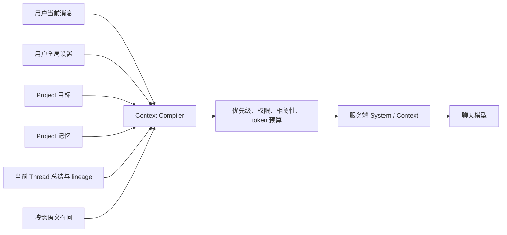

# 成熟产品记忆架构：A / B / C 方案研究

> 设计日期：2026-07-26。本文档集讨论的是成品级架构，不以“最快做出 MVP”为决策前提，也不把现有 PDF RAG 当作选择自建的理由。

## 已确认的产品边界

本轮讨论已经确定：

1. 当前一棵 branch tree 对应一个 Project，但 `project_id` 与 `tree_id` 分离，未来允许一个 Project 包含多棵 tree；
2. Project 目标采用“一个主目标 + 成功标准 + 约束”，不扩展成完整项目管理系统；
3. 用户全局设置是默认值，Project 明确设置可以覆盖它；
4. 每个 `Thread`（主线或分支会话）有一份 AI 生成、用户可编辑并可锁定的总结；
5. 记忆采用分级写入：低风险内容可以自动生效，高影响或敏感内容必须确认；
6. 思维导图是只读派生视图，不是记忆真相来源；
7. 当前产品只支持个人 Project，不设计多人权限流。

## 三个方案

| 方案 | 核心主张 | 真相来源 | 最适合 |
| --- | --- | --- | --- |
| [A：托管 Memory 服务为主](./01-option-a-managed-memory.md) | 把抽取、存储、更新和检索交给 Mem0 一类服务 | Memory 服务 + 本地 Project 元数据 | 希望把通用记忆基础设施外包，并接受供应商语义 |
| [B：关系型记忆内核 + 可插拔 Memory 引擎](./02-option-b-hybrid-kernel.md) | 本地保存权威状态，外部引擎只做候选抽取和语义能力 | 本地 Postgres | 要求目标、设置、决策、删除和来源保持确定性 |
| [C：事件溯源 + 时序知识图谱](./03-option-c-event-graph.md) | 所有变化先写事件，再投影成当前状态和知识图 | 追加式事件日志 | 需要复杂时间推理、关系查询和长期演化分析 |

所有方案共用的产品语义、安全边界和 TypeScript 契约见：

- [00-shared-product-model.md](./00-shared-product-model.md)
- [04-decision-and-delivery.md](./04-decision-and-delivery.md)

## 共同上下文模型

无论采用哪个存储方案，每次请求都不应把“所有记忆”直接塞给模型，而应先编译出有来源、预算和优先级的上下文：



固定优先级：

```text
用户当前消息中的明确要求
  > Project 明确设置
  > 用户全局明确设置
  > 系统自动推断的偏好
```

这个优先级只解决同类指令冲突。系统安全规则永远不允许被任何记忆覆盖。

## “记忆”不是一个表

成熟产品至少要区分以下对象：

| 对象 | 是否权威 | 是否允许模型自动修改 | 典型例子 |
| --- | --- | --- | --- |
| 用户全局设置 | 是 | 高影响修改必须确认 | 所有回答默认使用中文 |
| Project 目标 | 是 | 只能提出修改建议 | 完成记忆系统设计 |
| Project 记忆 | 是 | 按风险自动或确认 | 已决定使用 Postgres；术语定义 |
| 记忆候选 | 否 | 是 | 从新对话抽取的可能事实 |
| Thread 总结 | 派生知识 | 可自动生成；用户编辑后锁定 | 这个分支比较了三种存储方案 |
| 思维导图 | 派生视图 | 只读生成 | 目标—主题—分支—结论结构 |
| 原始消息/事件 | 证据 | 不由模型改写 | 用户原话和来源消息 |

把这些内容塞进统一的 `memories` 向量集合，会丢失权限、优先级和生命周期语义。

## 快速比较

| 维度 | A：托管服务 | B：混合内核 | C：事件图 |
| --- | --- | --- | --- |
| 初始工程量 | 低—中 | 中 | 高 |
| 长期产品控制 | 中 | 高 | 最高 |
| 当前值/覆盖规则 | 依赖供应商 + 本地补丁 | SQL/Reducer 确定 | 事件投影确定 |
| 时间历史 | 服务能力决定 | 版本链 | 原生强项 |
| 关系推理 | 一般 | 有限 | 强 |
| 删除证明 | 需要跨系统核验 | 本地事务 + 索引清理 | 墓碑事件 + 投影清理 |
| 供应商锁定 | 高 | 低 | 低，但基础设施复杂 |
| 运维成本 | 低—中 | 中 | 高 |
| 与 Project 领域模型的贴合度 | 中 | 高 | 高，但可能过度设计 |

## 当前倾向

在不考虑现有 RAG 复用、也不以 MVP 速度为前提时，仍不能用“成熟产品”直接推出方案 C。成熟产品首先需要清晰的数据所有权、可验证行为和可演进边界，不等于选择最复杂的架构。

当前倾向是 **B**：

- 自己拥有用户设置、Project 目标、Project 记忆、Thread 总结和审计；
- 通过 `MemoryEngine` 接口使用 Mem0 或其他成熟能力；
- 外部服务故障不会让权威状态丢失；
- 若未来确实出现多跳关系、复杂时间查询，再从事件表演进到 C。

这只是待评审建议。最终选择应按 [统一验收与交付计划](./04-decision-and-delivery.md) 用相同 fixture 验证，而不是根据架构图复杂度决定。
