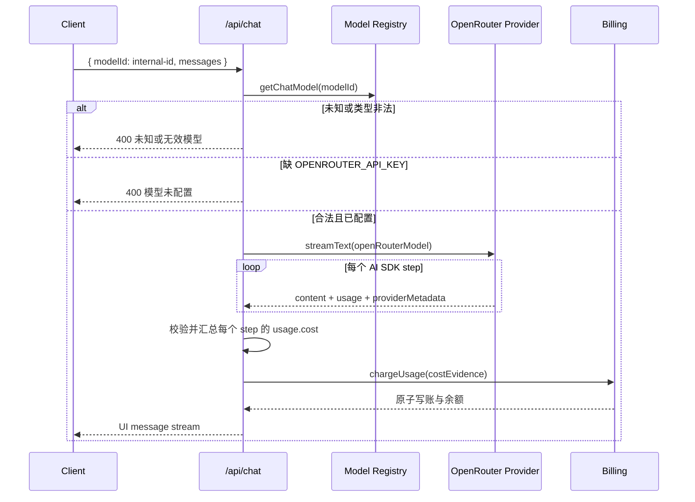

# OpenRouter 模型接入技术计划

> 本文件先冻结模块边界、类型和接口契约；OpenSpec 的规范行为以 `specs/openrouter-model-access/spec.md` 为准，可执行顺序以 `tasks.md` 为准。实现阶段不得让客户端直接提交 OpenRouter slug、成本或路由参数。

## 1. 范围与不变量

本 change 只为现有模型体系增加一个 **OpenRouter 专属调用适配器**及其 10 个产品模型，不重做已经完成的 `add-model-gateway`、`add-ark-model-selector`。

必须保持以下不变量：

1. `constants/model.ts` 仍是模型注册的单一事实来源；客户端只发送内部 `modelId`。
2. OpenRouter 模型固定走 OpenRouter，不参与 Vercel → CF → 供应商直连的既有三级路由，也不在缺 key 时静默切换到同名直连模型。
3. OpenRouter 原生 reasoning 由专属 provider 转换成 AI SDK reasoning parts；只有字面输出 `<think>` 的既有模型才使用标签抽取中间件。
4. 成功生成优先按 OpenRouter 返回的整次请求真实美元成本计费；元数据不完整时整次回退保守估值，禁止把“部分 step 的成本之和”冒充完整成本。
5. 未知模型、未配置 key、非法成本元数据均不得形成 500 或零价漏洞。
6. 分支继承和锁定规则保持不变；新增模型只改变允许选择的模型集合。

## 2. 模块边界

| 模块 | 负责 | 不负责 |
|---|---|---|
| `constants/model.ts` | 内部模型 id、展示信息、路由 provider、OpenRouter slug、reasoning 传输方式、Thread 可见集合 | 创建 SDK client、读取 API key、计费 |
| `lib/ai/openrouter.ts` | 创建 OpenRouter provider、检查 key、解析 OpenRouter 逐 step 成本元数据 | 注册表选择、余额更新、HTTP 响应 |
| `lib/ai/provider.ts` | 根据已校验的注册项选择具体 `LanguageModel`；OpenRouter 分支短路 | 接收不可信请求体、扣费、模型 UI |
| `app/api/chat/route.ts` | 校验 `modelId`、驱动 `streamText`、聚合所有 step 的成本证据并交给计费层 | 信任客户端 slug/成本、直接操作余额表 |
| `constants/pricing.ts` | OpenRouter 元数据缺失时的非零保守成本与既有售价公式 | 在线抓取 OpenRouter 价格、覆盖真实成本 |
| `lib/billing/credits.ts` | 把成本证据转换为账本成本/售价，原子扣余额并写流水 | 解析 providerMetadata、判断模型路由 |
| `lib/db/billing-schema.ts` | 声明 `openrouter` 成本来源类型 | 引入 OpenRouter 专属表或存储原始响应 |
| `thread-model-selector.tsx` | 从共享可见模型集合派生选项、排序与展示 | 复制模型表、决定后端路由 |

```mermaid
flowchart LR
  UI[Thread Model Selector] -->|internal modelId| API[POST /api/chat]
  API --> REG[constants/model.ts]
  REG --> RES[lib/ai/provider.ts]
  RES -->|provider=openrouter| OR[lib/ai/openrouter.ts]
  RES -->|existing providers| OLD[现有 MiniMax / Ark / Gateway 路径]
  OR --> SDK[@openrouter/ai-sdk-provider]
  SDK --> STREAM[AI SDK UI stream]
  SDK --> META[per-step usage.cost]
  META --> API
  API --> BILL[lib/billing/credits.ts]
  BILL --> LEDGER[(usage_records + user_credits)]
```

依赖方向只能从上层编排指向下层能力；`constants/*` 不得反向 import `lib/*`，计费层不得 import chat route。

## 3. 模型注册与类型定义

### 3.1 内部 id 与 OpenRouter slug

内部 id 带 `openrouter-` 前缀，避免与既有 Ark 模型（特别是 `deepseek-v4-flash`）碰撞，也避免将外部 slug 直接持久化为产品身份。

```ts
export const OPENROUTER_MODEL_IDS = [
  "openai/gpt-5.6-luna",
  "openai/gpt-5.6-luna-pro",
  "openai/gpt-5.6-terra",
  "openai/gpt-5.6-terra-pro",
  "openai/gpt-5.6-sol",
  "openai/gpt-5.6-sol-pro",
  "openai/gpt-5.5",
  "openai/gpt-5.5-pro",
  "moonshotai/kimi-k3",
  "deepseek/deepseek-v4-flash-0731",
] as const

export type OpenRouterModelId = (typeof OPENROUTER_MODEL_IDS)[number]

export type ChatModelProvider =
  | "minimax"
  | "deepseek"
  | "openai"
  | "ark"
  | "openrouter"

export type ReasoningTransport = "think-tags" | "native"

export type ChatModel = {
  id: string
  name: string
  description?: string
  /** 调用适配器，不等同于模型创建者。 */
  provider: ChatModelProvider
  /** 供应商/路由接受的模型名；OpenRouter 项必须是 OpenRouterModelId。 */
  upstreamModel: string
  gatewayModel?: string
  /** 仅 think-tags 需要 extractReasoningMiddleware；native 由 provider 原生转换。 */
  reasoningTransport?: ReasoningTransport
  /** 仅用于展示分组，不参与鉴权和路由。 */
  creator?: "openai" | "moonshotai" | "deepseek"
}

export type OpenRouterChatModel = ChatModel & {
  provider: "openrouter"
  upstreamModel: OpenRouterModelId
  reasoningTransport: "native"
  creator: "openai" | "moonshotai" | "deepseek"
}
```

现有 `reasoning?: boolean` 应收敛为 `reasoningTransport?: ReasoningTransport`：MiniMax M2 使用 `think-tags`；本 change 的 10 个模型全部使用 `native`。`resolveChatModel` 只能对 `think-tags` 调用 `extractReasoningMiddleware`。

固定映射：

| 内部 `id` | `upstreamModel` | 展示名 |
|---|---|---|
| `openrouter-gpt-5.6-luna` | `openai/gpt-5.6-luna` | GPT-5.6 Luna |
| `openrouter-gpt-5.6-luna-pro` | `openai/gpt-5.6-luna-pro` | GPT-5.6 Luna Pro |
| `openrouter-gpt-5.6-terra` | `openai/gpt-5.6-terra` | GPT-5.6 Terra |
| `openrouter-gpt-5.6-terra-pro` | `openai/gpt-5.6-terra-pro` | GPT-5.6 Terra Pro |
| `openrouter-gpt-5.6-sol` | `openai/gpt-5.6-sol` | GPT-5.6 Sol |
| `openrouter-gpt-5.6-sol-pro` | `openai/gpt-5.6-sol-pro` | GPT-5.6 Sol Pro |
| `openrouter-gpt-5.5` | `openai/gpt-5.5` | GPT-5.5 |
| `openrouter-gpt-5.5-pro` | `openai/gpt-5.5-pro` | GPT-5.5 Pro |
| `openrouter-kimi-k3` | `moonshotai/kimi-k3` | Kimi K3 |
| `openrouter-deepseek-v4-flash-0731` | `deepseek/deepseek-v4-flash-0731` | DeepSeek V4 Flash 0731 |

不使用 `canonical_slug`：它带日期并代表不可变版本；用户指定的是 OpenRouter 当前公共 model id，允许 OpenRouter在不改变公共 id 的情况下维护端点。

### 3.2 Thread 可见集合

`THREAD_CHAT_MODELS` 的判断不能继续写成“仅 minimax 或 ark”。建议把产品可见性显式建模，避免以后每加 provider 都修改过滤表达式：

```ts
export type ChatModelSurface = "linear" | "thread"

export type ChatModel = {
  // ...前述字段
  surfaces: readonly ChatModelSurface[]
}
```

若实现阶段判断该重构会无谓扩大 diff，最低可接受方案是将 `openrouter` 加入现有过滤条件；但 `plan.md` 推荐 `surfaces`，因为“在哪个产品入口显示”不是 provider 属性。

## 4. OpenRouter 适配器接口

新增 `lib/ai/openrouter.ts`，它是唯一允许 import `@openrouter/ai-sdk-provider` 的业务模块。

```ts
import type { LanguageModel, ProviderMetadata } from "ai"

export interface OpenRouterStepLike {
  providerMetadata?: ProviderMetadata
}

export function isOpenRouterConfigured(): boolean

export function openRouterChatModel(modelId: OpenRouterModelId): LanguageModel

/**
 * 所有 step 都携带合法 usage.cost 时返回总美元成本；
 * 任一 step 缺失/非法时返回 null，禁止返回部分和。
 */
export function openRouterCostUsdFromSteps(
  steps: readonly OpenRouterStepLike[]
): number | null
```

provider 构造参数：

```ts
createOpenRouter({
  apiKey: process.env.OPENROUTER_API_KEY,
  headers: {
    // 只有配置时才发送；空字符串不得发送。
    "HTTP-Referer": process.env.OPENROUTER_HTTP_REFERER,
    "X-OpenRouter-Title": process.env.OPENROUTER_APP_TITLE,
  },
})

openrouter(modelId, {
  usage: { include: true },
})
```

环境变量接口：

```ts
OPENROUTER_API_KEY: string                 // 必需，仅服务端
OPENROUTER_HTTP_REFERER?: string           // 可选，应用归因 URL
OPENROUTER_APP_TITLE?: string              // 可选，应用归因名称
```

不提供 `OPENROUTER_BASE_URL`：当前没有自建/区域代理需求，专属 provider 应使用官方默认端点；需要代理时另行提出，不预埋未使用配置。

## 5. `/api/chat` 接口与调用顺序

请求体保持兼容，不新增外部 slug、reasoning effort 或 provider 参数：

```ts
export interface ChatRequestBody {
  messages: UIMessage[]
  tools?: Record<string, ToolJSONSchema>
  deepResearch?: boolean
  threadChat?: { anchorText?: string | null }
  modelId?: unknown
  id?: string
}
```

边界规则：

- `modelId === undefined`：沿用现有默认模型。
- `modelId` 非字符串或未注册：HTTP 400。
- `modelId` 已注册但 `provider === "openrouter"` 且缺 key：HTTP 400，且不得进入 `streamText` 或扣费。
- 客户端提交 `openai/gpt-5.6-luna` 这类外部 slug：视为未知模型；只接受内部 id。
- 不接受客户端提交 `providerOptions.openrouter`，防止绕过产品定义修改路由、插件或 reasoning 成本。



## 6. 真实成本与计费接口

### 6.1 成本证据类型

将“成本如何得到”作为显式判别联合传给计费层：

```ts
export type UsageCostEvidence =
  | { source: "estimate" }
  | { source: "vercel-gateway"; generationId: string }
  | { source: "openrouter"; costUsd: number }

export type UsageInput = {
  userId: string
  model: string
  inputTokens: number
  outputTokens: number
  threadId?: string | null
  messageId?: string | null
  costEvidence?: UsageCostEvidence
}

export type UsageCostSource = "estimate" | "gateway" | "openrouter"

export type ChargeResult = {
  costMicros: number
  priceMicros: number
  balanceMicros: number
  costSource: UsageCostSource
}
```

兼容策略：`costEvidence` 缺省等价 `{ source: "estimate" }`。Vercel Gateway 仍先写 `estimate` 并保存 `generationId`，后续 reconcile 改成 `gateway`；OpenRouter 成功拿到真实成本时直接写 `openrouter`，不进入 Vercel reconcile。

### 6.2 成本元数据解析

对 OpenRouter 模型，`onEnd`（实施时顺带采用 AI SDK v7 非 deprecated 名称）读取 `steps`，而不是只读最终 step：Thread Chat 最多有 5 步工具循环，只读 `finalStep.providerMetadata` 会漏掉前序调用成本。

合法成本必须满足：

```ts
typeof cost === "number" && Number.isFinite(cost) && cost >= 0
```

聚合规则：

- `steps.length === 0`：返回 `null`。
- 每个 step 都有合法的 `providerMetadata.openrouter.usage.cost`：相加后返回；`0` 是合法值。
- 任一 step 缺失、为字符串、`NaN`、无限值或负数：整次返回 `null`，使用静态保守估值。
- 不读取客户端内容或原始 provider response 中的成本字段。
- OpenRouter 已把缓存、reasoning 和路由后的真实费用纳入 `usage.cost`；不得再根据 token 重复叠加。

### 6.3 回退价格

`MODEL_COST` 必须为 10 个内部 id 提供非零 USD 成本。由于当前结构只有单一输入/输出价，回退值使用 OpenRouter 当前长上下文最高阶梯价，确保元数据缺失时不会因超过 272K 输入而低估：

| 模型档 | 回退输入 / 输出（USD/1M） |
|---|---:|
| Luna / Luna Pro | 0.20 / 0.90 |
| Terra / Terra Pro | 2 / 9 |
| Sol / Sol Pro / GPT-5.5 | 10 / 45 |
| GPT-5.5 Pro | 60 / 270 |
| Kimi K3 | 3 / 15 |
| DeepSeek V4 Flash 0731 | 0.14 / 0.28 |

真实成本路径仍按 `usdToMicros(costUsd)` → `priceFromCost(costMicros)` 计算，继续保证既有 30% 目标利润率。回退价是故障兜底，不作为在线价格同步机制。

### 6.4 数据库边界

`cost_source` 底层已经是 `text`，Drizzle 的 `enum` 只是 TypeScript 字面量约束，因此增加 `"openrouter"` 不需要 DDL migration。不得新增 OpenRouter 响应 JSON、API key 或完整 provider metadata 列。

## 7. Reasoning 与工具调用边界

- 10 个模型都保留 OpenRouter 默认 reasoning 配置，本次不发送 `reasoning.effort`。
- Pro 是独立 OpenRouter model id，不映射为普通模型的 effort。
- 不把 OpenRouter reasoning 内容转成 `<think>`，也不对它执行 `extractReasoningMiddleware`。
- AI SDK provider 输出的 reasoning parts 正常进入既有 UI stream；Thread Chat 当前仍只显示“思考中”状态而不持久化 reasoning 文本，维持既有产品行为。
- 工具调用继续使用现有 `streamText({ tools, stopWhen, prepareStep })`；不得为某个新增模型复制一套工具定义。
- 所有 10 个模型在接入时必须验证 `tools`/`tool_choice` 能力；真实 smoke 至少覆盖一个 GPT、Kimi K3 和 DeepSeek。

## 8. 边界情况矩阵

| 情况 | 预期行为 |
|---|---|
| 缺 `OPENROUTER_API_KEY` | 请求前返回 400；不调用上游、不扣费 |
| 客户端直接传 OpenRouter slug | 400；只接受内部 id |
| OpenRouter 返回 401/402/429/5xx | 走现有流内错误掩码与服务端日志；不自动切换其它 provider |
| OpenRouter key 已配，同时 Vercel/CF key 也已配 | OpenRouter 模型仍固定走 OpenRouter |
| 同名/近似 Ark 模型已存在 | 两个内部 id 并存，选择与计费互不混淆 |
| 多 step 工具循环 | 汇总每个 step 的真实成本；不能只取最后一步 |
| 某一步缺成本元数据 | 整次按保守静态价估算，不能使用部分真实成本 |
| 成本为 0 | 视为合法真实成本，记录 `openrouter`；不因 falsy 回退 |
| 成本为负数、字符串、NaN、Infinity | 视为非法，整次回退估值 |
| 客户端断开连接 | 服务端继续 consume stream；成功完成后照常计费 |
| 流在完成前报错 | 保持现有“不触发完成计费”的行为；本 change 不引入部分失败计费 |
| 老树缺模型或保存了已移除模型 | 继续由既有 sanitize 回退默认模型，不丢消息或分支 |
| 老树保存了新增内部 id 后回滚 | 旧代码把它视为失效 id 并回退默认，不破坏树结构 |
| OpenRouter model id 后续下线 | 从注册表移除；历史树加载时回退默认，历史 usage ledger 保留原字符串 |
| 模型价格变化 | 正常请求以真实 cost 为准；静态回退价需人工更新并通过校验测试 |
| 输入超过 272K tokens | 正常路径真实 cost 自动覆盖阶梯价；元数据缺失时使用最高阶梯回退价 |
| Kimi 图片能力 | 本 change 不开放新附件能力；沿用当前统一附件文本化路径 |

## 9. 验证与交付顺序

1. 先落类型和注册表，增加唯一 id、OpenRouter slug、可见面与非零回退价的纯校验测试。
2. 接入专属 provider，验证缺 key、固定路由、native reasoning 不经过 `<think>` 中间件。
3. 实现逐 step 成本解析的纯函数，覆盖零值、缺步、非法值、多步求和。
4. 扩展计费证据与 `costSource`，验证真实成本原子扣费、估值回退和 Vercel reconcile 不扫描 OpenRouter 行。
5. 接通 route 与 Thread selector，验证选择、刷新、分支继承/锁定及未知 id 400。
6. 用真实 OpenRouter key 运行 GPT-5.6 Luna、Kimi K3、DeepSeek V4 Flash 0731 的流式/工具 smoke；GPT-5.5 Pro 只在明确接受高成本时手工验证。
7. 运行相关 e2e、`pnpm typecheck`、`pnpm lint`、`pnpm build`、`pnpm openspec:validate`。

## 10. 明确不做

- 不运行时抓取 `/api/v1/models` 自动改注册表或价格。
- 不开放任意 OpenRouter model slug 给客户端。
- 不实现 OpenRouter provider fallback、排序策略、Nitro/Exacto、插件或 BYOK。
- 不实现 reasoning effort 控件、持久化或按模型动态默认值。
- 不修改分支模型锁定策略。
- 不为多模态模型开放新的文件/图片传输路径。
- 不归档或回写已完成的 `add-model-gateway`、`add-ark-model-selector`。
