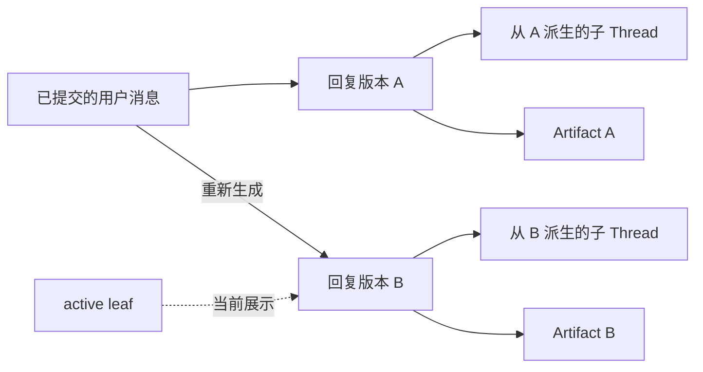

# thread-chat 消息操作：EARS 产品需求

## 文档信息

- 需求名称：`add-thread-chat-message-actions`
- 文档类型：Kiro Requirements-First 风格的产品需求
- 状态：基于已完成 OpenSpec change 的复述稿
- 适用范围：`/thread-chat/{treeId}` 的列模式与画布模式
- 追踪方式：每条验收标准使用稳定的 `AC-*` 编号，测试文档以该编号反向追踪

## 写法说明

本文采用 Kiro Feature Specs 使用的 EARS 句式：

```text
WHEN [条件或事件]
THE SYSTEM SHALL [可观察、可验证的系统行为]
```

EARS 只描述“系统应表现为什么”，不指定 React 组件、数据库表或函数实现。除非需求本身涉及协议、安全或持久化，不在验收标准中泄漏实现细节。

## 产品目标

作为 thread-chat 用户，我希望能复制、编辑、重新生成和评价消息；当生成过程异常时，我仍能恢复当前轮次；当同一问题出现多个回复版本时，旧回复、旧 Artifact 和由旧回复派生的子 Thread 仍然保持准确来源。



## 核心术语

- `messageId`：用户可见消息的产品身份；复制、编辑、版本、反馈、Artifact 和子 Thread 来源均以它为准。
- `generationId`：一次后台模型执行的身份；用于运行、停止、恢复、幂等、计费和观测，不作为产品反馈的主键。
- active path：从 Thread 根消息到 `activeLeafMessageId` 的当前展示路径。
- 回复版本：同一最新轮次下，由编辑问题或重新生成回复形成的完整问答备选路径。
- recoverable turn：树可正常读取，但其中一轮需要用户重试或编辑后重试的结构化恢复状态。

## 范围边界

- 本需求只允许编辑当前 active path 的最后一条 user 消息。
- 本需求只允许重新生成当前 active path 最后一轮且状态为 `done` 的 assistant 消息。
- 不支持破坏性编辑历史轮次、截断后续消息、重接任意历史路径或迁移既有子 Thread。
- 不承诺找回从未形成可恢复终态的旧模型输出；该场景只能启动一次新的生成。
- 只接受严格 schema-v2 消息图，不隐式迁移旧线性消息数据。

## Requirement 1：服务端权威恢复轮次

**用户故事**：作为刷新或断线后的用户，我希望系统依据已保存的树和后台执行事实恢复当前轮次，避免把仍在执行的回复误判为失败。

1. `AC-REC-01`

   WHEN 已保存的 user 消息存在当前 `running` 或 `stop_requested` generation，但 assistant 占位缺失或陈旧  
   THE SYSTEM SHALL 根据服务端 turn snapshot 恢复 assistant 目标并显示后台生成状态，且不得显示孤儿重试入口。

2. `AC-REC-02`

   WHEN 当前 generation 已完成、停止或失败并保存了结构化终态  
   THE SYSTEM SHALL 先合并该终态，再决定消息状态，且不得发起重复模型调用。

3. `AC-REC-03`

   WHEN `pending` 或 `streaming` assistant 没有匹配的当前 generation  
   THE SYSTEM SHALL 保留该消息的 `messageId`、已有正文和 Artifact，将其显示为可重试错误，而不得删除或假定完成。

4. `AC-REC-04`

   WHEN Thread 的 active leaf 是已提交 user，且没有 assistant child 或可恢复 generation  
   THE SYSTEM SHALL 正常显示原 user 消息，并提供绑定该轮次的“重试”和“编辑后重试”入口。

5. `AC-REC-05`

   WHEN 一棵可访问的树包含一个或多个 recoverable turn  
   THE SYSTEM SHALL 返回并展示完整可读历史，不得把局部轮次异常升级为整棵树加载失败。

## Requirement 2：孤儿 user 轮次恢复

**用户故事**：作为遇到“问题已保存但回复未建立”的用户，我希望直接重试或修改问题后重试，而不丢失原始提问。

1. `AC-ORP-01`

   WHEN 用户点击孤儿 user 轮次的“重试”  
   THE SYSTEM SHALL 复用原 user `messageId` 和原文，创建新的 assistant child 与 generation，并在持久化成功后开始生成。

2. `AC-ORP-02`

   WHEN 用户点击“编辑后重试”、修改为非空文本并发送  
   THE SYSTEM SHALL 创建 sibling user 和它的 assistant child，保留原 user 节点及原结构化 quote，并切换到新路径。

3. `AC-ORP-03`

   WHEN 新 user/assistant 路径无法通过持久化屏障  
   THE SYSTEM SHALL 不调用付费模型，保留可重试错误状态并向用户说明保存失败。

4. `AC-ORP-04`

   WHEN 孤儿轮次没有可恢复的 generation 终态  
   THE SYSTEM SHALL 将操作明确处理为一次新 generation，不得声称恢复了原调用的未持久化输出。

## Requirement 3：用户消息复制与编辑

**用户故事**：作为用户，我希望复制自己发送的 Markdown，并在不破坏历史的前提下修改最后一轮问题。

1. `AC-USR-01`

   WHEN 用户在任意 user 消息上触发“复制”且剪贴板写入成功  
   THE SYSTEM SHALL 写入该消息的原始 Markdown 文本，并在有限时间显示“已复制”。

2. `AC-USR-02`

   WHEN 用户点击当前 Thread 最后一条 user 消息的“重新编辑”  
   THE SYSTEM SHALL 将原气泡原位切换为预填原文的编辑框，并提供“取消”和“发送”。

3. `AC-USR-03`

   WHEN 用户在编辑器中点击“取消”  
   THE SYSTEM SHALL 恢复原消息展示，不修改持久化内容，也不启动 generation。

4. `AC-USR-04`

   WHEN 编辑后的文本为空或仅包含空白  
   THE SYSTEM SHALL 禁止提交，且不得创建消息或 generation。

5. `AC-USR-05`

   WHEN 用户查看并操作不是当前最后一轮的 user 消息  
   THE SYSTEM SHALL 继续允许复制，但禁用编辑并说明“仅支持编辑当前最后一轮”。

## Requirement 4：不可变消息版本

**用户故事**：作为用户，我希望编辑或重新生成时保留旧问答，以便在不同版本之间切换并继续访问旧版本的派生内容。

1. `AC-VER-01`

   WHEN 用户重新生成最新完成回复 A  
   THE SYSTEM SHALL 在同一 user parent 下创建新 assistant B，将 B 设为 active leaf，并保持 A 的正文、身份、反馈、Artifact 和派生子 Thread 不变。

2. `AC-VER-02`

   WHEN 用户编辑最新问题 U1 并发送  
   THE SYSTEM SHALL 创建与 U1 同 parent 的 user U2 及 assistant B，将 B 设为 active leaf，并保留 U1/A 路径。

3. `AC-VER-03`

   WHEN 最新轮次存在两个或更多问答版本  
   THE SYSTEM SHALL 显示有序的 `当前序号/总数` 版本切换器。

4. `AC-VER-04`

   WHEN 用户选择另一个回复版本  
   THE SYSTEM SHALL 一起切换该版本的 user、assistant、feedback、inline Artifact 和派生分支提示，不得拼接不同版本的问答。

5. `AC-VER-05`

   WHEN 用户刷新已切换过版本的树  
   THE SYSTEM SHALL 继续显示服务端已接受的 active leaf 版本。

## Requirement 5：修订号并发控制

**用户故事**：作为同时打开多个标签页的用户，我希望旧标签页不能静默覆盖新生成的消息版本或我明确选择的版本。

1. `AC-CAS-01`

   WHEN 客户端用陈旧 `baseRevision` 保存整棵树  
   THE SYSTEM SHALL 返回 `tree_revision_conflict`，且不得写入任何陈旧 state 字段。

2. `AC-CAS-02`

   WHEN 客户端以当前 revision 切换到合法的最新轮次 alternative  
   THE SYSTEM SHALL 原子更新 active leaf、递增 revision，并在刷新后保持该选择。

3. `AC-CAS-03`

   WHEN active-leaf 切换请求的 `baseRevision` 已被其他写入推进  
   THE SYSTEM SHALL 拒绝切换并要求客户端重新加载，不得覆盖更新后的消息图。

4. `AC-CAS-04`

   WHEN schema-v2 tree 收到不含 `baseRevision` 的整树 PUT  
   THE SYSTEM SHALL 返回 `revision_required`，不得接受旧客户端降写。

## Requirement 6：编辑发送替换当前执行

**用户故事**：作为用户，我希望可以在最后一轮仍生成时修改问题；只有真正发送新问题时才替换旧执行。

1. `AC-SUP-01`

   WHEN 用户只打开编辑器或修改草稿但未发送  
   THE SYSTEM SHALL 让当前 generation 继续运行，不停止执行，也不改变计费状态。

2. `AC-SUP-02`

   WHEN 用户在最后一轮仍生成时提交编辑  
   THE SYSTEM SHALL 停止或 supersede 旧 attempt，建立新路径与新 attempt，并保证该 Thread 最多一个 current generation。

3. `AC-SUP-03`

   WHEN 被 supersede 的旧 attempt 晚到终态结果  
   THE SYSTEM SHALL 不得让旧结果覆盖新 assistant 或切回旧 active leaf。

## Requirement 7：Assistant 消息操作

**用户故事**：作为用户，我希望复制、重新生成和评价已完成回复，同时不会把未完成或失败回复误当成可评价内容。

1. `AC-AST-01`

   WHEN assistant 消息为 `done`  
   THE SYSTEM SHALL 显示复制、重新生成、点赞和点踩操作；其中历史消息的重新生成须禁用并说明原因。

2. `AC-AST-02`

   WHEN assistant 消息为 `pending`、`streaming`、`error` 或其他未完成状态  
   THE SYSTEM SHALL 隐藏或禁用复制、点赞和点踩；错误恢复只显示独立 Retry。

3. `AC-AST-03`

   WHEN 用户复制含正文的 `done` assistant 消息  
   THE SYSTEM SHALL 把原始 Markdown 正文写入剪贴板，并短暂显示“已复制”。

4. `AC-AST-04`

   WHEN `done` assistant 的 Markdown 正文为空  
   THE SYSTEM SHALL 禁用复制并说明没有可复制正文，不得复制错误文案、DOM 文本或 Artifact 内容。

5. `AC-AST-05`

   WHEN 用户重新生成当前最后一轮 `done` assistant  
   THE SYSTEM SHALL 创建新的 assistant `messageId` 与 generation，立即显示等待状态，并保留原回复为可切换版本。

6. `AC-AST-06`

   WHEN 用户查看后面仍有对话历史的 `done` assistant  
   THE SYSTEM SHALL 允许复制与评价，但禁用重新生成并说明“仅支持重新生成当前最后一轮”。

7. `AC-AST-07`

   WHEN `done` assistant 有稳定 `messageId` 但前端 view model 没有 `generationId`  
   THE SYSTEM SHALL 仍允许复制、点赞和点踩，不得提示“没有可评价的 generation”。

## Requirement 8：消息级反馈

**用户故事**：作为用户，我希望赞踩只评价当前看到的具体回复，并在刷新后保持，不污染重新生成的新回复。

1. `AC-FBK-01`

   WHEN 用户对未评价的 `done` assistant 点赞或点踩  
   THE SYSTEM SHALL 按该 `messageId` 保存反馈，并以 `aria-pressed` 或等价语义显示唯一选中态。

2. `AC-FBK-02`

   WHEN 用户先点赞后点踩同一消息  
   THE SYSTEM SHALL 将反馈更新为 negative，并只显示点踩选中。

3. `AC-FBK-03`

   WHEN 用户再次点击同一已选反馈按钮  
   THE SYSTEM SHALL 清除该消息反馈并取消选中态。

4. `AC-FBK-04`

   WHEN 客户端重复提交相同反馈值  
   THE SYSTEM SHALL 幂等保留单一结果。

5. `AC-FBK-05`

   WHEN 用户刷新已评价消息所在的树  
   THE SYSTEM SHALL 从服务端恢复该 `messageId` 的反馈状态。

6. `AC-FBK-06`

   WHEN 已评价回复被重新生成并产生新的 sibling assistant  
   THE SYSTEM SHALL 让新消息从未评价状态开始，同时保留旧消息自己的反馈。

7. `AC-FBK-07`

   WHEN 反馈保存请求失败  
   THE SYSTEM SHALL 回滚乐观选择并显示“反馈保存失败，请重试”。

## Requirement 9：子 Thread 来源不变

**用户故事**：作为从某段回复创建子 Thread 的用户，我希望它永远引用当时那条准确回复，而不是后来生成的相似文本。

1. `AC-FRK-01`

   WHEN child Thread X 从 assistant A 的划选文本创建，随后父 Thread 切换到 sibling B  
   THE SYSTEM SHALL 保持 X 的 `forkFromMsgId` 指向 A，并让 X 继续继承截止 A 的准确上下文。

2. `AC-FRK-02`

   WHEN X 的分栏已打开且父列从 A 切换到 B  
   THE SYSTEM SHALL 保持 X 分栏打开，标注“基于回复 n/N · 当前未展示”，并提供“查看来源”。

3. `AC-FRK-03`

   WHEN A 的 child Thread 未打开且父列当前显示 B  
   THE SYSTEM SHALL 不在 B 正文显示 A 的锚点脚注，但仍让用户通过版本或子树导航发现该 child Thread。

4. `AC-FRK-04`

   WHEN 用户从 B 划选文字创建 child Thread Y  
   THE SYSTEM SHALL 只把 Y 绑定到 B，不按 quote 相似性改绑到 A。

## Requirement 10：Artifact 来源不变

**用户故事**：作为使用回复产出物的用户，我希望不同回复版本的 Artifact 分别保存，并能重新访问历史版本资产。

1. `AC-ART-01`

   WHEN assistant A 和 sibling B 分别生成 Artifact A 与 Artifact B  
   THE SYSTEM SHALL 分别以 A、B 的 `messageId` 作为来源保存，且不得覆盖、合并或交换 ownership。

2. `AC-ART-02`

   WHEN active leaf 为 B  
   THE SYSTEM SHALL 默认展示 B 的 active path Artifact，并保留 A 的 Artifact 于持久化 registry。

3. `AC-ART-03`

   WHEN 用户正在查看 Artifact A 后切换到 B  
   THE SYSTEM SHALL 保持 Artifact A 标签打开，并标注其为历史回复版本资产。

4. `AC-ART-04`

   WHEN 用户从 B 切回 A  
   THE SYSTEM SHALL 让 Artifact A 恢复为当前版本资产，并保持原内容与来源不变。

## Requirement 11：权限、严格协议与数据不变量

**用户故事**：作为用户，我希望消息操作只能访问自己的严格有效数据，并且旧客户端或损坏数据不能破坏当前消息图。

1. `AC-SEC-01`

   WHEN 用户尝试读取或修改不属于自己的 tree、thread 或 message 反馈  
   THE SYSTEM SHALL 拒绝请求，且不得泄露目标资源是否存在。

2. `AC-SEC-02`

   WHEN generation start 缺少显式 intent，或 intent 与目标轮次结构不匹配  
   THE SYSTEM SHALL 在调用模型前以稳定错误码拒绝请求。

3. `AC-SEC-03`

   WHEN 保存树缺少 schema-v2、message parent、active leaf 或 Artifact source identity，或消息图存在环、重复 ID、缺失 parent  
   THE SYSTEM SHALL 拒绝该数据，不得按数组位置或文本相似度猜测修复。

4. `AC-SEC-04`

   WHEN 服务端读取系统生成且状态为 `done` 的 assistant message  
   THE SYSTEM SHALL 能找到通过 `assistantMessageId` 关联的 generation；关联缺失时将其视为数据不变量错误，而非正常可反馈消息。

5. `AC-SEC-05`

   WHEN 同一个 `generationId` 的已接受请求被重放  
   THE SYSTEM SHALL 返回同一执行结果或状态，不重复创建 sibling，不重复调用模型，也不重复计费。

## Requirement 12：列/画布一致与可访问性

**用户故事**：作为使用不同视图或辅助技术的用户，我希望相同消息操作拥有同一状态、语义和结果。

1. `AC-UX-01`

   WHEN 用户在列模式执行复制、编辑、重新生成、版本切换、恢复或反馈后切换到画布模式，或反向操作  
   THE SYSTEM SHALL 显示同一 active path、消息、generation、来源分支、Artifact 和反馈状态。

2. `AC-UX-02`

   WHEN 消息操作按钮只显示图标  
   THE SYSTEM SHALL 提供可读的中文 accessible name，并为反馈按钮提供 `aria-pressed` 或等价状态。

3. `AC-UX-03`

   WHEN 用户只使用键盘导航消息操作  
   THE SYSTEM SHALL 让操作入口可聚焦、焦点可见、可激活，并能操作版本切换与编辑器。

4. `AC-UX-04`

   WHEN 设备为触摸输入或用户启用 `prefers-reduced-motion`  
   THE SYSTEM SHALL 保持操作入口可发现，并减少非必要旋转与淡入动画而不隐藏状态反馈。

## 需求追踪摘要

- 恢复与孤儿轮次：`AC-REC-*`、`AC-ORP-*`
- 用户消息操作：`AC-USR-*`
- 不可变版本与并发：`AC-VER-*`、`AC-CAS-*`、`AC-SUP-*`
- Assistant 操作与反馈：`AC-AST-*`、`AC-FBK-*`
- 子 Thread 与 Artifact 来源：`AC-FRK-*`、`AC-ART-*`
- 安全协议、跨视图与可访问性：`AC-SEC-*`、`AC-UX-*`
