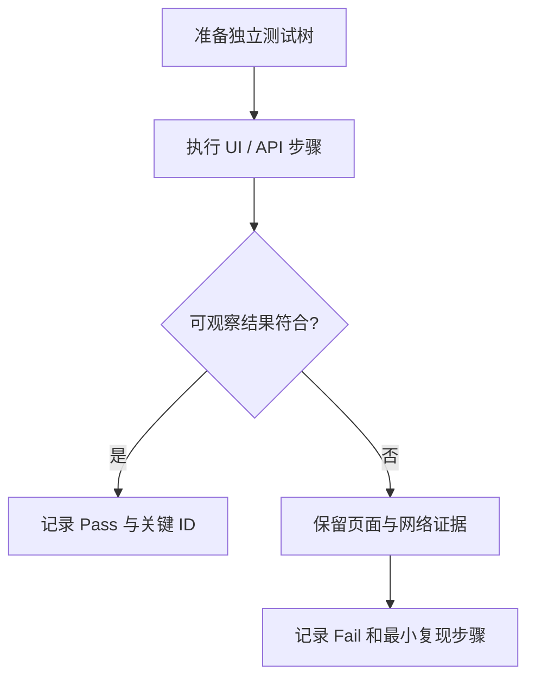

# thread-chat 消息操作逐条复测 Case

## 1. 文档用途

本文件用于测试人员按 List 从上到下逐条复测 `add-thread-chat-message-actions`。每条 Case 都给出需求追踪、前置条件、步骤和预期结果；执行时在标题前的复选框打勾，并填写结果。

## 2. 执行约定

- 测试入口：`/thread-chat/{treeId}`。
- 浏览器：至少覆盖一个 Chromium 桌面环境；触摸和 reduced-motion Case 使用浏览器模拟。
- 账号：准备用户 A、用户 B 两个互相隔离的账号。
- 模型：使用能够稳定返回 Markdown 的测试模型；涉及计费断言时使用可查 generation/usage 的测试环境。
- 数据：每个破坏性或故障注入 Case 使用独立 tree，避免前一个 Case 污染后续结果。
- 证据：失败时至少保存 treeId、threadId、messageId、时间、页面截图、网络响应状态与响应体；不得把完整敏感消息正文写入公共缺陷单。
- 结果字段：`Pass / Fail / Blocked / Not Run`。

## 3. 基础功能 List

### - [ ] TC-001：复制 user 原始 Markdown

- 追踪：`AC-USR-01`
- 前置条件：当前 Thread 有一条内容为 `**粗体**\n\n- item` 的 user 消息。
- 步骤：
  1. hover 或聚焦该 user 消息。
  2. 点击“复制”。
  3. 将剪贴板内容粘贴到纯文本编辑器。
- 预期：
  1. 粘贴内容逐字符等于原始 Markdown，而不是渲染后的富文本或 HTML。
  2. 按钮短暂显示“已复制”，稍后恢复为“复制”。
- 执行结果：

### - [ ] TC-002：复制 user 不混入 quote 或工具栏文本

- 追踪：`AC-USR-01`
- 前置条件：user 消息同时包含结构化 quote 和正文。
- 步骤：复制该消息并粘贴到纯文本编辑器。
- 预期：剪贴板只包含消息正文 `msg.text`；不包含 quote 展示文本、“复制”“重新编辑”等 DOM 文案。
- 执行结果：

### - [ ] TC-003：编辑最后一轮 user 并取消

- 追踪：`AC-USR-02`、`AC-USR-03`
- 前置条件：当前 active path 已有完成的最后一轮问答。
- 步骤：
  1. 点击最后一条 user 消息的“重新编辑”。
  2. 确认编辑框预填原文。
  3. 修改文本但点击“取消”。
  4. 刷新页面。
- 预期：原气泡恢复；文本保持原值；没有新消息、没有新 generation、没有新的版本切换项。
- 执行结果：

### - [ ] TC-004：空白编辑不可提交

- 追踪：`AC-USR-04`
- 前置条件：最后一条 user 消息可编辑。
- 步骤：打开编辑器，输入仅空格和换行。
- 预期：“发送”不可用；快捷键提交也不创建新节点或 generation。
- 执行结果：

### - [ ] TC-005：编辑最后一轮形成新问答版本

- 追踪：`AC-VER-02`、`AC-USR-02`
- 前置条件：路径 `U1 → A` 已完成，并记录 U1/A 的 messageId。
- 步骤：
  1. 编辑 U1 为不同的非空文本并发送。
  2. 等待新回复 B 完成。
  3. 使用版本切换器来回切换。
- 预期：
  1. 新路径为 sibling user U2 及其 assistant B，U2/B 使用新 messageId。
  2. U1/A 仍可完整切回，正文未被覆盖。
  3. 当前默认展示 U2/B，不出现 U1+B 或 U2+A 的错配。
- 执行结果：

### - [ ] TC-006：历史 user 只可复制、不可编辑

- 追踪：`AC-USR-05`
- 前置条件：Thread 至少有两轮对话。
- 步骤：hover 或聚焦第一轮 user 消息，检查操作并尝试编辑。
- 预期：复制可用；编辑不可执行，并可读取“仅支持编辑当前最后一轮”的解释；后续历史不被删除。
- 执行结果：

### - [ ] TC-007：完成回复显示完整操作栏

- 追踪：`AC-AST-01`
- 前置条件：有一条正文非空且状态为 `done` 的最新 assistant 消息。
- 步骤：hover、聚焦或使用触摸方式打开操作入口。
- 预期：可发现“复制”“重新生成”“点赞”“点踩”四个操作。
- 执行结果：

### - [ ] TC-008：未完成回复不暴露产品操作

- 追踪：`AC-AST-02`
- 前置条件：分别准备 `pending`、`streaming`、`error` assistant。
- 步骤：检查三种状态下消息区域和键盘焦点顺序。
- 预期：
  1. 三种状态均没有可执行的复制、点赞、点踩。
  2. `pending/streaming` 显示生成状态。
  3. `error` 仅提供独立“重试”，不伪装成完成回复。
- 执行结果：

### - [ ] TC-009：复制 assistant 原始 Markdown

- 追踪：`AC-AST-03`
- 前置条件：完成回复正文包含标题、列表、代码块，并另有 Artifact 卡片。
- 步骤：点击 assistant 的“复制”，粘贴到纯文本编辑器。
- 预期：剪贴板只包含回复的原始 Markdown 正文；不包含渲染 HTML、工具栏、Artifact 内容或错误文案；按钮短暂显示“已复制”。
- 执行结果：

### - [ ] TC-010：空正文完成回复不可复制

- 追踪：`AC-AST-04`
- 前置条件：通过测试 fixture 准备 `done` 且 `text` 为空的 assistant。
- 步骤：检查复制操作并读取禁用原因。
- 预期：复制不可执行，原因是“该回复没有可复制的 Markdown 正文”；剪贴板原内容不变。
- 执行结果：

### - [ ] TC-011：重新生成最后一轮回复

- 追踪：`AC-AST-05`、`AC-VER-01`、`AC-VER-03`
- 前置条件：最新路径 `U → A` 已完成，记录 A 的 messageId。
- 步骤：
  1. 点击 A 的“重新生成”。
  2. 观察即时状态。
  3. 等待 B 完成并检查版本切换器。
- 预期：
  1. 立即出现新的等待/生成状态。
  2. B 使用新 messageId，A 保留且内容不变。
  3. 版本切换器显示 `2/2`，可切回 A。
- 执行结果：

### - [ ] TC-012：历史 assistant 不可重新生成

- 追踪：`AC-AST-06`
- 前置条件：Thread 至少两轮，第一轮 assistant 为 `done`。
- 步骤：检查第一轮 assistant 操作。
- 预期：复制、点赞、点踩可用；重新生成禁用，并说明“仅支持重新生成当前最后一轮”；历史及后续消息不变化。
- 执行结果：

### - [ ] TC-013：完成消息不依赖前端 generationId

- 追踪：`AC-AST-07`
- 前置条件：fixture 中 `done` assistant 有稳定 messageId 和服务端 generation 关联，但前端消息 view model 不含 generationId。
- 步骤：复制、点赞、点踩该消息。
- 预期：三项均正常；页面不出现“没有可评价的 generation”一类提示。
- 执行结果：

## 4. 反馈 List

### - [ ] TC-014：点赞、点踩互斥切换

- 追踪：`AC-FBK-01`、`AC-FBK-02`
- 前置条件：未评价的 `done` assistant。
- 步骤：先点“点赞”，再点“点踩”。
- 预期：点赞后只有点赞为 pressed；点踩后只有点踩为 pressed；服务端该 messageId 最终值为 `negative`。
- 执行结果：

### - [ ] TC-015：再次点击同一反馈可清除

- 追踪：`AC-FBK-03`
- 前置条件：消息已点赞。
- 步骤：再次点击“点赞”，然后刷新。
- 预期：选中态被清除；刷新后仍为未评价；服务端不存在该消息的有效反馈记录。
- 执行结果：

### - [ ] TC-016：重复提交相同反馈幂等

- 追踪：`AC-FBK-04`
- 前置条件：取得用户 A 自有的 treeId、threadId、done assistant messageId。
- 步骤：通过 API 连续两次 PUT 相同 `positive` 值。
- 预期：两次请求均返回一致成功语义；最终只有一个反馈结果，无重复记录或冲突错误。
- 执行结果：

### - [ ] TC-017：刷新恢复 message 反馈

- 追踪：`AC-FBK-05`
- 前置条件：对 assistant A 点踩成功。
- 步骤：刷新页面，再切换列/画布各检查一次。
- 预期：A 在两种视图中都恢复点踩 pressed 状态。
- 执行结果：

### - [ ] TC-018：重新生成不继承旧反馈

- 追踪：`AC-FBK-06`
- 前置条件：assistant A 已点赞。
- 步骤：重新生成得到 B，检查 B；再切回 A。
- 预期：B 未评价；A 仍为点赞；A/B 的反馈没有互相迁移。
- 执行结果：

### - [ ] TC-019：反馈保存失败回滚

- 追踪：`AC-FBK-07`
- 前置条件：用网络拦截或测试开关让 feedback PUT 返回失败。
- 步骤：点击未评价消息的“点赞”。
- 预期：短暂乐观状态最终回滚为未选中，并显示“反馈保存失败，请重试”；刷新后仍未评价。
- 执行结果：

### - [ ] TC-020：非完成 assistant 反馈 API 被拒绝

- 追踪：`AC-AST-02`、`AC-SEC-04`
- 前置条件：取得 pending、streaming 或 error assistant messageId。
- 步骤：绕过 UI 调用反馈 PUT。
- 预期：服务端返回稳定的 4xx，未写反馈；后续 tree GET 不返回该消息的反馈摘要。
- 执行结果：

## 5. 版本与并发 List

### - [ ] TC-021：回复版本切换完整一致

- 追踪：`AC-VER-03`、`AC-VER-04`
- 前置条件：通过编辑或重新生成形成两个完整问答版本，且两条 assistant 的文本与反馈不同。
- 步骤：使用“上一个回复版本”“下一个回复版本”来回切换。
- 预期：序号、user、assistant、反馈、inline Artifact 和派生分支数同时切换；不存在跨版本拼接。
- 执行结果：

### - [ ] TC-022：版本选择刷新后保持

- 追踪：`AC-VER-05`、`AC-CAS-02`
- 前置条件：当前显示 `2/2`。
- 步骤：切换到 `1/2`，等待保存完成后刷新。
- 预期：刷新后仍显示 `1/2`；服务端 revision 已递增。
- 执行结果：

### - [ ] TC-023：陈旧整树 PUT 不覆盖新版本

- 追踪：`AC-CAS-01`
- 前置条件：标签页 A、B 打开同一 tree，二者起始 revision 相同。
- 步骤：
  1. 标签页 A 重新生成 B，使 revision 前进。
  2. 标签页 B 使用旧 `baseRevision` 触发整树保存。
  3. 刷新两个标签页。
- 预期：标签页 B 的请求返回 `409 tree_revision_conflict`；新节点 B、旧节点 A、fork、Artifact 和 active leaf 均未被旧快照覆盖。
- 执行结果：

### - [ ] TC-024：陈旧版本切换被拒绝

- 追踪：`AC-CAS-03`
- 前置条件：两个标签页持有同一旧 revision，且已有 A/B 两个版本。
- 步骤：标签页 A 先产生任意有效写入；标签页 B 用旧 revision 切换版本。
- 预期：切换请求返回 `tree_revision_conflict`；客户端重新加载服务端状态，不乐观覆盖更新后的 active leaf。
- 执行结果：

### - [ ] TC-025：缺少 baseRevision 的旧 PUT 被拒绝

- 追踪：`AC-CAS-04`
- 前置条件：取得用户自有 strict-v2 tree。
- 步骤：通过 API 发送不含 `baseRevision` 的整树 PUT。
- 预期：返回 `428 revision_required`；tree state 与 revision 均不变化。
- 执行结果：

### - [ ] TC-026：只打开编辑器不停止正在生成

- 追踪：`AC-SUP-01`
- 前置条件：最后一轮 assistant 正在 streaming。
- 步骤：打开最后一条 user 的编辑器，修改草稿但不发送，持续观察原回复。
- 预期：原 generation 继续 streaming 并可正常完成；没有 stop/supersede 请求，没有新 generation。
- 执行结果：

### - [ ] TC-027：生成中提交编辑会 supersede 旧 attempt

- 追踪：`AC-SUP-02`、`AC-SUP-03`
- 前置条件：最后一轮 assistant A 正在 streaming，具备延迟旧结果的测试能力。
- 步骤：编辑最后一条 user 并发送新文本，随后让旧 attempt 晚到结果。
- 预期：
  1. A 对应 attempt 被停止或 supersede。
  2. 新 U2/B 路径开始生成，Thread 最多一个 current generation。
  3. A 的晚到结果不覆盖 B、不切换 active leaf。
- 执行结果：

## 6. 恢复与故障 List

### - [ ] TC-028：孤儿 user 直接重试

- 追踪：`AC-REC-04`、`AC-ORP-01`、`AC-ORP-04`
- 前置条件：fixture 中 active leaf 是已提交 user，且没有 assistant child 或 generation。
- 步骤：加载树，点击“重试”，等待回复完成。
- 预期：
  1. 页面正常加载并显示“这条消息没有可恢复的 AI 回复。”以及重试入口。
  2. 原 user messageId 与原文不变。
  3. 新建 assistant child 与新 generation，持久化后才调用模型。
- 执行结果：

### - [ ] TC-029：孤儿 user 编辑后重试

- 追踪：`AC-ORP-02`
- 前置条件：与 TC-028 相同，且原 user 带结构化 quote。
- 步骤：点击“编辑后重试”，修改文本并发送。
- 预期：创建 sibling user 和 assistant child；quote 保留；原 user 不被覆盖；active path 切换到新问答。
- 执行结果：

### - [ ] TC-030：恢复路径持久化失败时不调用模型

- 追踪：`AC-ORP-03`
- 前置条件：让 generation preparation 的持久化事务稳定失败，并可观察模型调用计数。
- 步骤：对孤儿轮次执行直接重试或编辑后重试。
- 预期：显示保存失败的可重试错误；模型调用计数与计费记录不增加；原树保持可读。
- 执行结果：

### - [ ] TC-031：缺失 assistant 占位但后台 generation 仍运行

- 追踪：`AC-REC-01`
- 前置条件：fixture 中 generation 为 running/stop_requested，turn snapshot 有目标 identity，但树快照缺失或含陈旧 assistant 占位。
- 步骤：加载或刷新树。
- 预期：系统恢复目标 assistant 并显示后台生成；不显示孤儿 user 恢复条；最终结果合并到准确 messageId。
- 执行结果：

### - [ ] TC-032：generation 终态先于页面加载

- 追踪：`AC-REC-02`
- 前置条件：后台 generation 已完成、停止或失败并有结构化终态，客户端仍持有旧快照。
- 步骤：刷新页面并观察网络调用与消息状态。
- 预期：先合并既有终态；不创建重复 sibling、不启动重复模型调用；停止/失败态按对应终态显示。
- 执行结果：

### - [ ] TC-033：无 generation 的部分回复保留并转错误

- 追踪：`AC-REC-03`
- 前置条件：fixture 中 assistant 为 pending/streaming、有部分正文或 Artifact，但没有匹配 current generation。
- 步骤：加载树并记录 messageId、正文、Artifact。
- 预期：原 messageId、部分正文、Artifact 全部保留；状态转为可重试 error；未被删除，也未被标为 done。
- 执行结果：

### - [ ] TC-034：局部 recoverable turn 不阻止整树加载

- 追踪：`AC-REC-05`
- 前置条件：同一树包含正常历史和至少一个 recoverable turn。
- 步骤：加载树，展开正常历史并操作恢复条。
- 预期：tree GET 成功；正常历史完整可读；异常只在对应轮次显示，不出现整树错误页。
- 执行结果：

### - [ ] TC-035：刷新期间后台继续生成且不重复建节点

- 追踪：`AC-REC-01`、`AC-REC-02`、`AC-SEC-05`
- 前置条件：assistant 正在 streaming。
- 步骤：生成中连续刷新一次或两次，等待后台完成，再最终刷新。
- 预期：后台继续执行；最终只存在同一 generation 对应的一个 assistant 节点；不重复扣费、不重复创建 sibling；完成正文持久化。
- 执行结果：

## 7. 子 Thread 与 Artifact List

### - [ ] TC-036：从 A 派生的子 Thread 在切到 B 后保持来源

- 追踪：`AC-FRK-01`、`AC-FRK-02`
- 前置条件：从 assistant A 划选文字创建并打开 child Thread X，然后重新生成 B。
- 步骤：切到 B，继续在 X 中发送消息，再点击“查看来源”。
- 预期：X 始终保持打开且可继续对话；列头标注“基于回复 1/2 · 当前未展示”；继承上下文仍截止 A；“查看来源”切回 A。
- 执行结果：

### - [ ] TC-037：非当前版本不串显示锚点

- 追踪：`AC-FRK-03`
- 前置条件：A 有未打开 child Thread X，当前显示 sibling B。
- 步骤：检查 B 正文、版本切换器、子树导航和画布。
- 预期：B 正文不显示 A 的脚注或选区锚点；X 仍可从版本分支数、子树导航或画布发现。
- 执行结果：

### - [ ] TC-038：从 B 新建分支只绑定 B

- 追踪：`AC-FRK-04`
- 前置条件：A/B 含相同或相似文字，当前显示 B。
- 步骤：从 B 的相似文字创建 child Thread Y，刷新后检查来源与继承上下文。
- 预期：Y 的来源 messageId 为 B；不因文本相似改绑到 A；A 的 child 与 B 的 child 不交叉显示。
- 执行结果：

### - [ ] TC-039：A/B Artifact 分别归属并可切换

- 追踪：`AC-ART-01`、`AC-ART-02`、`AC-ART-04`
- 前置条件：assistant A 生成 Artifact A，重新生成的 B 生成 Artifact B。
- 步骤：在 A/B 间切换并检查 inline Artifact、drawer 与持久化 registry。
- 预期：A/B Artifact 分别绑定对应 messageId；当前路径默认只展示当前版本资产；切回 A 后 Artifact A 恢复为当前资产；二者都未被删除或覆盖。
- 执行结果：

### - [ ] TC-040：已打开历史 Artifact 不被强制关闭

- 追踪：`AC-ART-03`
- 前置条件：在 A 为当前版本时打开 Artifact A 标签。
- 步骤：切换到 B。
- 预期：Artifact A 标签仍打开，内容不变，并标注“历史版本”；默认当前资产区域按 B 更新。
- 执行结果：

## 8. 安全、协议与幂等 List

### - [ ] TC-041：反馈 owner 隔离且不泄露资源存在性

- 追踪：`AC-SEC-01`
- 前置条件：用户 A 拥有 tree/message；用户 B 已登录。
- 步骤：用户 B 使用 A 的 treeId/messageId 尝试读写反馈，再用随机不存在 ID 做相同请求。
- 预期：两类请求返回一致的非泄露性拒绝语义；A 的反馈和 tree 均不变化。
- 执行结果：

### - [ ] TC-042：缺失或错误 generation intent 在模型调用前被拒绝

- 追踪：`AC-SEC-02`
- 前置条件：可观察模型调用计数。
- 步骤：分别发送缺少 intent、source 不在最新轮次、identity 关系错误的 generation start 请求。
- 预期：返回稳定的 `invalid_turn`、`not_latest_turn` 或相应 4xx；模型调用和计费计数不增加。
- 执行结果：

### - [ ] TC-043：严格 schema-v2 拒绝损坏或旧数据

- 追踪：`AC-SEC-03`
- 前置条件：准备缺 schemaVersion、缺 parent、缺 active leaf、缺 Artifact source、消息环、重复 ID 六类 payload。
- 步骤：逐一提交树保存或 generation preparation。
- 预期：六类均在写入/模型调用前被拒绝；服务端不按数组位置、相邻项或 quote 文本猜测迁移。
- 执行结果：

### - [ ] TC-044：done assistant 缺失 generation 关联被识别为不变量错误

- 追踪：`AC-SEC-04`
- 前置条件：在隔离测试库构造系统生成、状态为 `done`、但无 `assistantMessageId` generation 关联的消息。
- 步骤：读取树并尝试提交反馈。
- 预期：系统返回结构化不变量错误或恢复状态；消息不作为正常可反馈完成消息开放；不写反馈。
- 执行结果：

### - [ ] TC-045：同 generationId 重放幂等

- 追踪：`AC-SEC-05`
- 前置条件：准备合法 generation start 请求并固定 generationId。
- 步骤：快速重放同一请求两次，等待终态后检查消息图、generation、usage 和计费。
- 预期：只创建一个 assistant sibling 和一个执行；模型只调用一次；usage/计费只记一次；两次请求均指向同一 attempt。
- 执行结果：

## 9. 视图一致性与可访问性 List

### - [ ] TC-046：列模式与画布模式共享状态

- 追踪：`AC-UX-01`
- 前置条件：有 A/B 两个版本、不同反馈、至少一个 child Thread 和 Artifact。
- 步骤：
  1. 在列模式切版本、评价消息。
  2. 切到画布模式检查并执行一次相反操作。
  3. 切回列模式。
- 预期：两种视图始终显示同一 active path、反馈、generation、来源分支与 Artifact；没有独立或延迟冲突状态。
- 执行结果：

### - [ ] TC-047：图标按钮 accessible name 与 pressed 状态

- 追踪：`AC-UX-02`
- 前置条件：使用浏览器 Accessibility Tree 或读屏软件。
- 步骤：检查复制、重新编辑、重新生成、点赞、点踩、前后版本按钮。
- 预期：每个按钮都有可读中文名称；点赞/点踩准确暴露 pressed 状态；busy/copied/error 状态有可感知反馈。
- 执行结果：

### - [ ] TC-048：纯键盘完成消息操作

- 追踪：`AC-UX-03`
- 前置条件：不使用鼠标。
- 步骤：用 Tab/Shift+Tab/Enter/Space 操作 user 编辑、取消/发送、assistant 复制/反馈、版本前后切换。
- 预期：所有入口可聚焦，焦点样式可见，顺序合理，操作结果与鼠标一致；焦点不会陷入隐藏工具栏。
- 执行结果：

### - [ ] TC-049：触摸设备可发现消息操作

- 追踪：`AC-UX-04`
- 前置条件：浏览器模拟无 hover 的触摸设备。
- 步骤：访问 user 与 `done` assistant 消息操作。
- 预期：无需 hover 也能发现并触发操作；操作入口不被气泡或滚动容器遮挡。
- 执行结果：

### - [ ] TC-050：reduced-motion 保留状态反馈

- 追踪：`AC-UX-04`
- 前置条件：启用 `prefers-reduced-motion: reduce`。
- 步骤：执行复制、重新生成和反馈。
- 预期：非必要旋转与淡入动画被移除或显著降低；“已复制”、生成中、pressed 和错误状态仍清楚可见。
- 执行结果：

## 10. 主链路回归 List

### - [ ] TC-051：普通发送不受消息操作功能影响

- 追踪：回归保护
- 前置条件：新建空白 thread-chat tree。
- 步骤：发送普通问题并等待回复完成，刷新页面。
- 预期：user 与 assistant 正常持久化；流式展示、完成正文、计费与刷新恢复正常；完成后才出现 assistant 操作栏。
- 执行结果：

### - [ ] TC-052：显式 Stop 仍独立工作

- 追踪：回归保护、`AC-SUP-01`
- 前置条件：assistant 正在 streaming。
- 步骤：点击现有 Stop，而不是编辑或重新生成。
- 预期：仅当前 generation 收到停止请求；终态按现有 Stop 契约展示；不会误创建新消息版本。
- 执行结果：

### - [ ] TC-053：Markdown、quote、Artifact 与划选开分支回归

- 追踪：回归保护、`AC-FRK-*`、`AC-ART-*`
- 前置条件：生成含 Markdown、quote 和 Artifact 的回复。
- 步骤：检查 Markdown 渲染；从正文划选创建 child Thread；打开 Artifact；再执行一次重新生成和版本切换。
- 预期：原有渲染、划选锚点、分支创建、Artifact drawer 均正常；新增版本操作不破坏 `.message/.bubble` 的划选和定位行为。
- 执行结果：

## 11. 收口标准

- P0 必测：`TC-001` 至 `TC-053` 全部执行。
- 发布阻断：任何 owner 越权、付费模型重复调用/重复计费、旧标签页覆盖消息图、旧回复/Artifact/child Thread 丢失、跨版本问答拼接，均按阻断问题处理。
- 允许带已知限制通过：只能编辑/重新生成 active path 最后一轮；历史轮次对应操作明确禁用且有解释。
- 完成记录至少包含：构建版本、环境、浏览器、执行人、执行日期、Pass/Fail/Blocked 数量、缺陷链接。

