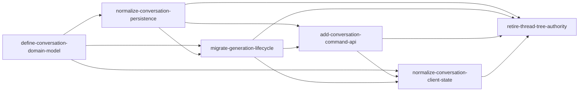

# Issue 34 OpenSpec Supersession Map

## 目的与规则

本文只声明规范权威的替代关系，不修改历史事实。

1. 已完成的旧 proposal/design/spec/tasks 保留，作为当时决策和交付证据。
2. 旧 change 中未完成的任务保持 `[ ]`；不能因为新架构覆盖了同一风险就回头补勾。
3. “被替代”仅指领域模型、持久化协议或运行时 authority；仍正确的渲染、交互和产品验收继续保留。
4. 新 changes 只有在各自必需任务和 `retire-thread-tree-authority` 的 cutover/观察/删除门禁完成后，才成为生产唯一权威。

## 新权威链

最终领域与运行时权威是 `Project → Conversation → Thread → Turn/Message/Generation`，分叉事实由 `ThreadFork(parentThreadId, sourceMessageId, childThreadId)` 表达。`ThreadTreeState`、魔法 `main`、整树 PUT 和 `branch_*` sidecar 不再定义领域事实。

## Change 级映射

| 旧 change / capability                                     | 处置                                  | 新权威                                                                                                                                   | 保留内容                                                    |
| ---------------------------------------------------------- | ------------------------------------- | ---------------------------------------------------------------------------------------------------------------------------------------- | ----------------------------------------------------------- |
| `add-branch-tree-persistence`                              | 领域与持久化协议完全替代              | `define-conversation-domain-model`、`normalize-conversation-persistence`、`add-conversation-command-api`、`retire-thread-tree-authority` | 历史迁移、当时的 owner/revision 风险记录                    |
| `add-tree-list-ui` 中的 branch-tree persistence delta      | 数据源和 identity 替代                | `add-conversation-command-api` 的 Conversation list + `normalize-conversation-client-state`                                              | 列表信息架构、重命名/归档等仍有效产品行为                   |
| `persist-thread-chat-generations`                          | Generation authority 完全替代         | `migrate-generation-lifecycle`、canonical persistence/API/client、cutover                                                                | 竞态、Stop、stale、计费 exactly-once 等风险案例作为历史输入 |
| `add-thread-chat-message-actions` 的 Tree/Message DAG 身份 | 身份和写协议替代                      | canonical Message ID、Turn variant、ThreadFork、command API                                                                              | copy/edit/regenerate/feedback 的用户行为与视觉设计          |
| `add-canvas-conversations` 的树数据输入                    | 图数据来源替代                        | Conversation snapshot + Thread/ThreadFork normalized client                                                                              | 画布布局与交互能力                                          |
| `add-markdown-artifacts` 的 Tree artifact provenance       | provenance 与持久化替代               | canonical `conversation_artifacts` + stable Conversation/Thread/Message ID                                                               | Markdown 渲染、代码块和 Artifact 展示能力                   |
| `add-bubble-composer`                                      | 不替代展示能力；仅替换其数据/发送接线 | canonical client + command/Generation API                                                                                                | composer 布局、输入和附件交互                               |
| `fix-thread-chat-help-panel`                               | 不替代                                | 无领域 authority                                                                                                                         | Help UI 行为独立保留                                        |

## `persist-thread-chat-generations` 未完成项逐条处置

原 change 的以下任务必须继续保持未勾选：

| 原任务                                                                     | 历史状态 | 新链中的覆盖证据                                                                                                         | 结论                                              |
| -------------------------------------------------------------------------- | -------- | ------------------------------------------------------------------------------------------------------------------------ | ------------------------------------------------- |
| 4.5 branch-tree API owner CRUD、越权、认领、terminal merge、running delete | `[ ]`    | canonical persistence/command API DB tests 与 HTTP owner/幂等/revision tests；legacy route 在 canonical authority 下 410 | 风险已由新协议覆盖；不补做旧整树 API 验收         |
| 7.4 legacy Stop 自然完成竞态、重复/跨用户 Stop、stale/current 查询         | `[ ]`    | `migrate-generation-lifecycle` 的 lease/checkpoint/Stop/stale policy 和 canonical Generation tests                       | 新 lifecycle 替代；不把旧 sidecar 重新确认为权威  |
| 10.3 旧 attempt、Stop-vs-complete、running tree 删除竞态                   | `[ ]`    | canonical Generation lifecycle、Turn current Generation 约束、billing exactly-once 测试                                  | 风险场景迁移到 canonical 模型；旧任务保留未完成   |
| 10.4 双用户 legacy Tree/Generation/Stop + Ego Browser                      | `[ ]`    | canonical owner/workspace/project 隔离 DB/API tests、邮箱登录 HTTP 测试和 Ego Browser canonical smoke                    | 验收对象已变更；不得为补勾而恢复 legacy authority |
| 10.6 全套旧 change tests/lint/build/validate                               | `[ ]`    | 新 change 链分别保存 typecheck/lint/build/OpenSpec/DB/HTTP 证据                                                          | 不能倒推旧 change 当时已经通过                    |
| 10.8 旧 change 提交前格式化与工作树复核                                    | `[ ]`    | 无可替代的历史时点证据                                                                                                   | 永久保留未完成，不补勾                            |

## Spec/capability 最终归属

归档新 changes 后，最终 spec 必须满足：

- `domain`：只定义 Workspace/Project/Conversation/Thread/ThreadFork/Turn/Message/Generation 等 canonical 术语。
- `conversation-persistence`：关系表、约束、事务和 snapshot hydration 是唯一持久化语义。
- `conversation-generation-lifecycle`：Generation intent、lease、checkpoint、Stop/stale、usage/billing 是唯一执行语义。
- `conversation-command-api`：认证、幂等、revision/ETag、命令和查询是唯一服务端写入口。
- `conversation-client-state`：normalized entity store、订阅/挂载/取消订阅与 optimistic reconciliation 是唯一客户端状态语义。
- `conversation-cutover`：authority、维护、导入/reset、观察、legacy 拒绝与物理删除门禁。

旧 `branch-tree-persistence` capability 不得继续出现在最终现行 specs 中；它只能留在历史 change/archive 中。Markdown、composer、canvas、message actions 等 capability 可以继续存在，但不得重新引入 Tree authority。

## 归档顺序（8.4 的输入，不代表现在执行）

1. `define-conversation-domain-model`
2. `normalize-conversation-persistence`
3. `migrate-generation-lifecycle`
4. `add-conversation-command-api`
5. `normalize-conversation-client-state`
6. 完成 cutover、观察和删除门禁后归档 `retire-thread-tree-authority`

任何依赖 change 未完成时不得提前归档其下游；`retire-thread-tree-authority` 当前仍有目标环境、观察窗口和物理删除任务，8.4 必须保持未完成。
