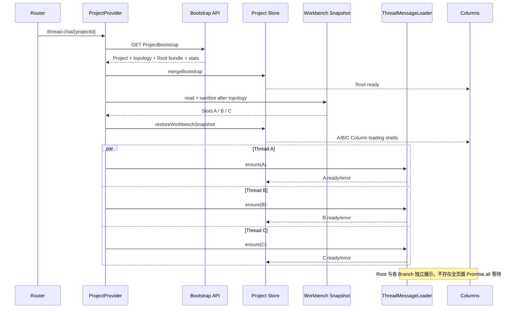

# 打开已有 Project 生命周期

## 1. 先区分三种“缓存”

打开 `/thread-chat/{projectId}` 时可能存在三种完全不同的缓存，不能混为一谈：

```text
Project Catalog Cache
  只含 ProjectSummary；不影响 Project 页面能否加载

ThreadWorkbenchSnapshot（localStorage）
  只含 Column Slot、Thread ID、宽度、折叠态、焦点和视图模式
  不含 Project/Thread/Message/Run 实体

ProjectRuntime Message Cache（内存）
  只在当前 ProjectRuntime 生命周期内存在
  threadMessagesById[threadId]=ready 时可避免重复请求
```

浏览器 HTTP Cache 不作为领域正确性或 Zustand 恢复机制。P0 在 ProjectRuntime 最后一个 Provider lease 释放后销毁 Runtime，不承诺跨 Project 路由保存 Message 内存缓存；页面刷新后一定重新 Bootstrap。

## 2. 路由与 Provider

```ts
function enterExistingProjectRoute(projectId: ProjectId) {
  // projectId 直接来自 URL；不写入 App Store selectedProjectId。
  const runtime = appRuntime.projectRuntimeRegistry.acquire(projectId)

  if (runtime.store.getState().requests.bootstrap.status === "ready") {
    // /new seed handoff 或同一 Runtime 已经完成 Bootstrap。
    runtime.generationCoordinator.resumeLoadedRuns()
    return runtime
  }

  // Catalog 是否已经加载不构成前置条件。
  void runtime.commands.loadProjectBootstrap()
  return runtime
}
```

在 Bootstrap 完成前，Project 页面只有一个 Project-level loading shell。不能根据 Catalog Summary 构造假 Project Entity 或 Root Thread。

## 3. 冷启动 Bootstrap

```ts
async function loadProjectBootstrap(): Promise<void> {
  const state = store.getState()

  if (state.requests.bootstrap.status === "ready") return
  if (bootstrapPromise) return bootstrapPromise

  state.setBootstrapLoadState({ status: "loading" })

  bootstrapPromise = api
    .getProjectBootstrap(runtime.projectId)
    .then((bootstrap) => {
      validateProjectBootstrap(bootstrap, {
        expectedProjectId: runtime.projectId,
      })

      /**
       * 一次 State Transition 合并：
       * - Project Entity
       * - 全量轻量 Thread topology
       * - Artifact Summary
       * - Root Message/Run；Artifact 正文仍按 ID 加载
       * - Root ThreadMessageWindow ready
       * - Bootstrap ready
       */
      store.getState().mergeBootstrap(bootstrap)

      restoreWorkbenchAndLoadBranches(bootstrap.threadTopology)
      generationCoordinator.resumeLoadedRuns()
    })
    .catch((error) => {
      if (runtimeDisposed || isAbortError(error)) return
      store.getState().setBootstrapLoadState({
        status: "error",
        error: normalizeError(error),
      })
    })
    .finally(() => {
      bootstrapPromise = null
    })

  return bootstrapPromise
}
```

## 4. 没有 Workbench Snapshot

```ts
function restoreWithoutSnapshot(rootThreadId: ThreadId) {
  // Store Action 使用当前 UI 默认值：只显示并聚焦 Root。
  store.getState().resetWorkbenchToDefault()

  // Root MessageBundle 已在 Bootstrap 中 ready，不再请求。
  assertThreadMessagesReady(rootThreadId)
}
```

结果：

```text
Root Column       ready
Branch Columns    没有打开，因此不请求 Branch Message
```

完整 topology 已在 Store 中，Tree Switcher、Child Count 和 Breadcrumb selector 可以工作，但不代表 Branch Message 已加载。

## 5. 有 Workbench Snapshot

Workbench Snapshot 必须等 Bootstrap topology 到达后才能校验和恢复：

```ts
function restoreWorkbenchAndLoadBranches(
  threadTopology: ThreadEntity[],
) {
  const raw = workbenchStorage.read(runtime.projectId)
  const snapshot = sanitizeWorkbenchSnapshot(raw, {
    projectId: runtime.projectId,
    threadTopology,
  })

  if (!snapshot) {
    restoreWithoutSnapshot(selectRootThreadId(store.getState()))
    return
  }

  // 只恢复 UI 事实；不得覆盖 Bootstrap entities/topology。
  store.getState().restoreWorkbenchSnapshot(snapshot)

  for (const slot of snapshot.columnSlots) {
    /**
     * 非阻塞 fan-out：不 await 全部 Branch 后再渲染。
     * Slot 已经恢复，因此 Column 可以立刻按自己的 Query State
     * 显示 loading / ready / error。
     */
    void runtime.commands.ensureThreadMessages(slot.threadId)
  }
}
```

Snapshot 只恢复“之前打开了哪些 Thread”，不缓存 Message。冷启动/刷新时，多个恢复 Branch 通常都需要分别请求 `ThreadMessageBundle`。



## 6. 有 Runtime Message Cache

在同一个 ProjectRuntime 仍存活时，用户关闭后重新打开某个 Thread，或多个入口同时请求同一 Thread：

```ts
async function ensureThreadMessagesInsideLoader(threadId: ThreadId) {
  const window = store.getState().requests.threadMessagesById[threadId]

  if (window?.loadState.status === "ready") {
    // 已有 Message Runtime Cache；零请求。
    return
  }

  const inFlight = inFlightByThreadId.get(threadId)
  if (inFlight) {
    // 同一 Thread 请求去重。
    return inFlight
  }

  return loadValidateAndMergeThreadMessages(threadId)
}
```

不同 Thread 的请求互不复用，可以并行；同一 Thread 只能有一个 in-flight Promise。

## 7. 每列独立状态

```ts
function selectThreadColumnView(
  state: ThreadChatProjectStore,
  slotId: "root" | ColumnSlotId,
): ThreadColumnView {
  const threadId = selectSlotThreadId(state, slotId)
  const window = state.requests.threadMessagesById[threadId]

  if (!window || window.loadState.status === "loading") {
    return createLoadingColumnView(slotId, threadId)
  }

  if (window.loadState.status === "error") {
    return createErrorColumnView({
      slotId,
      threadId,
      error: window.loadState.error,
      canRetry: true,
    })
  }

  return createReadyColumnView({
    slotId,
    thread: state.entities.threadsById[threadId],
    messages: selectActiveMessages(state, threadId),
    assistantRuns: selectRunsForThread(state, threadId),
    artifactRefs: selectArtifactRefsFromMessages(state, threadId),
    hasOlderMessages: window.hasOlderMessages,
  })
}
```

可能同时存在：

```text
Root       ready
Branch A   running assistant
Branch B   loading messages
Branch C   error，可 Retry
Branch D   ready
```

这些状态互不覆盖。一个 Branch Query 失败不得把 Project Bootstrap 或其他 Column 改为 error。

## 8. Slot 切换与迟到响应

```text
Slot S 显示 Thread A，A 正在加载
→ 用户把 S 切换成 Thread B
→ A 的响应后来到达
→ Bundle 只合并到 messages/requests[A]
→ S 继续显示 B
→ A 留在 Runtime Message Cache
```

`applyMessageBundle` 使用 `bundle.threadId` 合并；绝不能使用“发起请求时所在 slotId”决定写入目标。关闭或切换 Column 不取消 Query；ProjectRuntime 销毁时才统一 Abort，且 Abort 不写 error。

## 9. Message 与 Generation 恢复

每个 Bundle 合并成功后：

```ts
function afterMessageBundleMerged(bundle: ThreadMessageBundle) {
  for (const run of bundle.assistantRuns) {
    if (run.status === "queued" || run.status === "running") {
      // UI 已能先显示 checkpointParts。
      generationCoordinator.subscribeAssistant(
        run.assistantMessageId,
      )
    }
  }
}
```

Message Query ready 与 Assistant Run running 可以同时成立。事件订阅只更新对应 `assistantMessageId`，不触发其他 Thread 重新加载。

## 10. 决定性不变量

- Project Catalog 加载不是 ProjectBootstrap 的前置条件。
- URL/Provider 是当前 Project 身份权威，App Store 不保存 selectedProjectId。
- Workbench Snapshot 只缓存视图，不缓存服务端实体或 Message。
- 冷启动无 Snapshot 时只打开 Root，不请求未打开 Branch。
- 有 Snapshot 时先恢复 Column Shell，再非阻塞并行 ensure 各 Branch。
- 同 Thread 请求去重，不同 Thread 独立并行和独立 error。
- Runtime Message Cache 只在当前 ProjectRuntime 生命周期内有效。
- Bundle 始终按 threadId 合并，迟到响应不得改变 Slot 当前 Thread。
- ProjectRuntime 销毁才 Abort Thread Query；Abort 不停止服务端 MessageRun。
