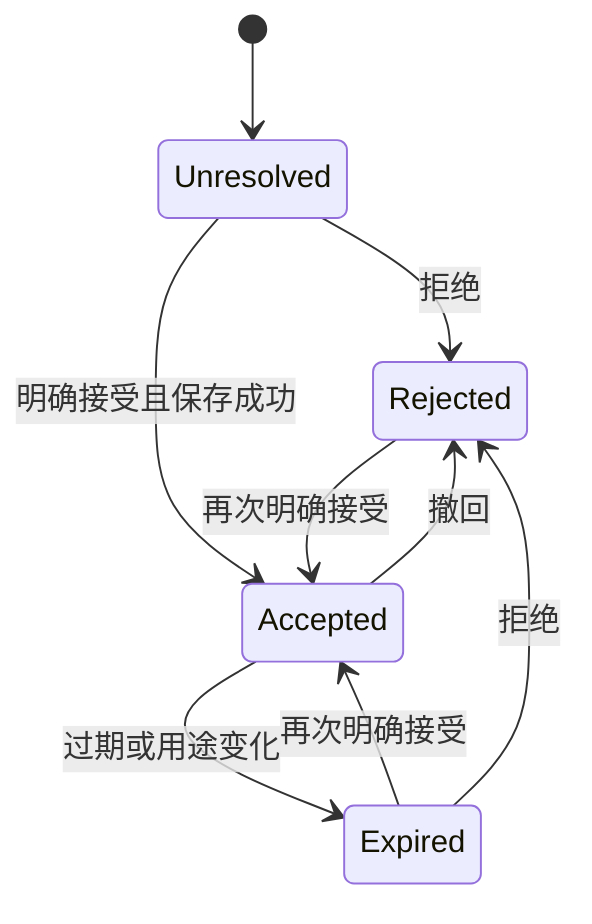

## Context

用户选择先做必要功能并数据驱动。可选分析、服务事实、账务、安全诊断与评测必须按用途分开，不能用“数据驱动”解释无限采集。Locale 复用 internationalization。

## Goals / Non-Goals

让拒绝分析的用户正常使用，确保分析不会在选择前泄漏；建立最小可执行数据治理。Cookie 组件只承载选择，不代替适用地区、处理商和法律依据审核。

## Decisions

### 1. 用户路径与组件

首次访问必要 cookie 正常工作；可选 analytics 默认关闭。ConsentBanner 提供“拒绝可选 / 设置 / 接受可选”同级操作，不预勾选。ConsentPreferences 使用已有 Dialog/Drawer；FooterPrivacyLinks 和设置页始终提供撤回入口。

不根据浏览器语言、IP 或英文页面决定是否尊重同意。第一版只有必要与分析两类；用户主动语言偏好的存储按实际用途披露，不强制依赖分析开关。关闭广告、session replay、autocapture，减少采集范围。

### 2. 模块、类型与接口

| 模块 | 输入 → 输出 | 边界 |
| --- | --- | --- |
| privacy/consent | 选择/版本 → ConsentSnapshot | 不负责用户账务 |
| privacy/analytics-gate | 当前同意/用途 → 可否发送 | 浏览器与服务器共享语义 |
| privacy/retention | 数据类别/环境 → 保留与处理规则 | 不硬编码未审核法律期限 |
| privacy/data-requests | 已验证用户请求 → 可审计任务 | 第一版允许人工履约 |

```ts
type ConsentSnapshot = {
  policyVersion: string;
  necessary: true;
  analytics: boolean;
  decision: 'accepted' | 'rejected';
  decidedAt: string;
  expiresAt: string;
  revision: number;
};
type ConsentState =
  | { state: 'unresolved'; analytics: false }
  | { state: 'valid'; snapshot: ConsentSnapshot }
  | { state: 'expired'; analytics: false };
type DataPurpose = 'service' | 'billing' | 'security' | 'analytics' | 'evaluation';
type DataRequest = {
  id: string;
  userId: string;
  kind: 'export' | 'delete';
  status: 'requested' | 'verified' | 'processing' | 'completed' | 'rejected';
  requestedAt: string;
  completedAt: string | null;
  reasonCode: string | null;
};
type RetentionRule = {
  category: string;
  purpose: DataPurpose;
  retentionDays: number;
  contentAllowed: boolean;
  approvedPolicyVersion: string;
};
```

拟议 PUT /api/privacy/consent 验证 enum、版本和来源；GET /api/privacy/consent 返回当前设备/已登录状态；POST /api/privacy/requests 需要有效身份与敏感操作再验证。输入用 Zod 校验，用户 ID 来自 session。设置保存失败时可选分析继续关闭，不乐观开启。无选择不是默认为同意。

### 3. 数据、同意范围与撤回竞态

设备 cookie 保存最小选择和版本；已登录服务器同意记录绑定 userId 与必要的设备选择标识，用于本人本设备产生的服务端分析事件，不能因为另一设备同意而覆盖本设备拒绝。未知设备保守拒绝。记录 current revision，用于撤回后丢弃已排队但未发送的可选事件。事件发送时再次检查同意；严禁事后补传同意前行为。

登录不能合并其他用户的分析身份；退出登录 reset 分析客户端。切换账户重新解析当前账户/设备选择。撤回立即在本地停止 capture 并清理可选标识，服务器持久化失败可重试，队列仍按最新可得的拒绝状态停止；敏感服务端事件不能只相信客户端 supplied analytics=true。

同意过期或政策发生实质用途变化后关闭可选分析并重新询问。普通修正文案不自动强迫全部用户重新接受；由明确的 policyVersion/change reason 决定。



### 4. 数据用途与内容边界

DB 的身份、Generation 状态、账户账务和安全记录按对应服务用途保存，不以 PostHog 授权作为服务前置。最小服务 DAU 可由必要事实汇总，但细粒度漏斗/行为追踪必须受 analytics gate 控制；不能用服务端绕过拒绝。

普通 ProductEvent 禁止包含聊天正文、完整 URL/query、上传内容、token 和身份密钥。Axiom 与 Langfuse 的内容诊断使用独立可审计策略：列明采集目的、访问权限、保留期、处理区域；不能把本人开发调试时的全量 I/O 规则直接套到所有 Beta 用户。诊断原文与评测复用不是同一许可；authorized-private 样本需单独满足授权。

### 5. 数据请求与删除

用户可以在设置发起导出/删除或联系支持，由系统记录状态和负责人，人工执行也必须留证据。数据范围清单覆盖账号、Project/Thread/Artifact/附件、公开分享、同意、反馈、日志镜像与评测副本。删除前验证身份并明确不可逆影响；处理中禁止新付费任务，已在途任务按已告知策略收尾并停止新增敏感数据。

公开分享先撤销，导出使用有时效的本人下载权限。对必须保留的账务/安全数据记录最小保留范围、依据及用户说明，不谎称全部立刻删除；备份记录自然到期窗口与恢复后再次执行删除的措施。异步删除幂等并能重试，第三方删除未完成不得标全部完成。

### 6. 观测和安全验收

记录 consent policy/revision 与数据请求状态转换，不把拒绝事件本身发送给被拒绝的分析平台。测试使用真实网络拦截验证未选择/拒绝/撤回无可选请求，覆盖浏览器与服务端队列、跨标签、跨账户和过期。必要聊天、语言、账务、反馈应始终可用。

## Migration Plan

先清点已经加载的 SDK 和服务器发送入口，再部署关闭默认值与 gate，最后开启可选分析。依赖表只在 develop 统一生成迁移。本 PR 不改数据。回滚时关闭全部可选分析，保留用户的拒绝记录，不回滚成默认同意。

## Risks / Trade-offs

全球统一保守选择降低地区逻辑复杂度，但不代替当地隐私要求。分析样本存在同意偏差，后续指标必须标注人群。第三方 SDK 隐式采集通过关闭配置和网络测试确认。

## Open Questions

开放前必须批准真实处理商/数据区域、分类保留期、支持联系方式、隐私政策与条款；没有这些不能仅凭 banner 通过上线门禁。库选型可用成熟 CookieConsent 或已有 UI 封装，但状态契约不交给 SDK 各自决定。
