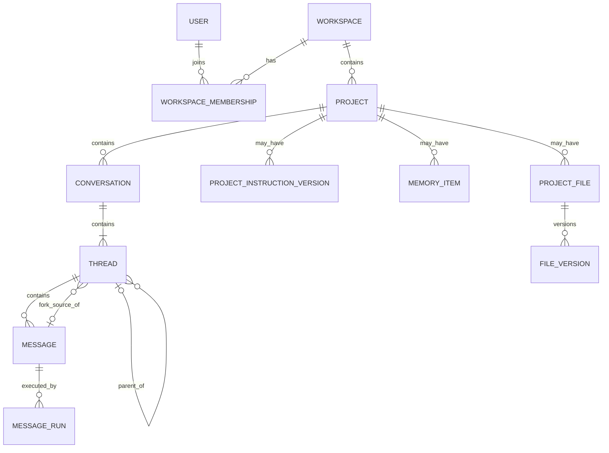
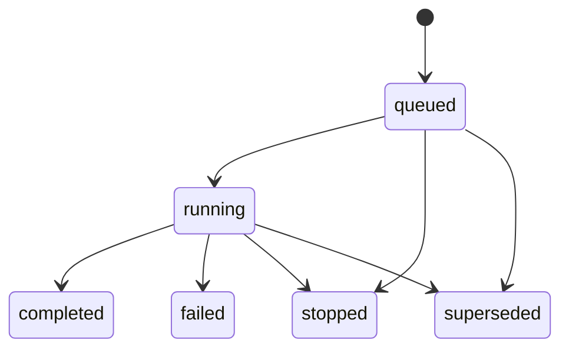

## Context

变更动机见 `proposal.md`。本文只定义目标领域、数据库和服务端模块骨架，不以当前 `ThreadTreeState`、整树 JSON、现有 API 或客户端 Store 的形状为前提。

此前目标设计同时引入了独立 ThreadFork、Turn、Message Variant、Generation、当前有效变体和多级 revision。它可以表达回答版本树，但产品最终确认的 ThreadChat MVP 1.0 不提供回答版本选择：

- 用户看到的每一列都是一个 Thread；
- Thread 内 Message 永远严格线性；
- 只有最后一条 user Message 可以 Edit；
- Regenerate 破坏式替换最后一条 assistant Message；
- 需要保留另一条历史时统一使用 Fork Thread；
- Child Thread 创建后必须保持 Fork 当时的语义，不受 Parent 后续破坏式修改影响；
- 模型执行需要后台持久化、Stop、断线恢复、用量与计费，但不应扩张 Chat 内容模型。

因此，目标模型收敛为：

```text
Workspace
└── Project
    ├── Conversation
    │   └── Thread
    │       └── Message[]
    ├── ProjectInstructionVersion
    ├── MemoryItem
    └── ProjectFile

执行子域：
Assistant Message
└── MessageRun[]
```

这次简化不是把运行可靠性删除，而是把“聊天内容事实”和“模型执行事实”分开。Chat Domain 不包含 Turn、Message Variant 或 Generation；执行子域使用 MessageRun 保存每次 attempt。

## Goals / Non-Goals

**目标：**

- 建立 Workspace、Project、Conversation、Thread、Message 与 MessageRun 的唯一名称和职责。
- 定义 Fork、根 Thread、分支 Thread、破坏式 Edit、破坏式 Regenerate、Retry 与 Stop 的语义。
- 定义 `BaseContext` 与 `ForkSourceSnapshot` 两个值对象及其不可变边界。
- 给出可由 PostgreSQL/Drizzle 实现的逻辑表、字段、复合约束、索引与事务不变量。
- 定义 UI Timeline、LLM Prompt、Conversation Bootstrap 等读取投影的事实来源。
- 定义纯领域、应用命令、执行端口、仓储、HTTP 适配器之间的目标模块骨架和依赖方向。
- 为后续服务端实现、集成测试、API 测试、Zustand Store、Hooks 与 UI 接入提供稳定基础。
- 保留 Workspace、Project、Conversation、Thread 和 Message 的稳定公开身份，使未来分享、CLI、MCP 与公开 API 无需重做核心身份。

**非目标：**

- 本变更不创建数据库迁移、Drizzle schema、仓储、API 路由或运行时代码。
- 本变更不设计 Zustand Store、React Hooks、Selectors、组件接入或 UI 交互细节。
- 本变更不设计现有数据导入、双写、切换、回滚或旧表删除方案。
- 本变更不保留被覆盖的 user/assistant Message 内容版本，也不提供回答版本选择器。
- 本变更不支持编辑历史 Message；历史位置的另一条发展路径必须通过 Fork 创建。
- 本变更不支持多来源 Thread、Thread Merge、跨 Thread 结论收敛或 Issue #39 的发布机制。
- 本变更不实现 Project Memory、Project Instruction、Project File、分享、公开 Token、CLI 或 MCP 产品功能；只定义所有权和扩展位置。
- 本变更不实现通用 `Idempotency-Key`、离线队列或命令重放；这些属于 V2。
- 本变更不决定 SSE、轮询或 WebSocket 的最终传输选择；它只定义可恢复事件需要的运行事实。

## Decisions

### D1. 统一术语与边界

| 名称 | 定义 | 是否为核心实体 |
|---|---|---:|
| Workspace | 租户、成员和授权的最外层边界 | 是 |
| WorkspaceMembership | User 与 Workspace 的成员/角色关系 | 关系实体 |
| Project | 长期目标、规则、记忆、文件和 Conversation 的资产边界 | 是 |
| Conversation | 一个根 Thread 及全部派生 Thread 组成的完整讨论 | 是 |
| Thread | 一列可以独立继续的严格线性对话 | 是 |
| Root Thread | Conversation 中唯一没有 Parent 的 Thread；是推导角色 | 否 |
| Branch Thread | 由 Fork 创建且具有 Parent 的 Thread；是推导角色 | 否 |
| Fork | 从确定 Message 创建 Child Thread 的服务端动作 | 否 |
| Message | Thread 中具有稳定 ID 和顺序的用户或助手内容 | 是 |
| MessageRun | 生成/重试一个 assistant Message 的一次后台执行 attempt | 执行子域实体 |
| BaseContext | Child Thread 创建时继承的不可变有效历史投影 | 值对象 |
| ForkSourceSnapshot | Fork 时选区、来源哈希和定位上下文的不可变快照 | 值对象 |
| ProjectInstructionVersion | Project 级指令的不可变版本 | 扩展实体 |
| MemoryItem | Project 级、可追溯的记忆条目 | 扩展实体 |
| ProjectFile / FileVersion | Project 内可跨 Conversation 使用的持久文件及版本 | 扩展实体 |
| UI Workspace | 列、折叠、画布和面板等客户端状态 | 不是后端实体 |

以下名称不进入目标模型：

```text
ThreadTree
MainThread 实体
ForkedThread 实体
ThreadFork 实体
Turn
Generation
Message.parentMessageId
Message Variant
activeGenerationId
Conversation/Thread/Turn revision
```

`MessageRun` 在执行/计费子域中有身份和生命周期，因此技术上是运行实体；“不是一等实体”只表示它不是 Chat 内容资源，不表示它可以只存在于进程内存。

### D2. 规范包含关系



包含关系不等于一个巨型事务聚合：

- Workspace 是授权解析边界；
- Project 是长期资产边界；
- Conversation 是完整讨论的命名、列表、归档和分享边界；
- Thread 是追加 Message、Edit 和 Regenerate 的主要写入边界；
- Fork 命令跨 Parent Thread 读取并原子创建 Child Thread；
- MessageRun 由执行仓储独立推进，不要求锁定整个 Conversation。

**根 Thread 的唯一事实：** 一个 Conversation 恰好有一个 `parentThreadId = null` 的 Thread。目标写模型不同时持久化 `Conversation.rootThreadId`，避免两个字段竞争。读取 DTO 可以派生并返回 `rootThreadId`。

**备选方案：Conversation 持久化 rootThreadId。** 不采用，因为它与 Root Thread 的空 Parent 角色重复，创建时还会产生循环引用。

### D3. Thread 内 Message 严格线性

Thread 不包含 Turn 或 Message DAG。唯一顺序为服务端分配的 `Message.sequence`：

```text
Thread A
├── sequence=1  user
├── sequence=2  assistant
├── sequence=3  user
└── sequence=4  assistant
```

发送一条用户输入时，服务端在同一事务中创建：

```text
User Message              sequence = N
Assistant placeholder     sequence = N + 1
MessageRun attempt = 1
```

`createdAt` 只负责审计，不负责领域排序。`prevMessageId/nextMessageId` 不持久化，因为它们可由 sequence 推导，双向指针会产生重复事实。

Message 只允许：

```text
role = user | assistant
```

System 指令由服务端 Prompt Builder 注入，不允许作为客户端提交的 Message。工具调用、工具结果、推理、Markdown Artifact 与文件引用使用版本化 Message Part 表达，不为每一种 part 强制创建数据库实体。

### D4. Edit 与 Regenerate 是破坏式操作

#### Edit

只有当前 Thread 最后一条 user Message 可以 Edit，并且它后面只能是对应的最后一条 assistant Message。事务执行：

1. 锁定目标 Thread 的末尾 Message；
2. 验证目标 user Message 是最后一个用户输入；
3. 更新该 user Message 的 `parts/contentHash/updatedAt`；
4. 清空或重置紧随其后的 assistant Message 内容；
5. 将旧的非终态 MessageRun 条件更新为 `superseded`；
6. 为同一个 assistantMessageId 创建下一个 MessageRun attempt；
7. 提交后调度执行。

Edit 不创建新的 Message ID、不保存旧输入版本、不产生隐式 Fork。

#### Regenerate

只有当前 Thread 最后一条 assistant Message 可以 Regenerate。事务执行：

1. 验证目标是 Thread 最后一条 assistant Message；
2. 保持 assistantMessageId 与 sequence 不变；
3. 清空或重置其可见输出；
4. 将旧非终态 attempt 标记为 `superseded`；
5. 创建下一个 MessageRun attempt；
6. 新结果写回同一个 assistant Message。

旧 assistant 内容不保留版本选择。需要保留原回答时，用户必须先 Fork。

**备选方案：同一个位置保存多个输入/输出版本。** 不采用，因为它会重新引入 Turn、Generation 配对和 active variant，违背 MVP 的唯一分支机制。

### D5. Fork 是语义快照边界

Fork 不创建独立 ThreadFork 行。由于 MVP 中每个非根 Thread 恰有一个 Parent、一个来源 Message，且 Fork 元数据与 Child Thread 同生共死，以下字段直接属于 Child Thread：

```text
parentThreadId
sourceMessageId
forkSourceSnapshot
baseContext
```

Fork API/应用命令只接受：

```text
parentThreadId
sourceMessageId
anchor(exact/prefix/suffix)
可选初始用户输入
```

客户端不得提交：

```text
childThreadId
baseContext
sourceContentHash
Parent Message history
```

服务端事务执行：

1. 解析 actor 与授权；
2. 读取并验证 Parent Thread；
3. 验证 source Message 属于 Parent Thread 且内容可 Fork；
4. 计算 Parent 截至 source Message 的 effective history；
5. 生成不可变 BaseContext；
6. 生成 ForkSourceSnapshot；
7. 创建 Child Thread；
8. 如携带初始输入，则同时创建 user/assistant Message 与 MessageRun；
9. 提交后调度可选执行。

Child 创建后：

- Parent 追加 Message 不改变 Child；
- Parent Edit/Regenerate 不改变 Child；
- Parent 或来源归档不删除 Child；
- 来源内容变化只让 provenance 状态变为 outdated；
- 来源不存在时 provenance 状态为 unavailable；
- BaseContext 永远保持 Fork 时的内容。

**备选方案：每次构造 Child Prompt 时递归读取祖先。** 不采用，因为破坏式 Edit/Regenerate 会改变 Child 已经建立的历史语义。

**备选方案：独立 ThreadFork 实体。** MVP 不采用；只有多 Parent、Merge、关系独立生命周期或关系级分享出现时再升级。

### D6. BaseContext 与 ForkSourceSnapshot

#### BaseContext

```ts
interface BaseContextV1 {
  schemaVersion: 1
  messages: ContextMessageV1[]
}

interface ContextMessageV1 {
  sourceMessageId?: string
  role: "user" | "assistant"
  parts: MessagePartV1[]
}
```

BaseContext 是 Message Content Projection，不是 Message Entity 副本。它不包含：

```text
threadId
sequence
MessageRun
feedback
createdAt / updatedAt
UI 状态
计费状态
```

嵌套 Fork 时，服务端先构造 Parent 的完整有效上下文：

```text
Parent.baseContext
+
Parent local messages through sourceMessage
```

再把结果扁平冻结为 Child.baseContext。因此运行时不需要递归读取祖先。

#### ForkSourceSnapshot

```ts
interface ForkSourceSnapshotV1 {
  schemaVersion: 1
  sourceMessageId: string
  sourceContentHash: string
  quote: {
    exact: string
    prefix?: string
    suffix?: string
  }
}
```

`forkSourceSnapshot` 只回答“从哪里 Fork”，`baseContext` 回答“以后以什么历史继续”。两者不得合并成一个含义模糊的 `forkContext`。

来源状态是读取投影，不单独持久化：

```text
source exists && currentHash == snapshotHash  → available
source exists && currentHash != snapshotHash  → outdated
source missing/inaccessible                    → unavailable
```

### D7. Message Part 协议

Message 内容采用项目自有的版本化 envelope：

```ts
interface MessageContentV1 {
  schemaVersion: 1
  parts: MessagePartV1[]
}
```

`MessagePartV1` 的当前形状必须与仓库安装的 AI SDK v7 `UIMessage.parts` 支持范围兼容，包括当前实际使用的 text、reasoning、tool、data、file/attachment 与 Artifact 表达。领域层不得导入 AI SDK 的运行时对象或 `streamText()` 结果类型。

依赖方向：

```text
AI SDK v7 UIMessage / stream events
              ↓ adapter
MessageContentV1 / NormalizedRunEvent
              ↓
Domain / Application
```

未来更换模型运行时只替换 adapter；稳定 Message、Thread 与 Conversation ID 不迁移。

### D8. MessageRun 是独立执行子域

```ts
interface MessageRun {
  assistantMessageId: MessageId
  attempt: number
  status:
    | "queued"
    | "running"
    | "completed"
    | "failed"
    | "stopped"
    | "superseded"
  modelId: string
  eventSequence: number
  checkpointParts: MessagePartV1[]
  usage?: ModelUsage
  errorCode?: string
  queuedAt: Date
  startedAt?: Date
  finishedAt?: Date
  heartbeatAt?: Date
  stopRequestedAt?: Date
}
```

身份使用 `(assistantMessageId, attempt)`。Regenerate/Retry 创建新 attempt，不复用旧 MessageRun 行；旧 attempt 可以保留用量、计费和审计，但不保留旧 assistant Message 内容版本。

状态机：



状态转换使用条件更新，而不是通用 revision：

```sql
UPDATE message_runs
SET status = 'completed', finished_at = now()
WHERE assistant_message_id = $1
  AND attempt = $2
  AND status = 'running';
```

同一个 assistant Message 同时最多只有一个 `queued/running` attempt。

浏览器刷新、关闭或流连接断开只释放订阅，不调用 Stop。重载后，读取模型按 assistantMessageId 返回最新 attempt 的：

```text
status
attempt
checkpointParts
eventSequence
```

传输层可以用 SSE、轮询或未来 WebSocket 交付同一规范运行事件。P0 不要求永久保存每个 token event；服务端可以在重连时先发送最新 checkpoint/reset 事件，再继续递增 eventSequence。

Message 表不重复保存 `running/failed/stopped`。UI 中的 assistant runtime status 是 Message 与最新 MessageRun join 后的读取投影。

### D9. Prompt 与 UI Timeline 是不同读取投影

#### UI Timeline

按 Message.sequence 返回全部本地 Message，并把最新 MessageRun 状态投影到 assistant Message：

```text
U1
[A1 生成失败]
U2
A2
```

#### Prompt History

Prompt Builder 使用：

```text
Project/System Context
+
Thread.baseContext
+
Thread local effective messages
```

P0 规则：

| 本地事实 | 进入 Prompt |
|---|---:|
| user Message | 是 |
| assistant 最新 attempt completed | 是 |
| assistant 最新 attempt queued/running | 否 |
| assistant 最新 attempt failed | 否 |
| assistant 最新 attempt stopped | 否 |
| assistant 最新 attempt superseded | 否 |

因此上面的 Prompt 为：

```text
U1
U2
A2
```

Project Instruction、Memory 与 File retrieval 属于 Project/System Context，不复制进 BaseContext。若未来需要执行可复现性，MessageRun 记录实际使用的 instruction version、file version 与 retrieval provenance；这不改变 Chat 内容实体。

### D10. PostgreSQL 核心 Schema

下列是目标逻辑 schema。具体 Drizzle 文件拆分、迁移编号和既有 User 表名由后续持久化变更决定。所有 ID 由服务端生成，使用 UUID 或等价不透明稳定 ID；时间统一存 `timestamptz`。

#### 枚举

```sql
CREATE TYPE workspace_role AS ENUM ('owner', 'admin', 'member');
CREATE TYPE record_status AS ENUM ('active', 'archived');
CREATE TYPE message_role AS ENUM ('user', 'assistant');
CREATE TYPE message_run_status AS ENUM (
  'queued',
  'running',
  'completed',
  'failed',
  'stopped',
  'superseded'
);
```

实际实现可以使用受约束 text 替代 PostgreSQL enum，避免枚举迁移成本；无论采用哪种物理表示，领域值集合必须相同。

#### workspaces

```sql
CREATE TABLE workspaces (
  id uuid PRIMARY KEY,
  name text NOT NULL,
  created_by uuid NOT NULL REFERENCES users(id),
  created_at timestamptz NOT NULL DEFAULT now(),
  updated_at timestamptz NOT NULL DEFAULT now()
);
```

Owner 角色以 membership 为唯一事实；`created_by` 只表示审计，不表示当前 Owner。

#### workspace_memberships

```sql
CREATE TABLE workspace_memberships (
  workspace_id uuid NOT NULL REFERENCES workspaces(id) ON DELETE RESTRICT,
  user_id uuid NOT NULL REFERENCES users(id) ON DELETE RESTRICT,
  role workspace_role NOT NULL,
  created_at timestamptz NOT NULL DEFAULT now(),
  PRIMARY KEY (workspace_id, user_id)
);

CREATE INDEX workspace_memberships_user_idx
  ON workspace_memberships(user_id, workspace_id);
```

“至少一个 owner”需要应用事务或延迟约束保证，不能仅靠单行 CHECK。

#### projects

```sql
CREATE TABLE projects (
  id uuid PRIMARY KEY,
  workspace_id uuid NOT NULL REFERENCES workspaces(id) ON DELETE RESTRICT,
  name text NOT NULL,
  description text,
  status record_status NOT NULL DEFAULT 'active',
  created_by uuid NOT NULL REFERENCES users(id),
  created_at timestamptz NOT NULL DEFAULT now(),
  updated_at timestamptz NOT NULL DEFAULT now(),
  archived_at timestamptz
);

CREATE INDEX projects_workspace_status_idx
  ON projects(workspace_id, status, updated_at DESC);
```

Project 默认继承 Workspace 成员权限；MVP 不创建 ProjectMembership。

#### conversations

```sql
CREATE TABLE conversations (
  id uuid PRIMARY KEY,
  project_id uuid NOT NULL REFERENCES projects(id) ON DELETE RESTRICT,
  title text,
  title_source text CHECK (title_source IN ('auto', 'custom')),
  status record_status NOT NULL DEFAULT 'active',
  created_by uuid NOT NULL REFERENCES users(id),
  created_at timestamptz NOT NULL DEFAULT now(),
  updated_at timestamptz NOT NULL DEFAULT now(),
  archived_at timestamptz
);

CREATE INDEX conversations_project_status_idx
  ON conversations(project_id, status, updated_at DESC);
```

`title_source` 用于阻止后续自动标题覆盖用户自定义标题。它与 revision 无关。

#### threads

```sql
CREATE TABLE threads (
  id uuid PRIMARY KEY,
  conversation_id uuid NOT NULL REFERENCES conversations(id) ON DELETE RESTRICT,

  parent_thread_id uuid,
  source_message_id uuid,
  fork_source_snapshot jsonb,
  base_context jsonb NOT NULL,

  title text,
  title_source text CHECK (title_source IN ('auto', 'custom')),
  default_model_id text,
  status record_status NOT NULL DEFAULT 'active',

  created_by uuid NOT NULL REFERENCES users(id),
  created_at timestamptz NOT NULL DEFAULT now(),
  updated_at timestamptz NOT NULL DEFAULT now(),
  archived_at timestamptz,

  UNIQUE (id, conversation_id),

  CHECK (jsonb_typeof(base_context) = 'object'),
  CHECK (
    (
      parent_thread_id IS NULL
      AND source_message_id IS NULL
      AND fork_source_snapshot IS NULL
    )
    OR
    (
      parent_thread_id IS NOT NULL
      AND source_message_id IS NOT NULL
      AND fork_source_snapshot IS NOT NULL
    )
  ),

  FOREIGN KEY (parent_thread_id, conversation_id)
    REFERENCES threads(id, conversation_id)
    ON DELETE RESTRICT
    DEFERRABLE INITIALLY IMMEDIATE
);

CREATE UNIQUE INDEX threads_one_root_per_conversation_idx
  ON threads(conversation_id)
  WHERE parent_thread_id IS NULL;

CREATE INDEX threads_parent_idx
  ON threads(parent_thread_id, created_at);

CREATE INDEX threads_conversation_status_idx
  ON threads(conversation_id, status, created_at);
```

根 Thread 的 `base_context` 必须是 `{ "schemaVersion": 1, "messages": [] }`。JSON 内部 schema 由应用层 codec 验证；数据库只做最低 JSON 类型约束。

#### messages

```sql
CREATE TABLE messages (
  id uuid PRIMARY KEY,
  thread_id uuid NOT NULL REFERENCES threads(id) ON DELETE RESTRICT,
  sequence bigint NOT NULL CHECK (sequence > 0),
  role message_role NOT NULL,

  content_schema_version smallint NOT NULL DEFAULT 1,
  parts jsonb NOT NULL,
  content_hash text NOT NULL,

  created_at timestamptz NOT NULL DEFAULT now(),
  updated_at timestamptz NOT NULL DEFAULT now(),

  UNIQUE (thread_id, sequence),
  UNIQUE (id, thread_id),
  CHECK (jsonb_typeof(parts) = 'array')
);

CREATE INDEX messages_thread_sequence_idx
  ON messages(thread_id, sequence);
```

`content_hash` 由服务端对规范化后的 MessageContent 计算，用于来源过期判断；客户端不能提交该值。

在 threads/messages 都存在后增加来源复合外键：

```sql
ALTER TABLE threads
  ADD CONSTRAINT threads_source_message_belongs_to_parent_fk
  FOREIGN KEY (source_message_id, parent_thread_id)
  REFERENCES messages(id, thread_id)
  ON DELETE RESTRICT
  DEFERRABLE INITIALLY IMMEDIATE;
```

它在数据库层保证 source Message 属于声明的 Parent Thread。Parent/Child 同 Conversation 已由 threads 的复合 Parent 外键保证。

MVP 不提供独立 Message hard delete。归档 Conversation/Thread 不删除 Message；未来硬删除必须以显式应用事务处理整个 Conversation，不能依赖来源 Message 的级联删除。

#### message_runs

```sql
CREATE TABLE message_runs (
  assistant_message_id uuid NOT NULL REFERENCES messages(id) ON DELETE RESTRICT,
  attempt integer NOT NULL CHECK (attempt > 0),
  status message_run_status NOT NULL,

  model_id text NOT NULL,
  provider_id text,
  event_sequence bigint NOT NULL DEFAULT 0 CHECK (event_sequence >= 0),
  checkpoint_schema_version smallint NOT NULL DEFAULT 1,
  checkpoint_parts jsonb NOT NULL DEFAULT '[]'::jsonb,

  usage jsonb,
  error_code text,
  billing_state text,

  queued_at timestamptz NOT NULL DEFAULT now(),
  started_at timestamptz,
  heartbeat_at timestamptz,
  stop_requested_at timestamptz,
  finished_at timestamptz,

  PRIMARY KEY (assistant_message_id, attempt),
  CHECK (jsonb_typeof(checkpoint_parts) = 'array')
);

CREATE UNIQUE INDEX message_runs_one_active_attempt_idx
  ON message_runs(assistant_message_id)
  WHERE status IN ('queued', 'running');

CREATE INDEX message_runs_latest_attempt_idx
  ON message_runs(assistant_message_id, attempt DESC);

CREATE INDEX message_runs_recovery_idx
  ON message_runs(status, heartbeat_at)
  WHERE status IN ('queued', 'running');
```

“assistant_message_id 必须指向 role=assistant”是跨行约束，由应用命令在事务中验证并由集成测试覆盖；如后续需要数据库强制，可增加约束触发器，不在首版使用复杂触发器。

`usage` 与 `billing_state` 的精确 schema 由计费能力拥有；MessageRun 只保留稳定承载位置，不让计费字段进入 Message。

#### message_feedbacks（附属关系）

```sql
CREATE TABLE message_feedbacks (
  user_id uuid NOT NULL REFERENCES users(id) ON DELETE RESTRICT,
  message_id uuid NOT NULL REFERENCES messages(id) ON DELETE RESTRICT,
  value text NOT NULL CHECK (value IN ('positive', 'negative')),
  created_at timestamptz NOT NULL DEFAULT now(),
  updated_at timestamptz NOT NULL DEFAULT now(),
  PRIMARY KEY (user_id, message_id)
);
```

Feedback 是 User 与 Message 的关系，不嵌入 Message JSON，也不复制进 BaseContext。

### D11. Project 扩展 Schema

这些表属于稳定扩展方向，但不要求与 Chat MVP 核心表在同一实现批次完成。

#### project_instruction_versions

```sql
CREATE TABLE project_instruction_versions (
  id uuid PRIMARY KEY,
  project_id uuid NOT NULL REFERENCES projects(id) ON DELETE RESTRICT,
  version integer NOT NULL CHECK (version > 0),
  content text NOT NULL,
  is_active boolean NOT NULL DEFAULT false,
  created_by uuid NOT NULL REFERENCES users(id),
  created_at timestamptz NOT NULL DEFAULT now(),
  UNIQUE (project_id, version)
);

CREATE UNIQUE INDEX project_instruction_one_active_idx
  ON project_instruction_versions(project_id)
  WHERE is_active;
```

切换 active version 必须在事务内先后更新旧、新版本。MessageRun 后续可以记录实际使用的 instructionVersionId。

#### memory_items

```sql
CREATE TABLE memory_items (
  id uuid PRIMARY KEY,
  project_id uuid NOT NULL REFERENCES projects(id) ON DELETE RESTRICT,
  content jsonb NOT NULL,
  source jsonb,
  status record_status NOT NULL DEFAULT 'active',
  created_by uuid NOT NULL REFERENCES users(id),
  created_at timestamptz NOT NULL DEFAULT now(),
  updated_at timestamptz NOT NULL DEFAULT now(),
  CHECK (jsonb_typeof(content) = 'object')
);

CREATE INDEX memory_items_project_status_idx
  ON memory_items(project_id, status, updated_at DESC);
```

向量、切块、摘要与搜索索引是可重建派生数据，不是 MemoryItem 的唯一事实。

#### project_files / file_versions

```sql
CREATE TABLE project_files (
  id uuid PRIMARY KEY,
  project_id uuid NOT NULL REFERENCES projects(id) ON DELETE RESTRICT,
  name text NOT NULL,
  status record_status NOT NULL DEFAULT 'active',
  created_by uuid NOT NULL REFERENCES users(id),
  created_at timestamptz NOT NULL DEFAULT now(),
  updated_at timestamptz NOT NULL DEFAULT now()
);

CREATE TABLE file_versions (
  id uuid PRIMARY KEY,
  file_id uuid NOT NULL REFERENCES project_files(id) ON DELETE RESTRICT,
  version integer NOT NULL CHECK (version > 0),
  storage_key text NOT NULL,
  content_type text NOT NULL,
  size_bytes bigint NOT NULL CHECK (size_bytes >= 0),
  content_hash text NOT NULL,
  created_by uuid NOT NULL REFERENCES users(id),
  created_at timestamptz NOT NULL DEFAULT now(),
  UNIQUE (file_id, version)
);
```

Message 中的临时 Artifact 可以继续存在于 parts。只有用户明确“保存到 Project Files”时才创建 ProjectFile/FileVersion，并用后续来源关系记录 originating Message；不会把每个工具输出自动提升为 Project 资产。

### D12. 数据库不变量与并发规则

数据库与应用层共同保证：

1. Project 恰好属于一个 Workspace；
2. Conversation 恰好属于一个 Project；
3. Conversation 恰好有一个 Root Thread；
4. Thread 归属 Conversation 后不可移动；
5. 非根 Thread 的 parent/source/snapshots 必须同时存在；
6. Parent、Child 和 source Message 必须位于同一 Conversation；
7. Child 创建时只能指向已经存在的 Parent，因此 Fork 事务不会创建环；额外领域校验拒绝任何导入环；
8. Thread 内 `(threadId, sequence)` 唯一；
9. 普通发送在同一事务中分配连续 user/assistant sequence；
10. 只有最后一条 user 可以 Edit；
11. 只有最后一条 assistant 可以 Regenerate/Retry；
12. 同一个 assistant Message 最多一个非终态 MessageRun；
13. MessageRun 状态通过条件更新推进；
14. BaseContext 创建后不可通过公开仓储更新；
15. 客户端不能提交 owner、contentHash、baseContext、run status 或新实体 ID；
16. 归档不级联删除 Child Thread、Message 或 MessageRun；
17. 通用 revision 不用于发送、Fork、运行订阅或状态转换。

Message sequence 分配属于 Thread 写入事务。实现可以锁定 Thread 行，或使用数据库原子计数器/最大 sequence 保护；选择由持久化实现提案决定。无论采用哪一种，客户端不生成 sequence，也不依赖时间排序。

P0 使用前端 single-flight 防止重复点击，但网络结果不确定后的重复提交仍是已知限制。V2 再增加 Idempotency-Key 和命令结果重放，不在当前表中预建半成品幂等结构。

### D13. 应用命令与事务边界

应用层使用明确用例，不暴露通用 `updateEntity`：

| 命令 | 主要事务结果 |
|---|---|
| createWorkspace | Workspace + Owner Membership |
| createProject | Project |
| createConversation | Conversation + Root Thread |
| sendMessage | user Message + assistant placeholder + MessageRun |
| editLastUserMessage | 更新最后 user/assistant + 新 MessageRun attempt |
| regenerateLastAssistantMessage | 重置最后 assistant + 新 MessageRun attempt |
| retryAssistantMessage | 验证 failed/stopped 后创建新 attempt |
| forkThread | Child Thread + BaseContext + ForkSourceSnapshot，可选初始消息/run |
| archiveConversation | 只更新 Conversation 生命周期 |
| archiveThread | 只更新目标非根 Thread 生命周期，不删除后代 |
| stopMessageRun | 条件推进最新 active attempt |
| submitMessageFeedback | upsert/delete 用户反馈关系 |

命令不返回可写整棵 Conversation。成功响应返回受影响实体或读取 DTO；客户端不能把 Bootstrap 原样 PUT 回服务端。

模型执行必须在 user/assistant Message 与 queued MessageRun 事务提交后开始。执行器启动失败时，MessageRun 最终收敛为 failed；不能回滚已经被用户提交并可查询的输入意图。

### D14. 读取模型

#### ConversationBootstrap

用于 ThreadChat URL 首次装载，至少包含：

```text
schemaVersion
conversation
threads
每个 Thread 最近最多 200 条 Messages
每条 assistant Message 的最新 MessageRun 摘要
当前用户 feedback
hasMoreOlder / olderCursor
```

它是只读 BFF DTO，不是数据库实体、备份或可写快照。P0 正常路径一次返回每 Thread 最近 200 条 Message，避免客户端一开始实现复杂的树内增量分页。

#### ConversationGraph

只返回 Conversation、Thread parent/source 与标题摘要，用于 Canvas 或导航，不下载 Message parts、BaseContext 全文或 Artifact 内容。

#### ThreadTimeline

按 sequence 返回本地 Message，并 join 最新 MessageRun 状态。BaseContext 不作为本地 Message 重复渲染；UI 可以通过 provenance 单独展示 Fork 来源。

#### ThreadPrompt

只在服务端构造，使用 Project/System Context、BaseContext 与本地有效 Message。客户端提交的 messages 数组永远不是权威 Prompt 来源。

### D15. 目标服务端模块骨架

目标目录表达依赖边界，不要求本变更创建文件：

```text
lib/thread-chat/
├── domain/
│   ├── ids.ts
│   ├── workspace.ts
│   ├── project.ts
│   ├── conversation.ts
│   ├── thread.ts
│   ├── message.ts
│   ├── value-objects/
│   │   ├── message-content.ts
│   │   ├── base-context.ts
│   │   └── fork-source-snapshot.ts
│   └── policies/
│       ├── thread-message-policy.ts
│       ├── fork-policy.ts
│       └── prompt-policy.ts
│
├── application/
│   ├── commands/
│   │   ├── create-conversation.ts
│   │   ├── send-message.ts
│   │   ├── edit-last-user-message.ts
│   │   ├── regenerate-last-assistant-message.ts
│   │   ├── fork-thread.ts
│   │   └── stop-message-run.ts
│   ├── queries/
│   │   ├── get-conversation-bootstrap.ts
│   │   ├── get-conversation-graph.ts
│   │   └── get-thread-timeline.ts
│   └── ports/
│       ├── unit-of-work.ts
│       ├── repositories.ts
│       ├── authorization.ts
│       ├── id-generator.ts
│       ├── clock.ts
│       └── model-runtime.ts
│
├── execution/
│   ├── message-run.ts
│   ├── message-run-state-machine.ts
│   ├── message-run-service.ts
│   └── normalized-run-event.ts
│
├── infrastructure/
│   ├── db/
│   │   ├── schema/
│   │   ├── repositories/
│   │   └── transaction.ts
│   ├── runtime/
│   │   └── ai-sdk-v7-adapter.ts
│   └── authorization/
│
└── transport/
    ├── schemas/
    ├── mappers/
    └── errors.ts

app/api/v1/
└── ... HTTP route adapters only
```

依赖方向：

```text
HTTP / future CLI / future MCP
              ↓
Application Commands & Queries
              ↓
Domain Policies + Execution Ports
              ↓
Infrastructure Adapters
```

约束：

- domain 不导入 React、Next.js、HTTP、Drizzle、AI SDK 或数据库 row；
- application 不导入 Next.js Request/Response；
- infrastructure 实现 ports，不反向定义领域规则；
- route 只负责认证适配、schema 解析、调用用例和错误映射；
- Prompt Builder 只在服务端；
- CLI/MCP 未来复用 application，不直接访问表。

### D16. 后续拆分链

本设计通过后，后续按以下顺序建立独立 OpenSpec：

1. **服务端领域与数据库骨架**：创建纯领域类型、值对象 codec、Drizzle schema、迁移、仓储和数据库约束测试。
2. **MessageRun 生命周期**：实现后台执行、状态机、checkpoint、Stop、断线恢复、用量和计费挂点。
3. **应用命令与 API v1**：实现授权、事务命令、查询 DTO、错误协议和路由；通用幂等仍不进入 P0。
4. **服务端验收**：领域策略测试、数据库集成测试、API 契约测试、并发/断线/恢复测试。
5. **前端领域与 Zustand**：设计 Entity Store、MessageRun Stream 状态、UI State、Selectors 和 Conversation Runtime。
6. **Hooks 与 UI 接入**：Bootstrap、发送、Fork、Edit、Regenerate、Stop、反馈、Canvas 和列视图 Hooks。
7. **整体链路与权威切换**：端到端验证后再处理旧数据、旧 API、旧整树权威和清理。

后续变更不得在没有显式修改本基础设计的情况下重新引入 Turn、Message Variant、独立 ThreadFork 或 Generation Chat 实体。

## Risks / Trade-offs

- **[BaseContext 会重复历史内容并随 Fork 深度增加存储]** → MVP 接受以换取破坏式编辑下的语义独立；只保存精简 ContextMessage Projection。真实规模达到阈值后可以引入内容寻址或快照去重，不改变逻辑模型。
- **[破坏式 Edit/Regenerate 永久丢失旧可见内容]** → 这是明确产品决策；需要保留时使用 Fork。MessageRun 只保留执行审计，不承诺恢复旧回答正文。
- **[来源 Message 内容变化后 sourceMessageId 仍指向同一可变实体]** → ForkSourceSnapshot 的 content hash 和 quote 保留当时 provenance；状态读取为 outdated，BaseContext 不变。
- **[JSONB parts/baseContext 缺少数据库内部结构约束]** → 使用共享版本化 codec 在写入和读取时验证，数据库保留 schemaVersion、JSON 类型和关系约束；对未知版本 fail closed。
- **[Message 与 MessageRun 分离增加 join]** → 使用 latest-attempt 索引和 Bootstrap/Timeline 读取模型集中 join，避免把运行状态重复写入 Message。
- **[不使用通用 revision 时多标签页可能发生最后写入者胜出]** → 追加顺序由事务和唯一 sequence 保护，运行状态由条件更新保护；低风险元数据 P0 接受 last-write-wins，需要覆盖保护时再局部增加 ETag。
- **[P0 无幂等键时网络不确定可能重复发送]** → 前端 single-flight 降低重复点击；将可靠重放作为 V2 独立能力，不在当前模型中加入半套命令系统。
- **[没有独立 ThreadFork 会限制未来多来源关系]** → 当前每个 Child 唯一 Parent，字段与 Thread 同生命周期；真正出现 Merge/多来源时再提升为关系实体并迁移，避免为未知需求预建。
- **[Project 扩展表让范围看起来扩大]** → 本设计只固定所有权与 schema 方向；实现批次可以只落核心 Workspace/Project/Conversation/Thread/Message/MessageRun。
- **[忽略现有实现会把迁移风险延后]** → 这是本阶段的有意边界；先批准正确目标，再用单独提案审计真实数据和切换路径，避免旧结构反向塑造新模型。

## Migration Plan

本变更不执行现有数据迁移。它定义目标状态和后续落地顺序：

1. 审查并批准本 proposal/design，确认简化模型为 Issue #34 唯一目标。
2. 在独立变更中同步修改正式 domain spec 和所有依赖旧模型的活跃 OpenSpec。
3. 建立全新服务端领域与数据库 schema，不在实现初期加入旧整树兼容逻辑。
4. 通过数据库约束、领域策略、事务集成和 API 契约测试完成后端验收。
5. 另行设计前端 Zustand Store、Selectors、Hooks 与 Conversation Runtime。
6. 前后端新链路端到端通过后，再审计旧数据并决定重置、一次性导入或只读保留。
7. 最终切换时只允许一个写入权威；禁止新旧模型双向同步或把规范实体反序列化回旧整树 JSON。

回滚、真实数据导入、运行中旧 generation 排空和旧表删除，必须基于部署环境数据另写 ADR，不在本基础设计中猜测。

## Open Questions

目前没有会改变核心实体、关系或数据库主干的未决问题。以下实现选择有意推迟到对应后续提案：

- Message sequence 使用 Thread 行锁、独立计数器还是等价数据库原子策略；
- MessageRun 事件使用 SSE、轮询还是 WebSocket，以及是否需要短期事件表；
- Project Instruction、Memory、File 的首个产品范围和 retrieval 策略；
- 真实旧数据采用重置、一次性迁移还是只读保留；
- V2 Idempotency-Key、离线重放和外部 API 生命周期。
