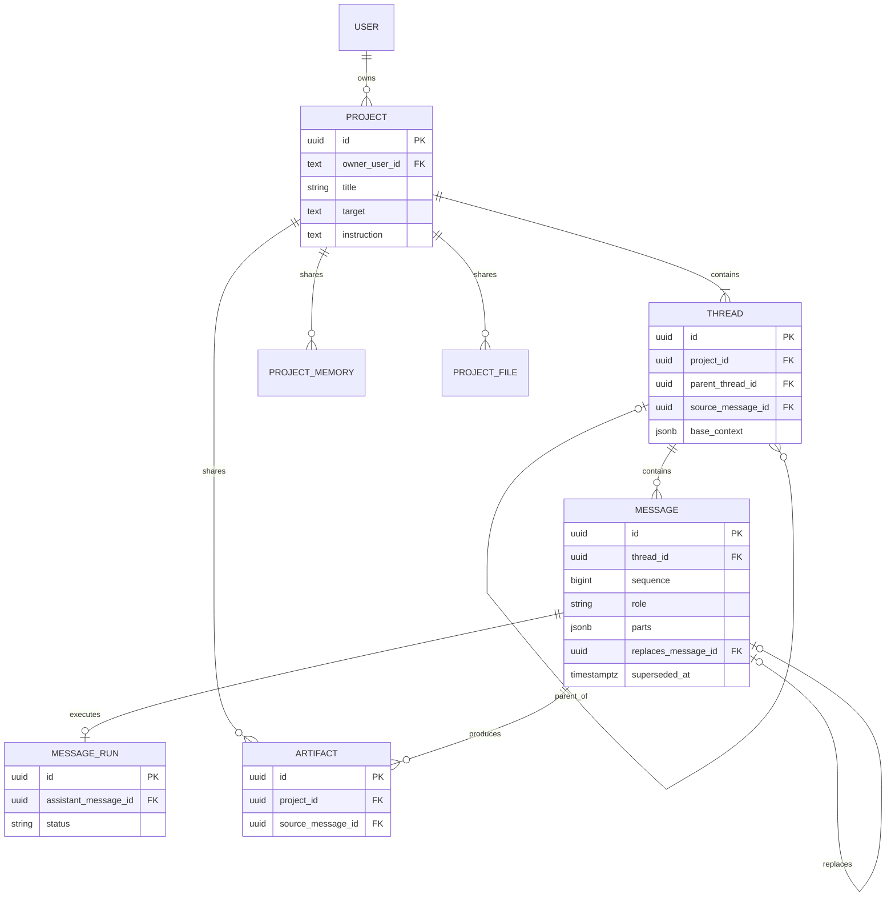
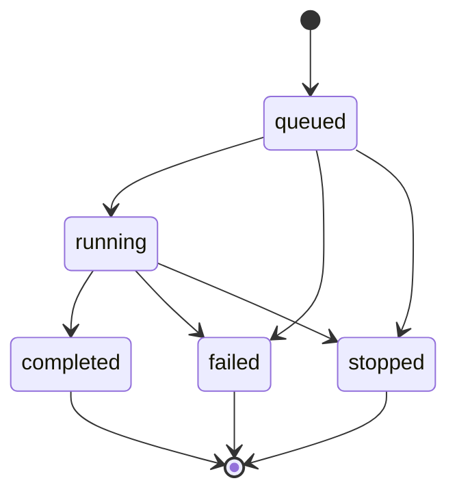

## Context

本设计实现 [proposal.md](./proposal.md) 与 [domain 增量规范](./specs/domain/spec.md) 的目标模型。它从当前已运行的 ThreadChat 模型出发，而不是从讨论阶段的草案出发。

当前基线由代码和数据库共同确定：

```text
登录 User
└── branch_trees row（treeId 由客户端生成）
    └── state: ThreadTreeState JSONB
        ├── threads: Record<threadId, Thread>
        │   └── messages: Message[]（parentMessageId + activeLeafMessageId）
        └── artifacts: Record<artifactId, Artifact>

branch_generations ── 以 treeId/threadId/messageId 关联生成 attempt
branch_message_feedback ── 以 treeId/threadId/messageId 关联反馈
```

当前不存在 Project 表，也不存在独立的 Thread、Message 表。`branch_trees.state` 是整棵树的持久化权威；`branch_generations` 是生成 attempt 的服务端 sidecar。新设计必须明确这些现有事实如何被 Project、Thread、Message 与 MessageRun 接替。

## Goals / Non-Goals

**Goals:**

- 将核心内容模型收敛为 `Project → Thread → Message`。
- 让 Project 同时成为列表项、Thread 拓扑、标题、共享资源和永久删除边界。
- 让 Project 在 MVP 中直接归属于当前登录用户，不预建尚不存在的团队/分组层。
- 保留已确认的 sequence、Message replacement、BaseContext.messageIds、Fork 与 MessageRun 机制。
- 给出从 `branch_trees`、嵌入实体和 `branch_generations` 迁移到规范化表的 PostgreSQL 目标 Schema 与模块骨架。

**Non-Goals:**

- 本 change 不修改代码、数据库、API、前端或 `tasks.md`。
- 不设计团队、成员、组织切换或平台级共享；出现真实需求后再独立建模。
- 不完整设计 Project Memory、Instruction、Target 和 File 的内容协议、检索、版本或同步机制；本设计只固定它们的 Project 归属边界。
- 不引入 Turn、Message Variant、Generation Chat 实体、通用 revision、V1 幂等系统或 ArtifactVersion。

## Decisions

### D1. 从当前 User → Thread Tree 基线迁移到 User → Project

目标所有权与聊天内容：

```text
User
└── Project
    ├── Project Resources
    │   ├── Memory
    │   ├── Instruction
    │   ├── Target
    │   ├── Files
    │   └── Artifacts
    └── Thread
        ├── Message[]
        └── Child Thread
            └── Message[]
```

服务端从 Session 获得 `actorId`，并校验 Project 的 `ownerUserId` 或未来独立引入的访问授权；客户端只以 `projectId` 作为 ThreadChat 内容入口。这个设计与当前 `branch_trees.user_id` 的直接用户所有权一致，不凭空增加新的中间实体。

若未来出现团队协作，应该新增明确的 Project 成员或平台权限模型，并迁移 `ownerUserId`；不在当前领域模型里提前建立没有生命周期和 UI 的空壳层。

### D2. Project 是一整簇 Thread 的唯一聚合边界



Project 的确定边界：

- Project 有且仅有一个 Root Thread。
- 其他 Thread 都通过 Parent/Fork 关系属于同一 Project。
- “新对话”创建 Project + Root Thread。
- “对话列表”列出 Projects。
- `/thread-chat/{projectId}` 是 canonical 内容 URL。
- Project 永久删除会清理整个 Thread 族群与共享资源。

Project 在目标模型中接替当前一条 `branch_trees` 记录所表达的产品边界，但不继承整树 JSON 的物理存储方式。迁移时，旧 `treeId` 只作为旧数据定位键或映射来源，不继续充当由客户端创建的新 Project ID。

### D3. Project Resource 共享范围与来源分离

Project Resource 的共同规则：

```text
同一 Project 的全部 Thread 可按权限使用
不同 Project 默认隔离
同一用户拥有多个 Project 也不代表内容自动共享
```

Target 与 Instruction 是 Project 当前配置；Memory 和 Files 是 Project 下的集合。Artifact 同时具有两种关系：

```text
projectId        决定可用范围和生命周期
sourceMessageId  记录产生来源
```

因此 Artifact 不再“只属于 Message”。Message 提供 provenance，Project 提供 ownership。BaseContext 仍只保存 Message ID，不复制 Artifact 正文。

### D4. Thread 角色由关系推导

统一 Thread 实体通过关系决定角色：

```text
parentThreadId = null  → Root Thread
parentThreadId != null → Branch/Child Thread
```

Fork 不建立独立 `thread_forks` 表；Child Thread 直接保存：

```ts
type ForkFacts = {
  parentThreadId: string
  sourceMessageId: string
  forkSourceSnapshot: {
    schemaVersion: 1
    quote?: string
    sourceRole: "user" | "assistant"
    sourceSequence: number
  }
  baseContext: BaseContextV1
}
```

Project、Parent Thread、来源 Message 与 Child Thread 必须属于同一 Project。

### D5. sequence 表示 Thread 内服务端写入顺序

每个 Thread 的 Message 拥有唯一、单调递增的 `sequence`：

```text
seq=1 user
seq=2 user
seq=3 assistant
seq=4 user
```

系统不要求角色交替，不保存 `prevMessageId/nextMessageId`，也不使用客户端时间排序。默认有效时间线为：

```sql
SELECT *
FROM messages
WHERE thread_id = :thread_id
  AND superseded_at IS NULL
ORDER BY sequence ASC;
```

replacement 获得新 sequence 并追加到尾部；旧 Message 保留原 sequence，通过 `supersededAt` 退出默认时间线。编辑最后一条有效 user Message 时，依赖旧内容的有效后缀一起 superseded，再追加 replacement 与新回复。这是上下文后缀失效，不是 user/assistant 配对。

完整流程见：[按 sequence 拉取 Thread 当前有效消息](./design/load-thread-messages-by-sequence.md)。

### D6. finalized Message 不可变，修改使用 replacement

不可变边界：

- user Message 的 `parts` 写入后立即不可改。
- assistant 生成增量写入 `MessageRun.checkpointParts`。
- assistant completed 时，最终 `parts` 与 `finalizedAt` 只写一次。
- finalized Message 的 role、parts、sequence 与来源关系不可更新。
- `supersededAt` 是时间线状态，不是内容修改。

Edit/Regenerate 必须创建新 Message；Regenerate 还必须创建该 assistant Message 唯一的新 MessageRun。旧 Message 不是孤儿：它仍属于原 Thread、保留 sequence，可被 BaseContext 与 Artifact provenance 引用。

未来实现必须在 Message Repository、Edit/Regenerate Command 与 Project 永久删除入口加入明确代码注释：finalized 内容不可覆盖，单 Message 不允许 hard delete。

完整 Regenerate 事务见：[创建 replacement assistant Message](./design/regenerate-replacement-assistant-message.md)。

### D7. BaseContext 只保存有序 messageIds

```ts
type BaseContextV1 = {
  schemaVersion: 1
  messageIds: string[]
}
```

Root Thread 没有 BaseContext。Branch Thread 的 BaseContext 由服务端在 Fork 时计算并永久冻结：

```text
Child BaseContext
= Parent.baseContext.messageIds
+ Parent 从开头到 sourceMessage 的有效且具备 Prompt 资格的 Message IDs
```

ID 顺序是 Prompt 顺序，不要求跨 Thread sequence 可直接比较。使用 ID 而不是 Parts 可以避免复制长文本、Tool Result 与 Artifact，并让 Parent replacement 后 Child 历史保持不变。

该方案依赖一个明确前提：单 Message 不 hard delete；只有 Project 永久删除时，引用它的全部 Child Thread 一并清理。

### D8. Fork 资格由前后端共同约束

| Message 状态 | 进入 BaseContext | 可作为 Fork source |
|---|---:|---:|
| 有效 user，finalized | 是 | 是 |
| 有效 assistant，completed | 是 | 是 |
| assistant，queued/running | 否 | 否 |
| assistant，failed/stopped | 否 | 否 |
| superseded，但已被旧 BaseContext 引用 | 保留既有引用 | 新 Fork 默认否 |

最后一条 assistant 仍 queued/running 时，前端禁用 Fork，服务端仍做最终拒绝。Fork 事务校验来源、计算 BaseContext、生成 Child Thread ID，并原子保存全部 ForkFacts。Parent 后续变化不删除 Child，也不重算 BaseContext。

### D9. 每条 assistant Message 恰有一条 MessageRun

```text
user Message      → 0 MessageRun
assistant Message → 1 MessageRun
```

Regenerate 创建新的 assistant Message，因此也创建新的 MessageRun；不会为旧 Message 增加 attempt 2。



浏览器断开只停止订阅。刷新后通过 assistantMessageId、status、checkpointParts 与 eventSequence 恢复，不创建第二个 Run。完整流程见：[刷新后恢复正在生成的 assistant Message](./design/resume-running-message-after-refresh.md)。

### D10. PostgreSQL 目标 Schema

字段使用 snake_case；所有新实体 ID 由服务端生成 UUID。目标表继续引用项目现有认证 `user.id`，不在本 change 新增其他所有权层。

#### 当前持久化到目标实体的对应关系

| 当前真实来源 | 目标 | 本 change 固定的边界 |
|---|---|---|
| `branch_trees` 一行 | 一个 Project | `user_id` 成为 `owner_user_id`；`title/custom_title` 迁移到 Project 标题；旧 `treeId` 只作迁移定位，不再由客户端生成新 ID |
| `branch_trees.state.threads` | `threads` 多行 | 每个嵌入 Thread 成为同一 Project 下的独立 row；`parentId/forkFromMsgId/anchorText` 转换为 Parent、source 与 Fork snapshot |
| `Thread.messages` 消息图 | `messages` 多行 | 当前有效路径迁移为默认时间线；所有保留节点都获得服务端 sequence，非默认节点如何标记 superseded 由持久化迁移 change 给出可验证算法 |
| `state.artifacts` | `artifacts` 多行 | 保留内容、来源 Thread/Message，并补 Project ownership |
| `branch_generations` | `message_runs` | 当前 generation 与目标 1:1 MessageRun 的转换必须显式处理历史 attempt；不得把多条 attempt 直接塞给同一 assistant Message |
| `branch_message_feedback` | 后续 Message feedback 表 | 使用迁移后的 Project/Thread/Message 映射重建关联 |

历史 `branch_trees.user_id IS NULL` 是现有兼容数据，不自动归属于任意用户。迁移实施前必须先按当前“精确 URL 认领”规则完成归属，或把未认领记录隔离；不得猜测 owner。

#### `projects`

| 字段 | 类型 | 语义 |
|---|---|---|
| `id` | uuid | PK |
| `owner_user_id` | text | FK → 现有 user.id，NOT NULL |
| `auto_title` | text | 机器派生标题 |
| `custom_title` | text | 用户标题，展示优先 |
| `target` | text/jsonb | Project 目标；协议后续细化 |
| `instruction` | text/jsonb | Project 指令；协议后续细化 |
| `archived_at` | timestamptz | 归档时间 |
| `created_at`, `updated_at` | timestamptz | NOT NULL |

展示标题为 `coalesce(custom_title, auto_title)`。索引 `(owner_user_id, updated_at DESC)` 支持当前用户的对话列表和最近 Project。

#### `threads`

| 字段 | 类型 | 语义 |
|---|---|---|
| `id` | uuid | PK |
| `project_id` | uuid | FK → projects，NOT NULL |
| `parent_thread_id` | uuid | 同 Project 自引用；Root 为 NULL |
| `source_message_id` | uuid | Branch 来源 Message；Root 为 NULL |
| `fork_source_snapshot` | jsonb | Branch 必填 |
| `base_context` | jsonb | Branch 必填，BaseContextV1 |
| `auto_title`, `custom_title` | text | Branch 局部标题 |
| `archived_at` | timestamptz | NULLABLE |
| `created_at`, `updated_at` | timestamptz | NOT NULL |

关键约束：每个 `project_id` 只能有一个 `parent_thread_id IS NULL`；Root 的 Fork 字段全部为 NULL，Branch 全部非 NULL；Parent 与来源必须属于同一 Project。

#### `messages`

| 字段 | 类型 | 语义 |
|---|---|---|
| `id` | uuid | PK |
| `thread_id` | uuid | FK → threads，NOT NULL |
| `sequence` | bigint | Thread 内服务端顺序 |
| `role` | text | user/assistant；不要求交替 |
| `parts` | jsonb | AI SDK v7 UIMessage.parts；运行中 assistant 可为 NULL |
| `replaces_message_id` | uuid | 同 Thread 自引用 |
| `superseded_at` | timestamptz | NULL 表示当前有效 |
| `finalized_at` | timestamptz | 内容封存时间 |
| `created_at` | timestamptz | NOT NULL |

约束：`UNIQUE(thread_id, sequence)`；一条 Message 最多一个直接 replacement；replacement 必须同 Thread。

#### `message_runs`

| 字段 | 类型 | 语义 |
|---|---|---|
| `id` | uuid | PK |
| `assistant_message_id` | uuid | UNIQUE FK → messages |
| `status` | text | queued/running/completed/failed/stopped |
| `model_id` | text | 实际执行模型 |
| `event_sequence` | bigint | 流恢复游标 |
| `checkpoint_parts` | jsonb | 运行中持久化内容 |
| `error_code`, `error_message` | text | 失败信息 |
| `heartbeat_at`, `stop_requested_at`, `finished_at` | timestamptz | 生命周期时间 |
| `created_at`, `updated_at` | timestamptz | NOT NULL |

运行状态通过条件更新保护，不引入通用 revision。

#### Project 共享资源骨架

```text
project_memory_items
  id PK
  project_id FK
  content JSONB
  source_message_id FK NULLABLE
  created_at / updated_at

project_files
  id PK
  project_id FK
  storage_key
  filename / mime_type / size / status
  created_at / updated_at

artifacts
  id PK
  project_id FK
  source_message_id FK NOT NULL
  kind / title / content
  created_at
```

这些表只固定 Project ownership。Memory 提取、File 存储协议、Artifact 编辑与版本化必须由后续 change 定义。

#### 删除策略

普通 Repository 不暴露单 Message hard delete。永久删除 Project 使用明确授权命令，在事务中清理 Project Resources、MessageRun、Message、Thread 和 Project。删除用户时由现有认证外键策略清理或触发其全部 Project 的删除流程。

### D11. 模块骨架

```text
thread-chat/
├── domain/
│   ├── project.ts
│   ├── project-resource.ts
│   ├── thread.ts
│   ├── message.ts
│   ├── message-run.ts
│   ├── base-context.ts
│   └── artifact.ts
├── application/
│   ├── commands/
│   │   ├── create-project.ts
│   │   ├── append-user-message.ts
│   │   ├── edit-last-user-message.ts
│   │   ├── regenerate-assistant-message.ts
│   │   ├── fork-thread.ts
│   │   └── delete-project-permanently.ts
│   ├── queries/
│   │   ├── list-projects.ts
│   │   ├── load-project-bootstrap.ts
│   │   └── load-thread-messages.ts
│   └── prompt/
│       └── resolve-prompt-history.ts
├── infrastructure/
│   ├── repositories/
│   ├── message-runner/
│   └── events/
└── transport/
    ├── http/
    └── stream/
```

领域层不依赖 React、HTTP、Drizzle 或具体 AI Runtime。AI SDK v7 UIMessage.parts 是 Message 内容兼容契约；Runtime 更换只影响 adapter。

### D12. ProjectBootstrap 与伪代码索引

进入 `/thread-chat/{projectId}` 时，首屏加载：

```text
全量 Project 的轻量 Thread topology
                    +
Root Thread 的有效 Messages 与 AssistantRunState
```

不全量加载所有 Branch Message、BaseContext 或大型 Project Resource。具体流程：

1. [从首页进入 ThreadChat](./design/enter-thread-chat-from-home.md)：首页导航、`/new` 无实体草稿边界与已有 Project 入口。
2. [按 sequence 拉取 Thread 当前有效消息](./design/load-thread-messages-by-sequence.md)：`sequence + supersededAt` 构造默认时间线。
3. [Regenerate：创建 replacement assistant Message](./design/regenerate-replacement-assistant-message.md)：旧 Message 不可变，新 Message 与 Run 原子创建。
4. [刷新后恢复正在生成的 assistant Message](./design/resume-running-message-after-refresh.md)：checkpoint、eventSequence 与重新订阅。

Provider、Zustand、路由交接和多栏异步加载属于客户端/API 设计，详见：

- [`/thread-chat/new` 首条消息与 AI 回复生命周期](../design-thread-chat-client-api/design/new-project-first-message-lifecycle.md)
- [打开已有 Project 生命周期](../design-thread-chat-client-api/design/open-existing-project-lifecycle.md)
- [Thread Message 异步加载设计](../design-thread-chat-client-api/design/thread-message-loading.md)

## Risks / Trade-offs

- **[未来需要团队共享 Project]** → 等成员、邀请、角色和所有权转移的真实生命周期明确后，再新增 Project 访问模型；MVP 保持与当前 `branch_trees.user_id` 一致的直接用户所有权。
- **[Project 既是“对话”又是长期工作项，用户文案可能混淆]** → 代码与规范统一使用 Project；UI 可暂时显示“对话”，但交互测试明确其创建/列表对象是 Project。
- **[BaseContext.messageIds 位于 JSONB，数组元素没有普通 FK]** → 禁止单 Message hard delete；Fork 时验证 ID，Project 删除时统一清理。
- **[superseded Message 增加存储]** → MVP 接受追加历史，不预建 GC；Project 删除时统一清理。
- **[Project Resource 协议尚未完整设计]** → 当前只固定 ownership 与隔离边界，Memory、Files 和 Artifact 演进分别走后续 change。
- **[MessageRun checkpoint 与最终 Message 竞态]** → 完成事务条件更新 Run，并原子写入最终 parts、finalizedAt 与 completed。

## Migration Plan

本 change 只更新设计。后续实施顺序：

1. 归档新的 `domain`，确立 Project → Thread → Message 术语。
2. 建立规范化持久化 change，定义 `branch_trees.state`、嵌入 Thread/Message/Artifact 与 `branch_generations` 到新表的迁移和校验。
3. 建立 Project/Thread Command API 与 ProjectBootstrap change。
4. 建立 MessageRun 与恢复流 change。
5. 建立客户端 Project entities、Thread topology、generationStreams 与 UI selectors。
6. 完成服务端集成、API 合同、Store/Hook 与端到端验收。
7. 切换 `/thread-chat/{projectId}` 为唯一入口，再退役旧 ThreadTree/branch generation 权威路径。

切换前可以撤销新入口并保留旧读写路径；切换后的数据禁止回写旧整树 JSON。`tasks.md` 将在领域和配套设计全部确认后统一重写，本轮不更新。
