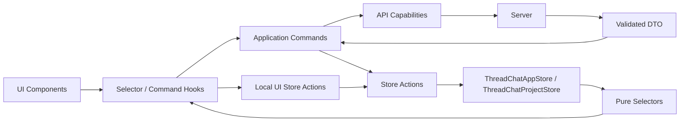
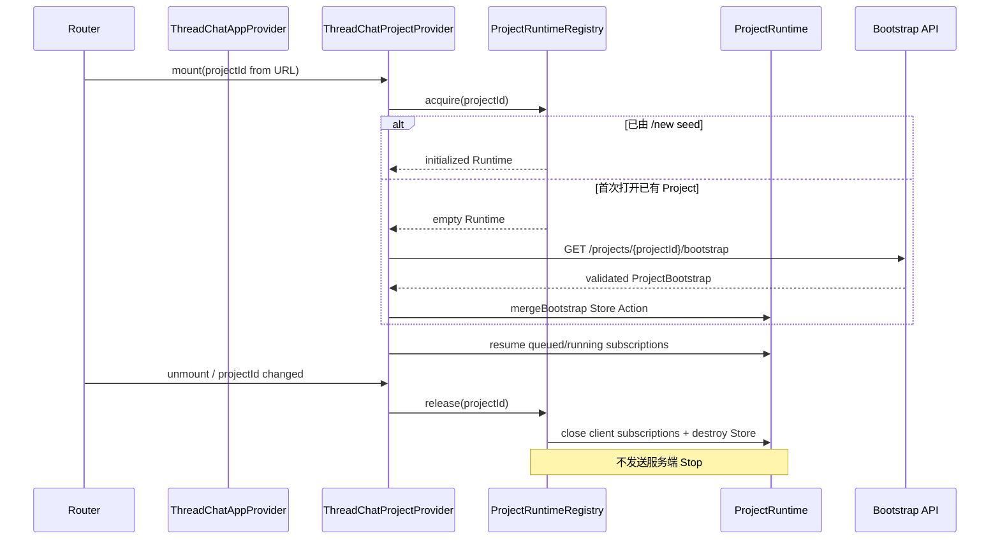
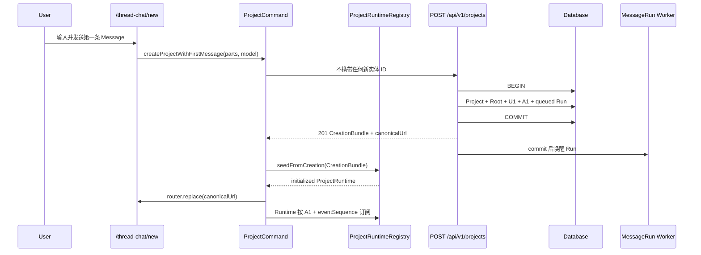

## Context

本设计依赖 `define-thread-chat-domain-model` 已确认的服务端领域事实：Project 是一整簇 Thread 的聚合边界，Thread 内 Message 以服务端 sequence 构成线性时间线，Edit/Regenerate 使用 replacement，Fork 的 BaseContext 由服务端冻结，每条 assistant Message 恰有一条 MessageRun。

当前前端的真实基线是：

```text
ThreadTreeState 整棵树
        ↓
createThreadStore（原地修改）
        ↓
全局 version++
        ↓
所有订阅者重新读取整树

chat-controller 同时承担：
客户端实体 ID + 整树持久化屏障 + Prompt 拼装
+ Command 协调 + SSE 消费 + Store 修改
```

当前实现中有四个应保留的方向：`useThreadChatRuntime` 作为页面组合根、headless 纯 selector、细分 `net/commands`、流式 delta 合帧。需要退出的是整树权威、客户端实体 ID、全局 version 粗粒度订阅和 controller 职责混合。

## Goals / Non-Goals

**Goals:**

- 定义前端实体、运行态、UI 态和 ViewModel 的唯一边界。
- 定义 ThreadChatAppStore 与 Project-scoped ThreadChatProjectStore 的 Zustand 结构。
- 定义 selector、Store Action、Application Command、Hook 与 UI 的依赖方向。
- 定义 `/thread-chat/new` 和 `/thread-chat/{projectId}` 的完整生命周期。
- 给出后端 `/api/v1` 所需的全部 MVP Query、Command、参数关系、响应 DTO 和可手动测试案例。
- 让 API 契约既服务 Web UI，也能作为未来 CLI/MCP/Token API 的基础。

**Non-Goals:**

- 不实现 Store、Hook、Route Handler、数据库或迁移。
- 不确定具体 Transport 类、HTTP 库、SSE parser、重试器和认证包装代码。
- 不实现离线命令队列、通用 Idempotency-Key、跨设备草稿、协同编辑或 Message Variant。
- 不重新设计服务端数据库 Schema、BaseContext 或 PromptBuilder。
- 不在本 change 编写 tasks；等本设计和 API 经过多轮确认后统一拆分。

## Decisions

### D1. 客户端只有一份服务端事实

数据依赖方向固定为：



entities slice 只保存服务端确认 DTO。生成流和 UI 可以暂时领先于最终实体，但不得伪造实体身份。Application Command 是唯一允许编排 API 结果的边界；它必须调用 Store Action 写入 Store。Transport、Command 和 React 组件都不直接调用 Zustand `set`/`setState`。

弃选：保存服务端实体后再构造一份可修改 `ThreadTreeState`。它会重新产生双向同步、整树覆盖和身份漂移问题。

### D2. 前端实体模型

```ts
/** 所有服务端实体 ID 对客户端都是不透明字符串；客户端不得解析或自行构造。 */
type ProjectId = string
type ThreadId = string
type MessageId = string
type ArtifactId = string

type JsonValue =
  | string
  | number
  | boolean
  | null
  | JsonValue[]
  | { [key: string]: JsonValue }

type ProjectTarget = {
  /** Project 最终希望达到的结果；不是当前任务标题，也不是完成状态。 */
  ultimate: string | null

  /** 当前阶段应优先完成的目标集合；MVP 不为单项分配 Goal ID。 */
  shortTerm: string[]

  /** 连接短期工作与终极目标的阶段性目标集合。 */
  midTerm: string[]
}

type ProjectEntity = {
  id: ProjectId

  /** 服务端授权归属；客户端只读取，绝不能通过请求修改。 */
  ownerUserId: string

  /** 服务端根据内容生成的回退标题。 */
  autoTitle: string | null

  /** 用户显式设置的标题；非空时展示优先级高于 autoTitle。 */
  customTitle: string | null

  /** 整个 Project 及其全部 Thread 共享的目标。 */
  target: ProjectTarget | null

  /** 构造该 Project 内模型请求时统一应用的 Project 指令。 */
  instruction: string | null

  /** 非空表示从默认 Project 列表隐藏，但内容和 Thread 仍然保留。 */
  archivedAt: string | null
  createdAt: string
  updatedAt: string
}

type ForkSourceSnapshot = {
  /** 允许未来升级快照形状；不是 Project/Thread revision。 */
  schemaVersion: 1

  /** Fork 时用于来源展示的冻结引用文本；来源以后变化也不回写。 */
  quote?: string

  /** Fork 当时来源 Message 的角色，用于稳定展示和审计。 */
  sourceRole: "user" | "assistant"

  /** Fork 当时来源 Message 在 Parent Thread 内的 sequence。 */
  sourceSequence: number
}

type ThreadEntity = {
  id: ThreadId

  /** Thread 所属聚合边界；Parent、来源 Message 和 Child 必须同 Project。 */
  projectId: ProjectId

  /** null 表示 Project 唯一 Root；非 null 表示 Branch/Child Thread。 */
  parentThreadId: ThreadId | null

  /** Branch 的 Fork 来源 Message；Root 必须为 null。 */
  sourceMessageId: MessageId | null

  /** Branch 创建时冻结的来源展示事实；Root 必须为 null。 */
  forkSourceSnapshot: ForkSourceSnapshot | null

  /** 服务端生成的 Branch 回退标题；Root 的展示标题来自 Project。 */
  autoTitle: string | null

  /** 用户设置的 Branch 标题；不得为 Root 建立第二套标题权威。 */
  customTitle: string | null

  /** 非空只改变 Branch 的默认导航可见性，不删除 Message 或 Child。 */
  archivedAt: string | null
  createdAt: string
  updatedAt: string
}

type MessageEntity = {
  id: MessageId

  /** Message 只属于一个 Thread；跨 Thread 上下文由服务端 BaseContext 解析。 */
  threadId: ThreadId

  /** 服务端分配的 Thread 内单调顺序；可有间隙，replacement 后不得重排。 */
  sequence: number

  role: "user" | "assistant"

  /** AI SDK v7 UIMessage.parts；运行中 assistant 可为 null，最终内容只封存一次。 */
  parts: UIMessage["parts"] | null

  /** 当前 Message 替代的旧 Message；replacement 仍然是追加的新实体。 */
  replacesMessageId: MessageId | null

  /** 非空表示该 Message 已退出默认有效时间线，但仍保留内容、sequence 和引用。 */
  supersededAt: string | null

  /** 非空表示内容已经封存；封存后的 parts 不允许原地覆盖。 */
  finalizedAt: string | null
  createdAt: string
}

type ArtifactEntity = {
  id: ArtifactId

  /** Artifact 对整个 Project 可用，不只属于产生它的 Thread。 */
  projectId: ProjectId

  /** 产生该 Artifact 的 Message，用于 provenance 和 BaseContext 间接解析。 */
  sourceMessageId: MessageId

  /** Artifact 语义类型；具体 kind 协议由后续 Artifact change 固定。 */
  kind: string
  title: string

  /** false 表示本响应只返回元数据/引用，不能据 content=null 推断资源为空。 */
  contentIncluded: boolean

  /** 仅在 contentIncluded=true 时有值；大型正文允许按需加载。 */
  content: JsonValue | null
  createdAt: string
}

type AssistantRunState = {
  /** 客户端关联键；不暴露服务端内部 MessageRun ID。 */
  assistantMessageId: MessageId

  /** 生成生命周期；它不是 Message 自身的 status 字段。 */
  status: "queued" | "running" | "completed" | "failed" | "stopped"

  /** 服务端实际接受并执行的模型，可能不同于客户端 requestedModelId。 */
  modelId: string

  /** 已持久化的运行中内容；刷新后先用它恢复画面，再续接事件。 */
  checkpointParts: UIMessage["parts"]

  /** 该 assistant Run 内严格递增的恢复游标，不是 Thread revision。 */
  eventSequence: number

  /** 仅保存可展示/可判断的结构化失败，不保存服务端堆栈。 */
  error: { code: string; message: string } | null

  /** 非空表示 Stop 已被服务端接受；不代表 Run 已进入 stopped 终态。 */
  stopRequestedAt: string | null

  /** completed/failed/stopped 的终态时间；queued/running 为 null。 */
  finishedAt: string | null
}
```

关键约束：

- `ProjectTarget` 先只表达终极、短期和中期目标，不引入 Goal ID、进度或截止时间。
- `Message.parts` 严格使用项目 AI SDK v7 UIMessage parts 协议。
- Message 不存 `status`；展示状态由 `finalizedAt/supersededAt + AssistantRunState` 派生。
- Thread 不存 `children/depth/isRoot/breadcrumb`；全部从 Parent 关系派生。
- AssistantRunState 是前端运行视图，不是可导航 Chat Entity。
- BaseContext、Prompt History 和服务端 MessageRun ID 不进入普通客户端实体模型。

### D3. 两种 Store 生命周期，而不是 Store 树

“App 级”和“Project 级”表示生命周期，不表示父 Store 内嵌子 Store。两者都是独立 vanilla Zustand Store 实例，通过 Provider/Runtime 组合。

#### 共同请求状态

```ts
type LoadState =
  | { status: "idle" }
  | { status: "loading" }
  | { status: "ready" }
  | { status: "error"; error: ClientError }

type CommandState =
  | { status: "submitting" }
  | { status: "error"; error: ClientError }

type ThreadMessageWindowState = {
  /** 该 Thread 的 Message bundle 是否已经加载。 */
  loadState: LoadState

  /** 服务端是否还有更早有效 Message；MVP 只保留能力，不自动翻页。 */
  hasOlderMessages: boolean

  /** 当前已合并窗口的 sequence 边界；空 Thread 时均为 null。 */
  oldestReturnedSequence: number | null
  newestReturnedSequence: number | null
}
```

`commandByScope` 中不存在 key 表示当前没有提交或错误；成功后删除 key，失败时保留 error 供 UI 展示。`threadMessagesById` 中不存在 Thread key 表示从未请求，不能与“已成功加载但返回空 Message”混淆。

#### App 级 ThreadChatAppStore

```ts
type ProjectSummary = {
  id: ProjectId

  /** 已应用 customTitle > autoTitle 回退规则，可直接用于列表。 */
  displayTitle: string

  /** 用于 active/archived 列表过滤。 */
  archivedAt: string | null

  /** 用于 `updatedAt DESC, id DESC` 的稳定最近访问排序。 */
  updatedAt: string

  /** 列表统计，不携带 Thread topology 或 Message 正文。 */
  threadCount: number
  messageCount: number
}

type ProjectCatalogState = {
  /** 服务端确认的轻量 Project 摘要；不保存 Project 完整实体。 */
  projectsById: Record<ProjectId, ProjectSummary>

  /** 当前列表查询顺序；与 projectsById 分离以避免复制摘要内容。 */
  orderedProjectIds: ProjectId[]

  /** 首次加载、刷新或加载下一页的整体状态。 */
  loadState: LoadState

  /** 当前列表查询条件；不是当前选中的 Project。 */
  activeFilter: "active" | "archived"

  /** 服务端签发的下一页不透明游标；null 表示没有下一页。 */
  nextCursor: string | null
}

type AppShellUiState = {
  /** 左侧 Project 导航是否展开；只影响当前设备布局。 */
  sidebarOpen: boolean

  /** 用户调整后的 Sidebar 像素宽度；与服务端 Project 内容无关。 */
  sidebarWidth: number

  /** 仅用于客户端过滤已加载 ProjectSummary，不写回服务端。 */
  projectSearchQuery: string

  /**
   * 用户已经点击并开始路由跳转、但目标 ProjectProvider 尚未就绪的 Project。
   * 它只驱动列表 loading/防重复点击；当前 Project 的唯一权威仍是 URL。
   * 路由完成、失败或被取消时必须清为 null。
   */
  pendingProjectId: ProjectId | null
}

type ThreadChatAppState = {
  /** Project 列表的服务端确认摘要和查询窗口。 */
  catalog: ProjectCatalogState

  /** 跨 Project 页面持续存在、但不属于任何 Project 的 App 外壳 UI。 */
  shellUi: AppShellUiState
}

type ThreadChatAppActions = {
  mergeProjectPage: (result: ListProjectsResult) => void
  upsertProjectSummary: (summary: ProjectSummary) => void
  removeProjectSummary: (projectId: ProjectId) => void
  setCatalogFilter: (filter: ProjectCatalogState["activeFilter"]) => void
  setProjectRoutePending: (projectId: ProjectId | null) => void
  setSidebarOpen: (open: boolean) => void
  setSidebarWidth: (width: number) => void
  setProjectSearchQuery: (query: string) => void
}

type ThreadChatAppStore = ThreadChatAppState & ThreadChatAppActions
```

`ThreadChatAppStore` 取代原先只描述一半的 `ProjectCatalogStore`：Catalog 是服务端列表摘要 slice，AppShellUi 是跨 Project 的本地外壳 slice。这里仍然没有 `selectedProjectId`；Sidebar 选中态必须由 `routeProjectId` 派生。

“App 级”不等于模块级服务器单例。Next.js 下必须由 `ThreadChatAppProvider` 创建 vanilla Store，避免跨请求共享状态。

无 `initialCatalog` 时，App Store 从空 `projectsById/orderedProjectIds`、`loadState=idle`、`nextCursor=null` 初始化；AppShellUi 使用产品默认 Sidebar 设置，且 `pendingProjectId=null`。

#### Project 级 ThreadChatProjectStore

```ts
type ThreadChatEntitiesState = {
  /** Bootstrap 前为 null；合并后必须与 Provider 的 projectId 一致。 */
  project: ProjectEntity | null

  /** 当前 Project 的全量轻量 topology，以及已按命令新增的 Thread。 */
  threadsById: Record<ThreadId, ThreadEntity>

  /** 已加载 Message 的唯一内容表；可以包含已 superseded 的历史实体。 */
  messagesById: Record<MessageId, MessageEntity>

  /**
   * Thread → 已加载 Message ID 的查询索引，不复制 Message 内容。
   * normalizer 负责去重并按 sequence 排序；有效时间线再由 selector 过滤 supersededAt。
   */
  messageIdsByThreadId: Record<ThreadId, MessageId[]>

  /** 仅保存 Bootstrap/Message bundle 已包含或用户按需加载的 Artifact。 */
  artifactsById: Record<ArtifactId, ArtifactEntity>
}

type StreamBuffer = {
  /** 尚未在下一次 UI flush 中合入 checkpoint 的 AI SDK v7 增量事件。 */
  pendingChunks: UIMessageChunk[]

  /** 已接收的最新事件游标，用于丢弃重复或倒序 delta。 */
  lastReceivedEventSequence: number

  /** 是否已经安排 requestAnimationFrame/批量 flush，防止每 token setState。 */
  flushScheduled: boolean
}

type ThreadChatRunsState = {
  /** 每条 assistant Message 的权威运行视图；内部 MessageRun ID 不进入客户端。 */
  byAssistantMessageId: Record<MessageId, AssistantRunState>

  /** 只在生成期间存在的高频缓冲；不得持久化到 localStorage。 */
  streamBuffersByAssistantMessageId: Record<MessageId, StreamBuffer>
}

type ThreadChatRequestsState = {
  /** 当前 ProjectBootstrap 的请求状态。 */
  bootstrap: LoadState

  /** 每个 Thread 的加载状态和已合并窗口边界，避免重复请求。 */
  threadMessagesById: Record<ThreadId, ThreadMessageWindowState>

  /**
   * 当前页面的命令 busy/error 状态，key 由命令名和既有资源 ID 构成，
   * 例如 `send:${threadId}`、`regenerate:${messageId}`；它不是网络级幂等记录。
   */
  commandByScope: Record<string, CommandState>
}

type ThreadColumnSlot = {
  /** 槽位当前展示的 Branch Thread；Root 固定在主列，不进入 slots。 */
  threadId: ThreadId

  /** true 表示折叠为窄条，保留位置但不计入展开列上限。 */
  folded: boolean
}

type TextSelectionState = {
  /** 发生选区的既有 Message。 */
  messageId: MessageId

  /** 用户实际选择的规范文本，用作 Fork anchor 输入而不是服务端历史事实。 */
  exactQuote: string

  /** 在规范文本投影中的 UTF-16 [start,end)；无法稳定定位时允许省略。 */
  textPosition?: { start: number; end: number }
}

type OverlayState = {
  /** 当前文本选区/Fork 气泡的语义输入；DOM Rect 和动画状态留在组件局部。 */
  selection: TextSelectionState | null

  /** Thread 切换器当前作用域；DOM 坐标和退场动画仍留在组件局部状态。 */
  threadSwitcherScope:
    | { kind: "global" }
    | { kind: "column"; threadId: ThreadId }
    | { kind: "subtree"; rootThreadId: ThreadId }
    | null

  treeListOpen: boolean
  helpPanelOpen: boolean
  artifactDrawerOpen: boolean
}

type ThreadChatUiState = {
  /**
   * Root 右侧的有序 Branch 槽位及折叠态，是分栏布局的唯一权威。
   * `visibleThreadIds` 必须由它派生，不再作为第二份 State 保存。
   */
  columnSlots: ThreadColumnSlot[]

  /**
   * 当前接收全局快捷键/工具栏命令的 Thread。
   * 它必须是 Root 或一个未折叠 column slot；ThreadColumn 自身命令仍使用自己的 threadId。
   */
  focusedThreadId: ThreadId | null

  /** 用户显式调整的展开列宽；无条目表示自动均分，折叠细条不读取此值。 */
  columnWidths: Record<ThreadId, number>

  /** null 表示根据视口自适应；非 null 是用户强制的展开列数量上限。 */
  forceColumnCount: number | null

  /** replace 在列满时替换一个槽；fold 保留槽位并把一列折叠为细条。 */
  placementMode: "replace" | "fold"

  /** columns 用于并排深读；canvas 用于查看整个 Thread topology。 */
  viewMode: "columns" | "canvas"

  /** Canvas 中 Thread 的设备本地坐标；不存在条目的 Thread 使用自动布局。 */
  canvasPins: Record<ThreadId, Point>

  /** 每个 Thread 独立的未发送输入；切换列时不丢失草稿。 */
  composerDraftByThreadId: Record<ThreadId, UIMessage["parts"]>

  /** 当前 Artifact Drawer 的目标；Drawer 关闭后可以保留，便于重新打开。 */
  selectedArtifactId: ArtifactId | null

  /** 支撑列满 LRU 策略的本地逻辑时钟；不是服务端活动时间。 */
  activationClock: number

  /** Thread 最近一次获得焦点/被打开时的逻辑顺序，用于选择替换或折叠候选。 */
  lastActivatedOrderByThreadId: Record<ThreadId, number>

  /** 只保存跨组件需要共享的语义开关；DOM 引用、坐标和动画计数不进 Store。 */
  overlays: OverlayState
}

type ThreadChatProjectState = {
  /** 服务端确认的 Project/Thread/Message/Artifact 事实。 */
  entities: ThreadChatEntitiesState

  /** assistant Message 的运行视图和未 flush 流缓冲。 */
  runs: ThreadChatRunsState

  /** Query/Command 的客户端请求状态；不是服务端领域状态。 */
  requests: ThreadChatRequestsState

  /** 当前设备上的 Project 工作台布局和交互焦点。 */
  ui: ThreadChatUiState
}

type ThreadChatProjectActions = {
  mergeCreationBundle: (bundle: CreationBundle) => void
  mergeBootstrap: (bootstrap: ProjectBootstrap) => void
  applyMessageBundle: (bundle: ThreadMessageBundle) => void
  applyMessageCreationBundle: (bundle: MessageCreationBundle) => void
  applyThreadCreated: (thread: ThreadEntity) => void
  applyReplacementBundle: (bundle: ReplacementBundle) => void
  applyRunEvent: (event: AssistantMessageEvent) => void
  setCommandState: (scope: string, state: CommandState | null) => void
  openThread: (threadId: ThreadId, sourceThreadId: ThreadId | null) => void
  closeThread: (threadId: ThreadId) => void
  focusThread: (threadId: ThreadId) => void
  setColumnWidth: (threadId: ThreadId, width: number | null) => void
  setPlacementMode: (mode: ThreadChatUiState["placementMode"]) => void
  setViewMode: (mode: ThreadChatUiState["viewMode"]) => void
}

type ThreadChatProjectStore =
  & ThreadChatProjectState
  & ThreadChatProjectActions
```

同一个 Project Store 内使用 slices，可以由一个 Store Action 通过一次 `set` 同时更新 Message、Run 和 request state；这不是把 slices 物理拆成多个 Store。组件通过细粒度 selector 订阅。

`columnSlots` 取代原先不充分的 `visibleThreadIds` State：fold 模式必须保存槽位折叠态。`selectVisibleThreadIds` 和 `selectVisibleColumns` 从 Root + `columnSlots` 派生，避免两份分栏权威。

Project Store 初始化和分栏变更必须保持：

- 空 Runtime 从 `project=null`、空实体表、`bootstrap=idle`、空 `columnSlots` 和 `focusedThreadId=null` 初始化。
- Bootstrap 后 `focusedThreadId` 默认是 Root；Root 固定渲染，不进入 `columnSlots`。
- `columnSlots.threadId` 必须唯一、属于当前 Project 且不是 Root；恢复 localStorage 时过滤失效 ID。
- `focusedThreadId` 非 Root 时必须指向未折叠槽位；打开/展开 Thread 同时使其获得焦点。
- 关闭或折叠当前焦点时，按相邻展开槽位、Root 的顺序选择新焦点，不允许留下悬空 ID。
- App Store 和 Project Store 的 UI slice 可以写入设备 localStorage；entities、runs 和 requests 不得以它作为持久化权威。

### D4. Provider、Runtime 与当前 Project 选择

Provider 解决的是“组件树应该使用哪个 Store 实例”，不是第三套业务 State。当前 Project 身份只来自 `/thread-chat/{projectId}` 的路由参数；Catalog 和 AppShellUi 都不保存 `selectedProjectId`。

#### Runtime 类型

```ts
type ThreadChatAppCommands = {
  /** 加载或继续加载轻量 Project Catalog。 */
  loadProjectCatalog: (input?: { reset?: boolean }) => Promise<void>

  /** 设置 pendingProjectId 后执行路由跳转；不直接选择 Project Store。 */
  navigateToProject: (projectId: ProjectId) => void

  /** Project 删除成功后更新 Catalog，并在当前路由命中时导航离开。 */
  deleteProject: (projectId: ProjectId) => Promise<void>
}

type ThreadChatProjectCommands = {
  /** 只在未 seed、未 ready 时加载当前 Provider Project 的 Bootstrap。 */
  loadProjectBootstrap: () => Promise<void>
  ensureThreadMessages: (threadId: ThreadId) => Promise<void>
  updateProject: (patch: PatchProjectRequest) => Promise<void>
  updateThread: (threadId: ThreadId, patch: PatchThreadRequest) => Promise<void>
  archiveThread: (threadId: ThreadId) => Promise<void>
  sendMessage: (threadId: ThreadId, parts: UIMessage["parts"]) => Promise<void>
  forkThread: (input: ForkThreadRequest) => Promise<ThreadEntity>
  editLastUserMessage: (input: EditMessageRequest) => Promise<void>
  regenerateAssistant: (input: RegenerateMessageRequest) => Promise<void>
  submitFeedback: (input: PutMessageFeedbackRequest) => Promise<void>

  /** 唯一会请求服务端停止 Run 的入口；关闭连接不得调用它。 */
  stopAssistant: (assistantMessageId: MessageId) => Promise<void>
}

type GenerationCoordinator = {
  /** 扫描已加载 queued/running Run，并按 assistantMessageId 去重订阅。 */
  resumeLoadedRuns: () => void

  /** 从 Store 中现有 eventSequence 建立或复用一条事件连接。 */
  subscribeAssistant: (assistantMessageId: MessageId) => void

  /** 只断开浏览器订阅；不调用 Stop API。 */
  unsubscribeAssistant: (assistantMessageId: MessageId) => void

  /** Runtime 销毁时关闭全部客户端连接与 flush 调度。 */
  destroy: () => void
}

type ThreadChatAppRuntime = {
  /** Provider-scoped App Store；不是模块级服务器单例。 */
  appStore: StoreApi<ThreadChatAppStore>

  /** 管理 ProjectRuntime 身份和从 /new 到 canonical URL 的一次性交接。 */
  projectRuntimeRegistry: ProjectRuntimeRegistry

  /** 命令工厂内部共享的已校验 API capability；React 组件不得直接调用。 */
  api: ThreadChatApiCapabilities

  /** 只操作 Catalog、AppShell 和跨 Project 路由的 App 级命令。 */
  commands: ThreadChatAppCommands

  /** AppProvider 卸载时销毁所有未释放 Runtime 和客户端连接。 */
  destroy: () => void
}

type ThreadChatProjectRuntime = {
  /** Runtime 与路由、Store.entities.project 必须始终一致的身份。 */
  projectId: ProjectId

  /** 当前 Project 唯一的 Zustand Store 实例。 */
  store: StoreApi<ThreadChatProjectStore>

  /** 已绑定 api、store 和 coordinator 的 Project 级业务命令集合。 */
  commands: ThreadChatProjectCommands

  /**
   * 管理该 Project 内 assistantMessageId → 事件连接的客户端协调器。
   * 连接对象不进入 Zustand State；断开只取消订阅，不发送 Stop。
   */
  generationCoordinator: GenerationCoordinator
}

type ProjectRuntimeRegistry = {
  /**
   * `/new` 创建成功后用 CreationBundle 建立已初始化 Runtime，等待目标路由 Provider 接管。
   * 这是一次性 navigation handoff，不是无边界 Project cache。
   */
  seedFromCreation: (bundle: CreationBundle) => ThreadChatProjectRuntime

  /**
   * 为路由 projectId 取得唯一 Runtime：优先消费 seed；否则创建空 Store 等待 Bootstrap。
   * 同一 Provider 生命周期内重复 acquire 必须返回同一实例。
   */
  acquire: (projectId: ProjectId) => ThreadChatProjectRuntime

  /**
   * ProjectProvider 卸载时释放租约、关闭浏览器事件连接并销毁无租约 Runtime。
   * 它不得调用服务端 Stop；后台 MessageRun 继续运行。
   */
  release: (projectId: ProjectId) => void

  /** 只用于诊断和测试是否已有实例，不得成为 UI 选择当前 Project 的方式。 */
  peek: (projectId: ProjectId) => ThreadChatProjectRuntime | null
}
```

Registry 不是 Zustand Store，也不参与 selector。它只管理包含 Store、Commands 和连接协调器的非序列化 Runtime 对象。P0 在最后一个 Provider release 后立即销毁 ProjectRuntime，不建立 LRU 多 Project 缓存。

#### Provider 类型与职责

```ts
type ThreadChatRoute =
  /** 无持久化实体 ID 的首次创建入口。 */
  | { kind: "new" }

  /** projectId 直接来自 `/thread-chat/{projectId}` 路由参数。 */
  | { kind: "project"; projectId: ProjectId }

type ThreadChatAppProviderProps = {
  children: ReactNode

  /** 可选的首屏 Catalog 数据，用于服务端渲染与客户端 hydration 一致。 */
  initialCatalog?: ListProjectsResult
}

type ThreadChatProjectProviderProps = {
  children: ReactNode

  /** 直接来自路由 params；不是 Catalog Store 的 selected 状态。 */
  projectId: ProjectId
}

type NewProjectDraftProviderProps = {
  children: ReactNode

  /** `/new` 可选初始模型偏好；这里不存在 Project/Thread 实体 ID。 */
  initialRequestedModelId?: string
}
```

`ThreadChatRoute` 是 Router 的解析结果，不存入 Zustand。它决定挂载 DraftProvider 还是 ProjectProvider，也因此是当前 Project 身份的唯一来源。

`ThreadChatAppProvider`：

- 在 ThreadChat App 外壳边界用 `createStore` 创建一次 `ThreadChatAppStore`、Registry 和 API capabilities。
- 通过 React Context 向 Sidebar 与 Project route 提供 `ThreadChatAppRuntime`。
- “App 级”只表示在 ThreadChat 路由之间持续存在；不得在 Next.js 服务端用模块变量跨请求共享。

`ThreadChatProjectProvider`：

- 使用 route `projectId` 调用 `registry.acquire(projectId)`，并向下提供唯一 `ThreadChatProjectRuntime`。
- Provider 必须以 `key={projectId}` 挂载；路由身份变化时旧 Provider release，新 Provider acquire。
- 若 Runtime 尚未由 `/new` seed，则发起 Bootstrap；若已 seed，则直接使用 CreationBundle 内容并恢复 Run 订阅。
- Bootstrap DTO 的 `project.id` 与任何 Thread `projectId` 不匹配 Provider 身份时，必须拒绝合并。
- 当前 Provider 就绪或失败时，如果 `pendingProjectId` 等于自己的 projectId，必须将它清为 null。

`NewProjectDraftProvider`：

- 只存在于 `/thread-chat/new`，保存无实体 ID 的本地草稿与提交状态。
- 创建成功后调用 `registry.seedFromCreation(bundle)`，再 `router.replace(bundle.canonicalUrl)`。
- 目标 ProjectProvider acquire 同一 seeded Runtime，因此无需为了路由切换重新请求 Bootstrap。

Provider 必须只创建一次 vanilla Store/Runtime，不能在 React 重渲染时重新执行 factory：

```tsx
const ThreadChatAppRuntimeContext =
  createContext<ThreadChatAppRuntime | null>(null)

const ThreadChatProjectRuntimeContext =
  createContext<ThreadChatProjectRuntime | null>(null)

function ThreadChatAppProvider({
  children,
  initialCatalog,
}: ThreadChatAppProviderProps) {
  /** useState initializer 保证同一次 Provider 生命周期只有一个 AppRuntime。 */
  const [runtime] = useState(() =>
    createThreadChatAppRuntime({ initialCatalog }),
  )

  useEffect(() => {
    return () => runtime.destroy()
  }, [runtime])

  return (
    <ThreadChatAppRuntimeContext.Provider value={runtime}>
      {children}
    </ThreadChatAppRuntimeContext.Provider>
  )
}

function ThreadChatProjectProvider({
  children,
  projectId,
}: ThreadChatProjectProviderProps) {
  const appRuntime = useThreadChatAppRuntime()

  /** 外层 key={projectId} 保证 initializer 捕获的身份不会在实例内漂移。 */
  const [runtime] = useState(() =>
    appRuntime.projectRuntimeRegistry.acquire(projectId),
  )

  useProjectRuntimeLifecycle(runtime)

  useEffect(() => {
    return () => {
      appRuntime.projectRuntimeRegistry.release(projectId)
    }
  }, [appRuntime, projectId])

  return (
    <ThreadChatProjectRuntimeContext.Provider value={runtime}>
      {children}
    </ThreadChatProjectRuntimeContext.Provider>
  )
}
```

#### Provider 组合

```tsx
<ThreadChatAppProvider initialCatalog={initialCatalog}>
  <ProjectSidebar />

  {route.kind === "new" ? (
    <NewProjectDraftProvider>
      <NewProjectScreen />
    </NewProjectDraftProvider>
  ) : (
    <ThreadChatProjectProvider
      key={route.projectId}
      projectId={route.projectId}
    >
      <ThreadChatScreen />
    </ThreadChatProjectProvider>
  )}
</ThreadChatAppProvider>
```

#### Runtime 与 Store Hooks

```ts
function useThreadChatAppRuntime(): ThreadChatAppRuntime
function useThreadChatProjectRuntime(): ThreadChatProjectRuntime

function useThreadChatAppStore<T>(
  selector: (state: ThreadChatAppStore) => T,
): T {
  return useStore(useThreadChatAppRuntime().appStore, selector)
}

function useThreadChatStore<T>(
  selector: (state: ThreadChatProjectStore) => T,
): T {
  return useStore(useThreadChatProjectRuntime().store, selector)
}

function useThreadChatCommands(): ThreadChatProjectCommands {
  return useThreadChatProjectRuntime().commands
}
```

两个 Runtime Hook 是基础设施 Hook，供 Store/Command/Lifecycle Hook 组合使用；普通 UI 组件应优先使用细粒度 Selector Hook 和 Command Hook，不直接取得 `api`、Registry 或 Coordinator。

三个“当前”必须分开：

```text
current Project       = URL routeProjectId
current Project Store = ProjectProvider 当前提供的 Runtime.store
focused Thread        = Runtime.store.ui.focusedThreadId
```

一个 Project 可以同时展示多个 `columnSlots`，所以没有全局唯一的“selected Thread 内容”。ThreadColumn 的命令始终使用自己的 `threadId`；`focusedThreadId` 只服务全局快捷键、工具栏和无列级参数的 UI 操作。

#### Provider 生命周期



### D5. 明确什么不能存进 Store

以下数据必须用 selector 计算：

```text
rootThreadId
childThreadIds
threadDepth
breadcrumbs
activeMessages
visibleThreadIds
threadTreeRows
branchCount
canFork
canEdit
canRegenerate
threadColumnView
projectHeaderView
```

核心 selectors：

```ts
selectRootThreadId(state): ThreadId
selectChildThreadIds(state, parentThreadId): ThreadId[]
selectThreadLineage(state, threadId): ThreadEntity[]
selectActiveMessages(state, threadId): MessageEntity[]
selectMessageView(state, messageId): MessageView
selectForkAvailability(state, messageId): ForkAvailability
selectThreadColumnView(state, threadId): ThreadColumnView
selectProjectTreeRows(state): ProjectTreeRow[]
selectVisibleThreadIds(state): ThreadId[]
selectVisibleColumns(state): ThreadColumnView[]
```

`selectActiveMessages` 的唯一规则：

```text
message.threadId === threadId
AND supersededAt === null
ORDER BY sequence ASC
```

ViewModel 可以组合实体、Run、Artifact 和 UI，但永远不是 API 请求体或持久化对象。

### D6. Store Actions 与 Application Commands 取代 monolithic chat-controller

#### Store Actions

Store Action 与对应 Zustand Store/slice 共置，只执行同步、可测试的 State Transition，并且是客户端唯一允许调用 `set`/`setState` 的位置。MVP 至少包含：

```ts
mergeBootstrap          → 跨 entities/runs/requests 原子初始化 Project
applyMessageBundle      → 合并一个 Thread 的有效 Message、Run 与 Artifact
applyMessageCreationBundle → 合并发送命令返回的 user、assistant 与 Run
applyThreadCreated      → 合并服务端创建的 Child Thread
applyReplacementBundle  → 原子标记 superseded 并合并 replacement 与新 Run
applyRunEvent           → 只更新对应 assistantMessageId 的流状态或终态
openThread/closeThread  → 根据 placementMode 更新 columnSlots
focusThread             → 更新全局快捷键与工具栏的 Thread 焦点
```

合并类 Store Action 是内部写入口，不直接暴露给 UI；`openThread`、`closeThread`、`focusThread` 这类纯本地 UI Action 可以由 Command Hook 直接调用。Store Action 不调用 API、不导航、不建立 SSE，并且不得原地改写已确认实体内容。

这遵循 Zustand 将 state 与 actions 共置、使用 `set`/`setState` 提交更新以及用 slices 组织大型 Store 的推荐方式。我们额外规定 Store Action 保持同步、IO 放入 Application Command；这是本项目为了固定副作用边界采用的更严格约束，不是 Zustand 强制要求。

#### Application Commands

目标结构：

```text
client/application/
├── project-commands
│   ├── loadProjectCatalog
│   ├── createProjectWithFirstMessage
│   ├── updateProject
│   ├── archiveProject
│   └── deleteProject
├── thread-commands
│   ├── loadProjectBootstrap
│   ├── ensureThreadMessages
│   ├── forkThread
│   ├── updateThread
│   └── archiveThread
├── message-commands
│   ├── sendMessage
│   ├── editLastUserMessage
│   ├── regenerateAssistant
│   └── submitFeedback
└── generation-coordinator
    ├── resumeLoadedRuns
    ├── subscribeAssistant
    ├── handleEvent
    ├── unsubscribeAssistant
    └── destroy
```

Application Command 的共同算法：

```text
读取最小本地前置条件
→ 调用 Store Action 设置 scope busy（只防当前页面重复提交）
→ 调用一个 API capability
→ 校验响应 DTO
→ 调用一次语义化 Store Action 原子合并服务端事实
→ 启动后续生命周期动作（订阅、导航、打开列）
→ 调用 Store Action 清理 busy / 写结构化错误
```

Application Command 不生成实体 ID、不构造 Prompt、不提交 BaseContext、不序列化整棵 Project，也不直接调用 `set`/`setState`。

### D7. `/thread-chat/new` 是草稿模式，不是 Project

```ts
type NewProjectDraftState = {
  /** 明确表示本 Store 没有持久化 Project 身份，禁止把 "new" 当作 ProjectId。 */
  kind: "new"

  /** 首次发送前的 AI SDK v7 输入草稿；API 失败时必须保留。 */
  draftParts: UIMessage["parts"]

  /** 用户为首次回答选择的模型偏好；实际模型仍以服务端 Run 为准。 */
  requestedModelId: string

  /** 只描述首次创建命令，不代表任何 Project/Message 运行状态。 */
  status: "idle" | "submitting" | "error"

  /** 创建命令的可展示错误；idle/submitting 时为 null。 */
  error: ClientError | null
}

type NewProjectDraftActions = {
  setDraftParts: (parts: UIMessage["parts"]) => void
  setRequestedModelId: (modelId: string) => void
  markSubmitting: () => void
  markError: (error: ClientError) => void
  resetSubmission: () => void
}

type NewProjectDraftStore = NewProjectDraftState & NewProjectDraftActions
```

`NewProjectDraftStore` 由 `NewProjectDraftProvider` 创建并随 `/new` 页面销毁，不放进 ThreadChatAppStore，也不插入 ThreadChatProjectStore.entities。UI 通过 `NewProjectScreen` 复用 Composer 和空白列外观，但传递的是 `onSubmitDraft`，不是假的 threadId。



如果事务提交前失败，保留草稿并停留 `/new`。如果服务端已经提交但响应丢失，P0 的按钮防抖无法证明是否创建成功；这是暂缓通用幂等带来的已知限制。

### D8. 已有 Project 的 Bootstrap 生命周期

`ProjectBootstrap`：

```ts
type ProjectBootstrap = {
  /** 当前 Provider projectId 对应的完整 Project 实体。 */
  project: ProjectEntity

  /** 当前 Project 的全量轻量 Thread topology；不包含 Branch Message。 */
  threadTopology: ThreadEntity[]

  /** 唯一 Root Thread 的首屏 Message window。 */
  initialThread: ThreadMessageBundle
}

type ThreadMessageBundle = {
  /** Bundle 所属 Thread；其余 Message 必须全部匹配该 ID。 */
  threadId: ThreadId

  /** 当前有效时间线窗口，按 sequence 升序；不返回 superseded Message。 */
  messages: MessageEntity[]

  /** 必须且只包含本窗口 assistant Message 对应的 Run。 */
  assistantRuns: AssistantRunState[]

  /** 渲染本窗口 Message 所需且允许内联的 Artifact。 */
  includedArtifacts: ArtifactEntity[]

  /** true 表示服务端还存在更早有效 Message；MVP 不自动加载。 */
  hasOlderMessages: boolean

  /** 返回窗口首尾 sequence；空窗口时均为 null。 */
  oldestReturnedSequence: number | null
  newestReturnedSequence: number | null
}
```

生命周期：

```text
解析 URL projectId
→ ThreadChatProjectProvider acquire(projectId)
→ 若 Runtime 已由 /new seed：跳过 Bootstrap
→ 否则 GET ProjectBootstrap
→ 校验唯一 Root、Provider projectId 和所有 Thread projectId 关系
→ mergeBootstrap 一次合并 entities/runs/request state
→ 读取并过滤 localStorage workbench state
→ 初始化 focusedThreadId=Root；columnSlots 恢复合法 Branch 槽位
→ 渲染 Root + topology/columnSlots
→ generation coordinator 恢复 queued/running Runs
```

打开尚未加载的 Branch 时，`ensureThreadMessages(threadId)` 请求一个 ThreadMessageBundle；加载状态为 ready 时直接复用，不重复请求。

MVP 返回最新最多 200 条有效 Message，并按 sequence 升序交给客户端。`hasOlderMessages` 只保留能力边界，当前 UI 不实现树内自动分页替换。

### D9. 核心 Application Command 伪代码

#### 首次创建

```ts
async function createProjectWithFirstMessage(input: {
  parts: UIMessage["parts"]
  requestedModelId?: string
}) {
  const { appStore, projectRuntimeRegistry, api } = appRuntime
  newDraftStore.getState().markSubmitting()

  try {
    const bundle = await api.createProject({
      initialMessage: { parts: input.parts },
      requestedModelId: input.requestedModelId,
    })

    const runtime = projectRuntimeRegistry.seedFromCreation(bundle)
    appStore.getState().upsertProjectSummary(toProjectSummary(bundle.project))
    appStore.getState().setProjectRoutePending(bundle.project.id)

    runtime.generationCoordinator.subscribeAssistant(
      bundle.assistantRun.assistantMessageId,
    )
    router.replace(bundle.canonicalUrl)
  } catch (error) {
    newDraftStore.getState().markError(normalizeError(error))
  }
}
```

#### 发送后续消息

```ts
async function sendMessage(threadId: ThreadId, parts: UIMessage["parts"]) {
  const scope = `send:${threadId}`
  const state = store.getState()
  if (state.requests.commandByScope[scope]?.status === "submitting") return
  state.setCommandState(scope, { status: "submitting" })

  try {
    const bundle = await api.sendMessage({ threadId, parts })
    store.getState().applyMessageCreationBundle(bundle)
    store.getState().setCommandState(scope, null)
    generationCoordinator.subscribeAssistant(
      bundle.assistantRun.assistantMessageId,
    )
  } catch (error) {
    store.getState().setCommandState(scope, {
      status: "error",
      error: normalizeError(error),
    })
  }
}
```

服务端响应前只显示 submitting，不创建 optimistic Message。这样牺牲几十毫秒即时气泡，换取零临时 ID、零 ID 替换和明确的服务端身份。

#### Fork

```ts
async function forkThread(input: {
  sourceThreadId: ThreadId
  sourceMessageId: MessageId
  anchor?: TextAnchor
}) {
  const availability = selectForkAvailability(store.getState(), input.sourceMessageId)
  if (!availability.allowed) return availability.failure

  const child = await api.forkThread(input)
  store.getState().applyThreadCreated(child)
  store.getState().openThread(child.id, input.sourceThreadId)
}
```

#### Regenerate

```ts
async function regenerateAssistant(
  sourceAssistantMessageId: MessageId,
  requestedModelId?: string,
) {
  const result = await api.regenerate({
    sourceAssistantMessageId,
    requestedModelId,
  })

  store.getState().applyReplacementBundle(result)
  generationCoordinator.subscribeAssistant(
    result.assistantRun.assistantMessageId,
  )
}
```

### D10. Hooks 是窄胶水，不是业务层

#### Store 基础绑定

```ts
useThreadChatAppStore(selector)
useThreadChatStore(selector)
useThreadChatAppRuntime()
useThreadChatProjectRuntime()
```

#### Selector Hooks

```text
useProjectCatalog()
useAppShellUi()
useProject()
useProjectTarget()
useThread(threadId)
useThreadMessages(threadId)
useThreadColumnView(threadId)
useProjectTreeRows()
useAssistantRun(assistantMessageId)
useForkAvailability(messageId)
useVisibleThreadColumns()
useFocusedThreadId()
```

#### Command Hooks

```text
useAppShellCommands()
useProjectCommands()
useThreadCommands(threadId)
useMessageCommands(messageId)
```

Command Hook 只绑定 Application Command、纯本地 Store Action 和作用域 ID，例如：

```ts
function useThreadCommands(threadId: string) {
  const commands = useThreadChatCommands()
  return useMemo(() => ({
    send: (parts) => commands.sendMessage(threadId, parts),
    fork: (messageId, anchor) => commands.forkThread({
      sourceThreadId: threadId,
      sourceMessageId: messageId,
      anchor,
    }),
    stop: (assistantMessageId) => commands.stopAssistant(assistantMessageId),
  }), [commands, threadId])
}
```

#### 生命周期 Hooks

```text
useProjectRuntimeLifecycle()      // 仅由 ThreadChatProjectProvider 调用
useEnsureThreadMessagesLoaded(threadId)
useActiveGenerationSubscriptions()
useWorkbenchPersistence()        // projectId 从当前 ProjectRuntime 取得
```

生命周期 Hook 可以使用 Effect；Root/children/messages/canFork 等衍生状态禁止用 Effect 镜像。

### D11. API 通用契约

Base URL：`/api/v1`。

共同规则：

- Session 决定 actor；body 不接受 ownerUserId 作为授权依据。
- 客户端只传既有资源 ID；新实体 ID 全由服务端生成。
- Request/Response 使用共享 Zod schema；Message.parts 兼容 AI SDK v7。
- 普通 JSON 成功响应返回 `{ data: T }` 中的服务端权威 DTO，不只返回 `{ ok: true }`；204 和事件流除外。
- 错误统一为 `{ error: { code, message, details? } }`。
- Request Object 严格拒绝未声明字段，避免客户端注入新实体 ID 或服务端内部事实。
- append/Fork/generation 不使用 Thread/Project revision。
- P0 不强制 Idempotency-Key；客户端 busy guard 只防重复点击。
- `requestedModelId` 是本次运行请求，服务端校验后在 AssistantRunState 返回实际 `modelId`。

推荐 HTTP 状态：

| 状态 | 语义 |
|---:|---|
| 200 | Query、更新或幂等终态操作成功 |
| 201 | 创建 Project、Fork 或新 Message bundle 成功 |
| 400 | DTO 形状或字段非法 |
| 401 | Session 无效 |
| 403/404 | 无权访问或资源不存在 |
| 409 | 当前领域状态不允许该命令 |
| 422 | 资源存在但不满足业务资格 |

### D12. API 契约索引

API 总表、参数之间的决定性关系、完整输入输出 Schema、错误码与接口 Case 统一由 [ThreadChat V1 API 详细合同](./design/api-contracts.md) 管理。

### D13. 手动验收案例

#### Case 1：首次创建

```text
1. 打开 /thread-chat/new。
2. 不发送，刷新或离开。
   预期：Project 列表不新增记录。
3. 返回 /new，发送“帮我设计支付系统”。
   预期：201；返回 Project/Root/U1/A1/Run；URL replace 为 projectId。
4. 查询 Bootstrap。
   预期：能读到相同 ID，Run 为 queued/running/completed 之一。
```

#### Case 2：Fork 资格

```text
1. A1 正在 running 时请求 Fork。
   预期：409/422 fork_source_not_finalized，零 Child Thread。
2. A1 completed 后再次请求。
   预期：201，Child Thread 的 projectId 与 Parent 相同。
3. 请求体伪造 baseContext/newThreadId。
   预期：validation_error 或字段被严格拒绝。
```

#### Case 3：Regenerate replacement

```text
1. 记录 A1.id、sequence、parts。
2. POST A1/regenerations。
3. 预期返回 A2 + R2，A2.replacesMessageId=A1.id。
4. 再读 Thread。
5. 默认时间线只含 A2；审计查询中 A1 内容和 sequence 未变化。
```

#### Case 4：刷新恢复

```text
1. 发送消息并等待 Run=running。
2. 记录 eventSequence，刷新页面。
3. Bootstrap 返回 checkpoint + sequence。
4. 事件订阅使用 afterEventSequence。
5. 预期不创建第二个 Run，终态后 Message.parts 与服务端一致。
```

#### Case 5：Target

```text
1. PATCH Project，设置 ultimate、shortTerm、midTerm。
2. 重新请求 Bootstrap。
3. 预期完整返回 Target，其他 Project 不受影响。
4. PATCH 只提交 customTitle。
5. 预期 Target 保持不变。
```

### D14. Transport 后置，但边界已固定

后续 Transport 只需实现：

```text
API capability interface
→ HTTP method/path/body
→ auth/session recovery
→ Zod response validation
→ ClientError normalization
→ JSON 或 event stream 解码
```

Transport 不决定业务原子性、不访问 Zustand、不生成实体 ID、不构造 ViewModel。事件载体最终选 SSE 或 WebSocket，不改变 `assistantMessageId + eventSequence` 的逻辑契约。

## Risks / Trade-offs

- **[服务端响应前不插入 optimistic Message，视觉上略慢]** → 使用 thread-scoped submitting 状态和 Composer loading；换取无临时 ID、无实体替换。
- **[P0 无 Idempotency-Key，响应丢失后首次创建可能重复]** → 当前只做 busy guard 并明确限制；V2 为有副作用命令增加幂等协议。
- **[一个 Project 一个 Store，频繁切换会重载]** → ProjectCatalog 保留轻量列表；是否引入有界 LRU Store cache 等真实性能数据出现后决定。
- **[messageIdsByThreadId 与 messagesById 可能不一致]** → 只允许共享 normalizer/merge 函数更新，测试去重、排序和归属不变量。
- **[Bootstrap 同时返回 topology 与 Root bundle，DTO 较复合]** → 这是一次请求避免首屏瀑布；仍不下载 Branch Message 和大型资源。
- **[最新 200 条隐藏更早 UI 历史]** → 返回 hasOlder/boundary 保留升级路径；Prompt 历史始终由服务端构造，不受 UI 是否加载完整影响。
- **[Target 以后需要进度、依赖和截止时间]** → 当前 ProjectTarget 是最小结构；出现目标管理需求后新增 Goal 实体，不提前过度设计。

## Migration Plan

本 change 只完成设计。后续建议拆分：

1. `add-thread-chat-v1-contracts`：共享 DTO/error schemas 与 API 集成测试夹具。
2. `add-thread-chat-project-queries`：Project list、Bootstrap、Thread Message Query。
3. `add-thread-chat-command-api`：create/send/fork/edit/regenerate/metadata/feedback。
4. `add-thread-chat-generation-events`：AssistantRun query/event/stop 与刷新恢复。
5. `normalize-thread-chat-zustand-store`：ProjectCatalog + Project-scoped entities/runs/requests/ui slices。
6. `add-thread-chat-client-commands`：Store Actions、Application Commands、normalizer 和 generation coordinator。
7. `integrate-thread-chat-hooks-ui`：Provider、selector/command/lifecycle Hooks 与现有 UI 接入。
8. Transport 可在第 2～4 步随契约落地，也可先用接口注入的测试 adapter，不改变 Store Action/Application Command 设计。

切换期不得让新 Store 回写旧 `branch_trees.state`。回滚以路由/feature flag 切回旧页面为边界，新旧实体不做双向同步。

## Open Questions

- P0 是否需要“只追加 user Message、不立即创建 assistant Run”的独立命令？当前 UI 和本设计只提供常用的 `user + assistant + Run` 原子发送，但数据库不变量仍允许未来扩展连续 user Message。
- Artifact 内容在 ThreadMessageBundle 中按 kind/size 何时内联，何时只返回引用，需要在 Artifact API change 中固定阈值。
- 事件 Transport 选择 SSE 还是 WebSocket 留到 Transport 设计；逻辑恢复契约已经固定。
