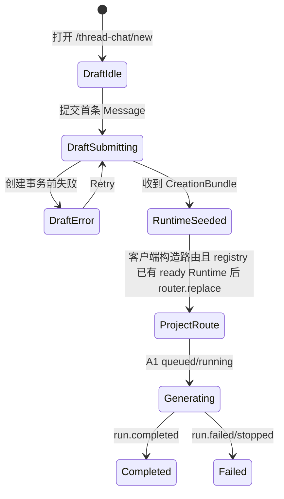

# `/thread-chat/new` 首条消息与 AI 回复生命周期

## 1. 目标

用户从空白 `/thread-chat/new` 发送首条 Message 后，系统必须原子创建 Project 和首个聊天链路，并无空白帧地交接到 `/thread-chat/{projectId}`：

```text
本地 Draft UI
  → 服务端 CreationBundle
  → 先建立 ready ProjectRuntime
  → 客户端根据 project.id 构造目标 Project URL
  → 再替换当前 URL
  → 同一 Runtime 继续接收 AI 事件
```

不能先导航到 Project URL、显示 Bootstrap Loading，再等待 Project 创建结果；也不能创建 `tempProjectId/tempThreadId/tempMessageId` 后二次替换身份。

## 2. 页面状态机



`DraftSubmitting` 期间保持当前页面和 Composer 几何位置，不清空草稿、不挂载空 Project Store。按钮只进入 submitting/disabled 状态。旧 `/new` 页面必须持续渲染到目标 Project Route 已能从 Registry 取得 seeded Runtime 为止。

## 3. 服务端原子创建

```ts
async function createProjectWithFirstMessage(command: {
  actorId: UserId
  initialMessageParts: UIMessage["parts"]
  requestedModelId?: ModelId
}): Promise<CreationBundle> {
  const internal = await database.transaction(async (tx) => {
    validateUserMessageParts(command.initialMessageParts)

    const project = await projectRepository.insert(tx, {
      id: idGenerator.newProjectId(),
      ownerUserId: command.actorId,
      autoTitle: null,
      customTitle: null,
      target: null,
      instruction: null,
    })

    const rootThread = await threadRepository.insert(tx, {
      id: idGenerator.newThreadId(),
      projectId: project.id,
      parentThreadId: null,
      sourceMessageId: null,
      forkSourceSnapshot: null,
    })

    const userMessage = await messageRepository.insert(tx, {
      id: idGenerator.newMessageId(),
      threadId: rootThread.id,
      sequence: 1,
      role: "user",
      parts: command.initialMessageParts,
      replacesMessageId: null,
      supersededAt: null,
      finalizedAt: clock.now(),
    })

    const assistantMessage = await messageRepository.insert(tx, {
      id: idGenerator.newMessageId(),
      threadId: rootThread.id,
      sequence: 2,
      role: "assistant",
      parts: null,
      replacesMessageId: null,
      supersededAt: null,
      finalizedAt: null,
    })

    const messageRun = await messageRunRepository.insert(tx, {
      id: idGenerator.newMessageRunId(),
      assistantMessageId: assistantMessage.id,
      status: "queued",
      modelId: await modelPolicy.resolve({
        actorId: command.actorId,
        projectId: project.id,
        requestedModelId: command.requestedModelId,
      }),
      checkpointParts: [],
      eventSequence: 0,
    })

    await messageRunOutbox.enqueue(tx, {
      messageRunId: messageRun.id,
    })

    return {
      project,
      rootThread,
      userMessage,
      assistantMessage,
      messageRun,
    }
  })

  // 事务提交后才能唤醒 Worker；唤醒失败不得把已提交创建误报成整体失败。
  try {
    await messageRunDispatcher.wakeUpAfterCommit(
      internal.messageRun.id,
    )
  } catch (error) {
    logger.error("message_run_wakeup_failed", error)
    // durable Outbox / queued scanner 后续恢复执行。
  }

  return {
    project: toProjectDTO(internal.project),
    rootThread: toThreadDTO(internal.rootThread),
    artifactSummary: {
      changeSequence: 0,
      total: 0,
      byKind: {},
    },
    userMessage: toMessageDTO(internal.userMessage),
    assistantMessage: toMessageDTO(internal.assistantMessage),
    assistantRun: toAssistantRunStateDTO(internal.messageRun),
  }
}
```

CreationBundle 返回前 Project、Root、U1、A1 和 Run 必须已经 durable。模型 Worker 可以已经从 queued 进入 running；事件订阅的首个 `run.snapshot` 会用服务端当前 checkpoint 校正 CreationBundle 中较早的 queued 视图。

服务端不得返回或拼接 ThreadChat 页面 URL。URL 是 Web 客户端的展示与导航约定，不是 Project 领域数据；客户端只使用 CreationBundle 中的 `project.id` 通过集中式 `threadChatRoutes.project(projectId)` 构造目标路径。

## 4. 客户端创建命令与无抖动交接

```ts
async function submitNewProjectDraft() {
  const draft = newDraftStore.getState()
  if (draft.status === "submitting") return

  const frozenParts = cloneAndValidateUserParts(draft.draftParts)
  const requestedModelId = draft.requestedModelId

  // 不清空 Composer；保持 /new 当前画面直到目标 Project Route ready。
  newDraftStore.getState().markSubmitting()

  try {
    const bundle = await api.createProject({
      initialMessage: { parts: frozenParts },
      requestedModelId,
      // 不提交任何新实体 ID。
    })

    validateCreationBundle(bundle)
    const projectUrl = threadChatRoutes.project(bundle.project.id)

    /**
     * 决定性顺序：先 seed，后导航。
     * seedFromCreation 创建并完整初始化 ProjectRuntime：
     * - entities.project/root/U1/A1
     * - runs[A1]
     * - readModels.artifactSummary
     * - bootstrap=ready
     * - Root Message window=ready
     * - focusedSlotId="root"，columnSlots=[]
     */
    const runtime = appRuntime.projectRuntimeRegistry.seedFromCreation(
      bundle,
    )

    // Catalog 只能合并服务端确认的 ProjectSummary。
    appRuntime.appStore.getState().upsertProjectSummary(
      toProjectSummary(bundle.project),
    )
    appRuntime.appStore.getState().setProjectRoutePending(
      bundle.project.id,
    )

    /**
     * 订阅在导航前挂到 AppProvider 持有的 Runtime：
     * 即使 AI 很快完成，终态也先进入同一个 Store，不会丢失。
     */
    runtime.generationCoordinator.subscribeAssistant(
      bundle.assistantRun.assistantMessageId,
    )

    /**
     * 使用客户端软导航替换 /new；当前页面保留到新 Route 提交。
     * 目标 ProjectProvider acquire 的是同一个 seeded Runtime，
     * 因此首帧直接是 Root + U1 + A1，不再请求 Bootstrap 或闪空白 Loading。
     */
    router.replace(projectUrl)
  } catch (error) {
    /**
     * 明确 validation/authorization/事务回滚：仍停留 /new，保留草稿并可 Retry。
     * 网络中断或响应丢失可能发生在服务端提交之后；P0 没有 Idempotency-Key，
     * 这种 unknown outcome 不得自动重试，必须显示“创建结果未知”。
     */
    newDraftStore.getState().markError(
      normalizeCreateProjectError(error),
    )
  }
}
```

`seedFromCreation` 必须持有一次性 navigation handoff lease：`NewProjectDraftProvider` 卸载不能销毁该 Runtime；目标 `ThreadChatProjectProvider` 用相同 `projectId` acquire 后消费 seed 并接管租约。

## 5. 目标 ProjectProvider 接管

```ts
function mountProjectProvider(projectId: ProjectId) {
  const runtime = registry.acquire(projectId)

  assert(runtime.projectId === projectId)

  if (runtime.store.getState().requests.bootstrap.status === "ready") {
    // /new seed handoff：跳过 GET ProjectBootstrap。
    clearMatchingPendingProjectId(projectId)
    return runtime
  }

  // 只有直接打开/刷新 URL、内存中没有 seed 时才走正常 Bootstrap。
  void runtime.commands.loadProjectBootstrap()
  return runtime
}
```

为了避免 UI 抖动，页面组件边界必须满足：

```text
ThreadChatAppProvider / App Shell
  在 /new 与 /{projectId} 之间保持挂载

NewProjectScreen 与 Root Thread Screen
  使用相同 Column/Composer 外形尺寸

router.replace 之前
  seeded Runtime 已经 ready

目标 Project Route 首帧
  不出现第二次 Bootstrap Loading
```

不要求 Draft 与 U1 使用相同 React key；身份从本地草稿切换为服务端 Message 时允许组件重建，但不得插入空白 Project 帧、重置整个 App Shell 或先清空 Composer 再等待路由。

## 6. AI 回复事件

```ts
function onAssistantEvent(event: AssistantMessageEvent) {
  switch (event.type) {
    case "run.snapshot":
      // 用持久化 checkpoint 校正 queued/running/terminal 状态。
      runtime.store.getState().applyRunEvent(event)
      break

    case "run.delta":
      // Store Action 只入 frame buffer 并调度合帧，不逐 token 刷新最终实体。
      runtime.store.getState().applyRunEvent(event)
      break

    case "run.completed":
      /**
       * 一次合并 finalized A1、completed Run、Artifact 和最新 Summary。
       * UI 从 checkpoint/running 直接过渡到 Message.parts/finalized。
      */
      runtime.store.getState().applyRunEvent(event)
      break

    case "run.failed":
    case "run.stopped":
      runtime.store.getState().applyRunEvent(event)
      break
  }
}
```

如果浏览器在生成中刷新，内存 seed 消失，页面按“打开已有 Project”冷启动：Bootstrap 返回 Root A1 和当前 Run checkpoint，再从 eventSequence 恢复，不创建第二个 Run。

## 7. 决定性不变量

- 首次发送前只有 NewProjectDraftStore，没有 Project Store 或假实体。
- 客户端不生成 Project、Thread、Message 或 MessageRun ID。
- CreationBundle 完整初始化 Runtime 后才能导航。
- 目标 ProjectProvider 必须接管同一 seeded Runtime，并跳过 Bootstrap。
- `/new` 当前画面保留到目标 Project Route 可提交，不显示中间空白 Project。
- AI 订阅可以在导航前开始；事件始终写入 seeded Runtime。
- completed 事件携带 finalized Message；不以前端累计 token 作为最终权威。
- 浏览器刷新只改变客户端恢复路径，不改变后台 MessageRun。
- P0 对响应丢失后的创建结果无法安全判定；在幂等命令落地前不得自动重试 unknown outcome。
