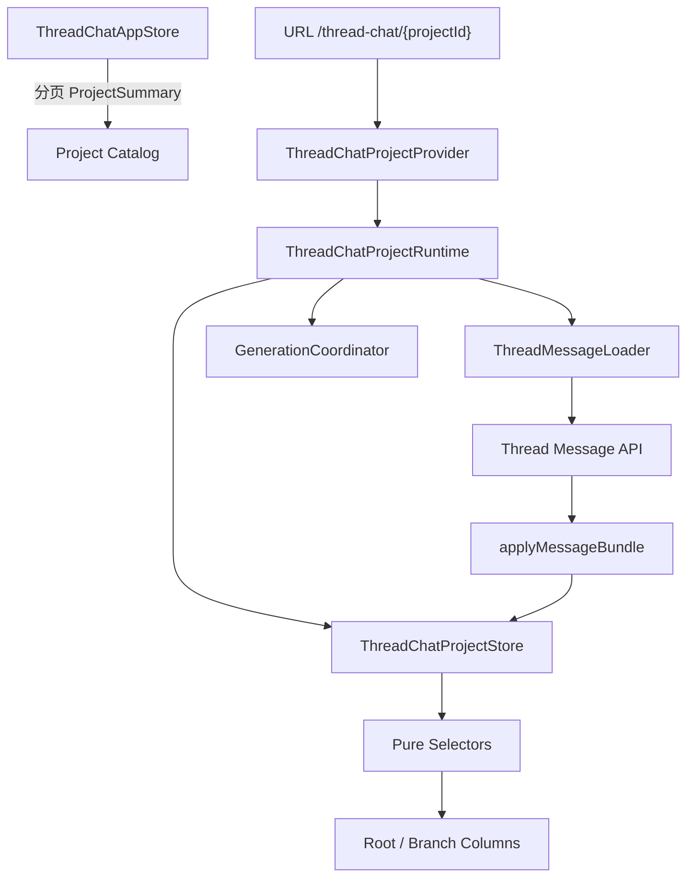
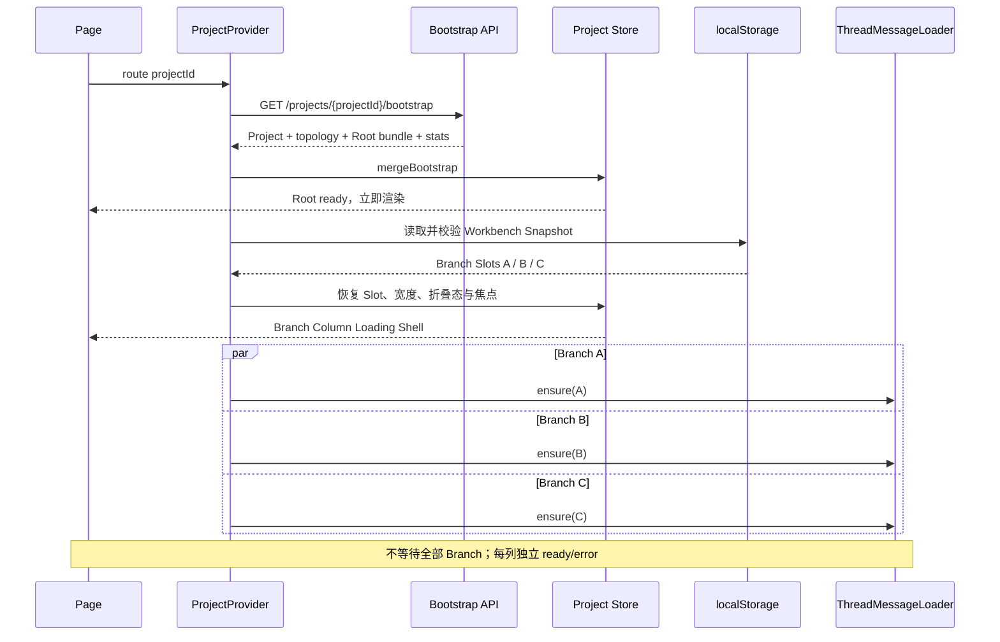
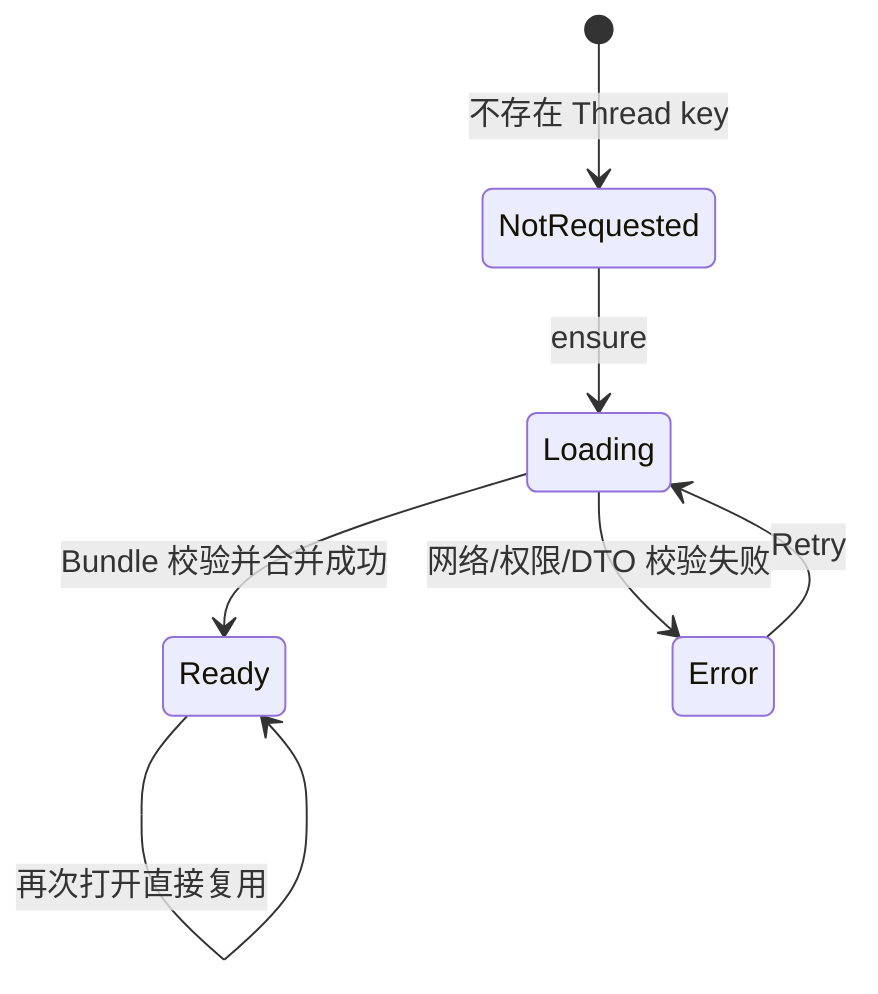

# Thread Message 异步加载设计

## 1. 边界与权威

Project Catalog 只分页加载 `ProjectSummary`；它不保存当前 Project 的 Thread 或 Message。当前 Project 身份由 `/thread-chat/{projectId}` URL 决定，`ThreadChatProjectProvider` 据此取得独立 `ThreadChatProjectRuntime`。



数据职责：

- App Store：Project 列表摘要与跨 Project 外壳 UI，不保存 `selectedProjectId`。
- URL/Provider：决定当前 ProjectRuntime。
- Project Store：规范化保存当前 Project 的 Thread、已加载 Message、Run、Artifact、请求状态和本地工作台状态。
- ThreadMessageLoader：保存非序列化 `threadId → Promise/AbortController`，负责请求去重与 Runtime 级取消。
- Column Slot：只决定某个物理列当前展示哪个 Thread，不拥有 Message 数据。

## 2. Bootstrap 与按需加载

`ProjectBootstrap` 一次返回 Project、完整轻量 Thread topology、Project Artifact Summary 和 Root Thread MessageBundle。Root 在 Bootstrap 合并后视为 ready；Bootstrap 不下载所有 Branch Message。

Branch Message 在以下时机调用 `ensureThreadMessages(threadId)`：

1. 用户首次打开尚未加载的 Branch。
2. 刷新恢复 `ThreadWorkbenchSnapshot` 后，恢复出的 Branch Column 尚未 ready。
3. 用户对 error Column 明确 Retry。



Provider 不得 `await Promise.all(...)` 后才展示页面。Root 与 topology 合并后立即渲染；恢复出的 Branch 使用各自 `ThreadMessageWindowState` 展示 loading、ready 或 error。

## 3. Store 中的加载状态

`requests.threadMessagesById` 按 `threadId` 隔离：

```ts
type ThreadMessageWindowState = {
  loadState: LoadState
  hasOlderMessages: boolean
  oldestReturnedSequence: number | null
  newestReturnedSequence: number | null
}
```

决定性语义：

```text
不存在 threadMessagesById[threadId]
  = 从未请求

loadState.loading
  = 已有请求在飞

loadState.ready + 空 messageIds
  = 请求成功，但 Thread 当前有效时间线为空

loadState.error
  = 请求失败，可以独立 Retry
```

不得用 `messageIds.length === 0` 判断是否需要请求。



## 4. ThreadMessageLoader

Loader 是 ProjectRuntime 的非序列化基础设施，不是 Zustand slice：

```ts
type ThreadMessageLoader = {
  ensure(threadId: ThreadId): Promise<void>
  destroy(): void
}
```

内部至少维护：

```ts
inFlightByThreadId: Map<ThreadId, Promise<void>>
abortByThreadId: Map<ThreadId, AbortController>
disposed: boolean
```

核心伪代码：

```ts
async function ensureThreadMessages(threadId: ThreadId): Promise<void> {
  assertThreadBelongsToRuntimeProject(threadId)

  const window = store.getState().requests.threadMessagesById[threadId]
  if (window?.loadState.status === "ready") return

  const existing = inFlightByThreadId.get(threadId)
  if (existing) return existing

  store.getState().setThreadMessageLoadState(threadId, {
    status: "loading",
  })

  const abortController = new AbortController()
  abortByThreadId.set(threadId, abortController)

  const request = api
    .getThreadMessages(threadId, { signal: abortController.signal })
    .then((bundle) => {
      if (disposed) return

      validateMessageBundle(bundle, {
        expectedProjectId: runtime.projectId,
        expectedThreadId: threadId,
      })

      // 一次同步 State Transition 合并 Message、Run、Artifact 和 ready 窗口。
      store.getState().applyMessageBundle(bundle)

      // 只恢复本 Bundle 中 queued/running 的 assistant Run。
      generationCoordinator.resumeLoadedRuns()
    })
    .catch((error) => {
      if (disposed || isAbortError(error)) return
      store.getState().setThreadMessageLoadState(threadId, {
        status: "error",
        error: normalizeError(error),
      })
    })
    .finally(() => {
      inFlightByThreadId.delete(threadId)
      abortByThreadId.delete(threadId)
    })

  inFlightByThreadId.set(threadId, request)
  return request
}
```

同一 Thread 的多个调用复用同一个 Promise；不同 Thread 的请求互不等待。`applyMessageBundle` 必须验证 Bundle 的 Thread/Project 归属、Message 的 `threadId`、sequence 窗口和 Run/Artifact 引用后再原子合并。

## 5. Column 与迟到响应

请求按 `threadId` 写入实体和请求索引，不按 `slotId` 写入。因此切换物理列不会产生“旧响应覆盖新列”的竞态：

```text
Slot S 展示 Thread A
→ ensure(A)
→ 用户把 Slot S 切换为 Thread B
→ A 的响应稍后到达
→ 响应只合并到 messageIdsByThreadId[A] 和 requests[A]
→ Slot S 继续展示 B
→ A 成为 ProjectRuntime 内可复用缓存
```

关闭或切换 Column 不取消已经开始的 Thread Query。这样可以避免 UI 快速切换导致重复网络请求；只有 ProjectProvider 释放并销毁整个 ProjectRuntime 时，Loader 才 Abort 全部请求。Abort 只是生命周期结束，不得写入 `loadState.error`。

## 6. Message Query 与 Generation 状态

一个 Column 的展示由两个正交状态组合：

```text
Thread Message Query
  not_requested / loading / ready / error

Assistant Run
  queued / running / completed / failed / stopped
```

Message Query ready 后，如果 Bundle 中存在 queued/running Run：

1. 立即使用 `checkpointParts` 恢复已经持久化的生成内容。
2. 使用 `assistantMessageId + eventSequence` 建立或复用事件订阅。
3. Column 继续显示 ready 的 Message 时间线，同时对应 Assistant Message 显示 running。

单个 Branch Message Query 失败只影响该列；不得使 Bootstrap、Root、其他 Branch 或 GenerationCoordinator 进入全局 error。

## 7. Selector 与 UI 输入

Column 不自行读取整个 Store 或发请求。它通过 Slot 找到当前 Thread，再由 selector 组合：

```text
ColumnSlot.threadId
  + ThreadEntity
  + ThreadMessageWindowState
  + active MessageEntity[]
  + AssistantRunState
  + included ArtifactEntity
  → ThreadColumnView
```

`ThreadColumnView` 至少表达列级：

```ts
type ThreadColumnLoadView =
  | { status: "loading" }
  | { status: "error"; error: ClientError; canRetry: true }
  | { status: "ready"; hasOlderMessages: boolean }
```

不存在 Thread key 时，已经打开的 Column 也应呈现 loading shell，并由 Lifecycle/Command Hook 触发 ensure；React 组件不得直接 `fetch` 或自行维护第二份 Message loading state。
