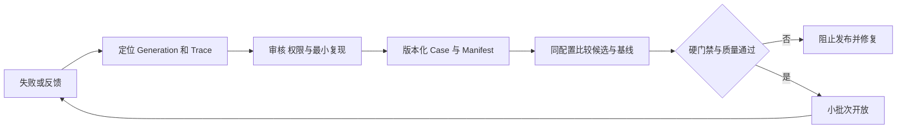

## Context

evals/agent/README.md 已区分 fixture smoke 和 --executor=declared 的真实内容/生命周期路径，并提供隔离数据库 guard、manifest、candidate fingerprint、Langfuse 镜像及 judge 校准。反馈已有 MessageFeedback 和 feedback_score_outbox。必须增量补强，不能重命名后另建系统。

## Goals / Non-Goals

每次候选变更有可复现基线，每次放量有真实证据，生产失败能回流为授权 Case。评测数据、运行成本和生产身份隔离。

## Decisions

### 1. 模块与组件

| 模块 | 职责 | 不负责 |
| --- | --- | --- |
| 既有 feedback mutation/DTO | up/down/clear 的唯一事实，扩展原因/授权 | 第二套评分表 |
| 反馈详情组件 | 可选原因/文字/复用同意，绑定当前输出 | 默认授权全部聊天 |
| evals/agent/schema/cases/manifests | 固定 Case 与候选集合 | 静默使用远端 latest |
| 既有 production executor | 真实编排/上下文/工具/终态测试 | 默认使用生产数据库 |
| baseline/compare | 分项/逐案比较与 hard fail | 自动挑有利子集 |
| release checklist | 证据、批准人、状态/原因 | 将 not_run 当 pass |

复用消息反馈按钮，详情用现有 Dialog/Drawer；Admin 可定位失败/Case 关联，不建设通用工单和完整 Benchmark 网站。

### 2. 类型与接口

```ts
// 以下 import 指向现有类型；不复制其枚举。
import type { MessageFeedback } from '@/lib/thread-chat/contracts/dto';

type FeedbackDetailInput = {
  generationId: string;
  rating: MessageFeedback;
  reason: 'incorrect' | 'missing_context' | 'bad_citation' | 'too_slow'
    | 'ui_problem' | 'other' | null;
  comment: string | null;
  allowEvaluationReuse: boolean;
};
type CasePromotionRecord = {
  id: string;
  generationId: string;
  caseId: string;
  sensitivity: 'synthetic' | 'public' | 'authorized-private';
  approvedBy: string;
  datasetRevision: string;
  authorizationReference: string | null;
};
type ReleaseCheck = {
  id: string;
  name: string;
  severity: 'blocking' | 'quality' | 'diagnostic';
  status: 'pass' | 'fail' | 'not_run';
  evidencePath: string | null;
  checkedAt: string | null;
};
type EvaluationFingerprint = {
  commitSha: string;
  datasetRevision: string;
  manifestHash: string;
  candidateHash: string;
  evaluatorVersion: string;
  pricingPolicyVersion: string;
  searchPolicyVersion: string;
};
type ReleaseDecision = {
  candidate: EvaluationFingerprint;
  status: 'blocked' | 'approved';
  checks: ReleaseCheck[];
  approvedBy: string | null;
  approvedAt: string | null;
};
```

FeedbackDetailInput 合并已有 mutation，server 根据 session/对象所有权验证 generationId 确实属于被反馈消息，不能任意评分别人的输出。comment 有长度上限与隐私提示；默认 allowEvaluationReuse=false。clear/up/down 的原有语义保留，镜像从 DB 事实发送，延迟任务不重算错误 Trace。

细节可放现有反馈所属记录的可空字段/关联 detail，唯一键按消息/生成/作者/当前反馈版本定义；不得把 rating 同时写两套互不一致表。清除评分不自动撤回已单独审批的样本授权；界面提供独立授权撤回路径，后续受控样本处理按 #165 执行。

### 3. 生产反馈到固定 Case

真实失败/用户反馈 → 定位 Generation/Trace/价格与策略 → 人工审查与隐私处理 → 尽量构造 synthetic/public 最小复现 → 固定 Case 和 rubric → candidate/baseline 同题比较 → 修复/发布。

authorized-private 保留明确授权记录，默认不上传 Langfuse Dataset/Experiment，沿用现有双重开关；撤回/删除后跟踪受影响样本并阻止继续使用，历史评测记录按政策最小保留。任何脱敏不能被宣称自动消除全部隐私风险。



### 4. 三层验证与候选指纹

第一层每实现 PR 运行确定性权限/账务/状态/隐私/语言测试、现有 fixture smoke；只是代码/fixture 证据。第二层在发布候选使用 --executor=declared 和真实受限 provider、隔离 DB、浏览器与两实例，验证 production 路径。第三层灰度收集明确口径的任务完成、核心激活、失败与实际成本，授权反馈回流。

保留原 case ID 和 manifest fingerprints；增加/删除 Case 必须审查集合和基线，不能只比较交集。candidate 包含代码、模型/渠道、工具 schema、prompt、effort/temperature/maxTokens、价格、搜索与 judge/rubric；任一关键变化需新指纹。模型和 live Web 的非确定性单列，必要时固定重复次数并显示样本量；不把小样本分数伪装为确定性能保证。

现有 declared DB 命名/guard/与生产 URL 分离规则必须继续生效。CI 付费凭据只提供给受信任且获准的环境，外部 PR 默认只运行不含 secrets 的测试；日志不能输出 key。每次评测有有限调用/费用/超时预算，纳入内部成本而非用户真实余额。

### 5. 初始 Case 范围与门禁

先从已有集合整理约 30 条核心任务，数量是起步范围，不强行新建 30 条重复题。以下为必须覆盖的行为，不声称已有对应 case ID：

| 组 | 关键覆盖 |
| --- | --- |
| 核心体验 | 首次回答、选区分支、回主线、上下文不串线、Artifact 更新/版本 |
| 准入安全 | 邮箱/OAuth/API、两账号 ID 替换、Pro/模型权限 |
| 账务 | 预占竞态、重复赠额/结算、stop/complete、缺价、缓存、unknown |
| 搜索 | 直接 URL、长文跨实例续读、中英文/时效、真实主备、429/timeout/无证据 |
| 状态恢复 | 刷新、停止、崩溃、部署 drain、过期 lease |
| 国际化/隐私 | 双语完整、首屏、拒绝/撤回网络检查、邮件、导出删除 |

资金、安全、授权、隐私和状态一致性是 blocking；任何 fail 或 not_run 阻止开放，不允许 LLM 裁判平均分抵消。质量项按批准基线逐案检查新增失败、引用支撑和任务完成；阈值在运行前冻结，不能看到结果后调线。diagnostic 是辅助信息，不伪装 pass。必要的人工检查必须有操作者和证据，不接受只有截图没有 release/环境。

### 6. 成本体验与产品价值实验

¥5 体验实验固定模型 ID/渠道、输入输出比例、cache、对话增长、联网比例和扣额政策；tokens 定义为累计 provider 报告的输入/输出（cache 子集不重复加），不是用户手写文字量。记录实际可完成任务、总 Token、搜索/辅助调用费用、预占利用、剩余额度/超额和完成质量。不同模型分别报告分布，不以最便宜样本宣传全部均达到百万 Token。

小量目标用户做“分支讨论 → 回主线 → 得到可用方案”的完整任务，观察是否完成、返工、费力程度和反馈；分叉次数只是过程指标。邀请 10 → 30 → 100 是运营试行批次，每批按失败/成本/支持负担和核心体验复核，不按固定日期自动放量。

### 7. 证据、发布与任务归属

每个 evidence 保存 commit、环境、时间、参数、结果、相关 trace/artifact 路径及费用覆盖，敏感附件不放公开仓库。Checklist 引用证据不复制用户内容。not_run 与 fail 都阻止 blocking gate；供应商采购、政策审核、真实投递和恢复缺一项不能用 CI 绿勾代替。

各工作包自验自身场景，08 只负责集成验收与 decision，不回头重新实现各模块。发布批准与代码合并分开，必须能暂停邀请、关闭新付费任务、停用单 provider 和回滚候选。开关操作被审计，不删除已发生账目。

## Migration Plan

增量扩展反馈细节/样本审批，保持旧 up/down/clear 和 outbox；develop 统一生成必要迁移。先引入不阻断的报告验证误报，冻结基线后把硬安全/账务/隐私项设 blocking。回滚可以关闭新采集/新 provider，但不能用“临时取消安全门禁”替代修复。

## Risks / Trade-offs

真实评测有费用且 Web 会变化，固定预算与 live 标签不可省。人工评审小集比建立巨大未校准 judge 平台更适合早期 Beta。假绿灯的代价高于明确 not_run。

## Open Questions

实际 baseline revision、质量阈值、评测预算、付费执行审批人和放量批准人需在首次运行前填写；未填写不授权开放。这个 PR 不代表已经验证成本目标或用户满意度。
