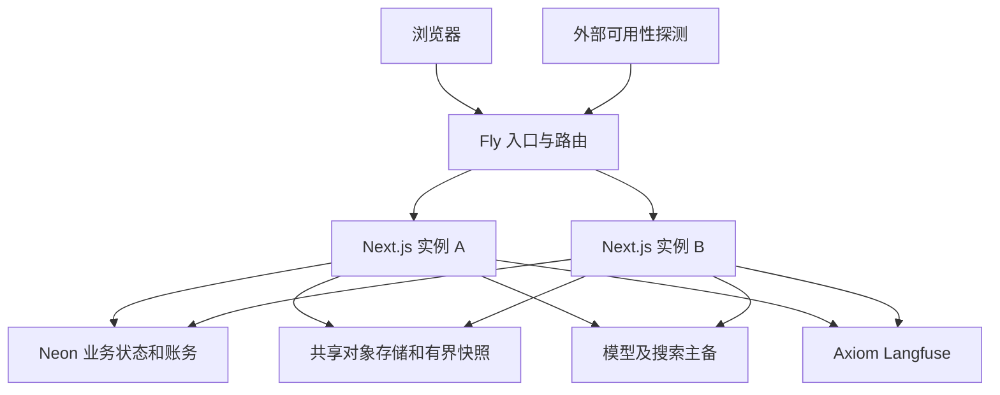

## Context

当前系统使用 Next.js、Neon/Postgres、长连接和服务端 Generation；客户端刷新可以脱离而任务仍继续。这些特征要求按真实后台工作而非仅 HTTP 连接数评估停机与扩容。运行参数需实现时依据实际 Fly/Next.js 版本文档确认，不复制过时示例。

## Goals / Non-Goals

可复现部署、可控成本、两实例不串数据/双扣/丢附件、发布与崩溃后状态可解释。不是将“serverless/边缘”当作低延迟和高可用保证。

## Decisions

### 1. 架构与模块



| 模块 | 职责 | 不负责 |
| --- | --- | --- |
| Dockerfile/构建 | 锁文件可复现镜像、非 root、运行需要文件 | 编译时写生产 DB |
| fly.toml/部署配置 | 服务端口、区域、资源、并发、检查 | 凭空保证自动建机 |
| runtime/config | 校验环境/预算/secret 引用 | 将 key 返给客户端 |
| runtime/health | liveness/readiness 安全响应 | 调用付费模型作每次健康检查 |
| runtime/drain | 停止受理新 Generation、收尾现有工作 | 重放无法确定的付费任务 |
| 既有 Generation lease/recovery | CAS 终态、恢复、对账 | 独立新的 Run 队列 |
| 运维 runbook | 发布/回滚/恢复/扩容和处置 | 自建监控 SaaS |

无新产品页面；Admin 复用 #168 健康/容量概要，详细数据进入现有日志与外部监控。

### 2. 配置与接口类型

```ts
type DeploymentConfig = {
  environment: 'staging' | 'production';
  primaryRegion: string;
  release: string;
  minimumRunningMachines: number;
  maximumMachines: number; // 运营扩容护栏，不声称是任意原生 Fly 配置字段
  databasePoolMaxPerMachine: number;
  drainTimeoutSeconds: number;
  autoStopEnabled: boolean;
};
type HealthReport = {
  status: 'healthy' | 'degraded' | 'unready';
  release: string;
  draining: boolean;
};
type DrainState = {
  acceptingNewGenerations: boolean;
  activeGenerations: number;
  activeDeliveries: number;
  deadlineAt: string | null;
};
type RecoveryObjective = {
  rpoMinutes: number;
  rtoMinutes: number;
  lastRestoreTestAt: string | null;
};
```

启动验证端口、区域、pool 上限、可用 runtime secret 和预算有限值；缺配置明确失败，不使用生产匿名 provider 或默认零价。公开 GET /healthz 只返回进程状态/版本，不含 DB URL 或 provider 配置；readiness 使用低成本 DB 探测/缓存，不频繁调用模型/搜索。运维 drain endpoint 仅管理员机器身份可调用，不作为公开 GET 有副作用。

### 3. 区域、资源和扩容

先一个主区域靠近实际 Neon 主写区域，测量目标用户地区到页面/API、App 到 DB、App 到各 provider 的延迟后确定。不能仅按入口 Anycast 就认定动态请求最近且最快。静态资源、字体、初始 bundle 与图片独立优化；搬迁前后比较同一任务样本。

首轮实例内存/CPU 由真实 Next.js 构建产物运行、附件解析、并发流及长文任务测量决定，不承诺 256MB。一个常驻实例可以作为成本起点但不称高可用；放量前必须启动两实例验证。记录峰值 RSS/OOM、CPU、DB pool、active Generation、p95 与供应商 QPS，再扩容。

自动启停与创建新 Machine 是不同动作，配置/运维明确 maximumMachines 和预算，扩到上限时返回容量受限而非无界开机。当前仍在 Web 进程持有后台任务的 Beta 阶段，默认关闭可影响这些实例的 autostop：用户断开后无 HTTP 连接不等于无活跃任务。只有独立验证后台工作不被误停后才允许开启，min-running=1 也不能保护其他正在工作的实例。

### 4. 共享状态和 Next.js 多实例

账户、reserved 预算、provider account 限流、邀请、Generation/取消/lease、需跨请求续读的快照和可靠 outbox 不以进程内 Map 为事实源。局部 cache/semaphore/circuit breaker 仅优化，不参与全局正确性承诺。

持久附件复用已有 S3-compatible 对象存储；临时磁盘只作可重建缓存，不能把 Fly 本地文件当作所有实例共享。预签名链接有时效和 owner guard；公开分享与私有附件权限分开。

同一发布所有实例使用同一镜像/构建产物和需要共享的服务端加密配置；登录 session 配置一致。实现前读取安装版本的 Next.js 多实例与缓存指南：动态账户/账务页面不采用可跨用户误共享的缓存，需要跨实例失效的功能要明确机制或禁用该缓存。不要把每个容器单独 next build 的差异视作同一 release。

DB 连接池按“最大实例数 × 每实例 pool + worker/管理连接”计算，不超过账户限额；使用适合当前事务功能的连接模式，实际测试事务/锁/预占。部署迁移连接和应用连接按权限分开；不得在每个实例启动时并行生成或运行 migration。

### 5. 发布前收尾与异常恢复

流程：构建同一镜像 → staging 验收 → 单一迁移/兼容检查 → 旧实例停止受理新 Generation → 新实例 ready → 旧任务完成或达到已声明收尾边界 → 替换旧实例 → 检查告警/对账。

长任务可能超过平台 SIGTERM 等待窗口，因此不能只靠 signal handler 等 15 分钟。部署前显式 drain，并确认活跃 Generation/outbox 状态后再替换；实现时核验平台允许的终止时间。无法安全收尾时阻止正常滚动发布，不把该风险隐藏在“graceful shutdown”名称里。

明确用户 Stop、预算边界、部署收尾和进程崩溃是不同原因。真实崩溃时不可能保证内存中的流无损继续；依赖保存结果/lease 识别中断并结算可证实费用、保留部分内容。不得为恢复自动重放模型/外部写入。旧 lease 失效和新 owner 接管使用 CAS/fencing，延迟旧进程不能覆盖新终态或双扣。刷新从数据库恢复终态，不在本轮承诺 token 逐字重放。

日志/追踪 flush 有截止时间，不能为了等可选分析阻止进程退出；账务/outbox 的待办事实先可靠落库。

### 6. 环境隔离、恢复与回滚

staging/production 使用不同数据库、对象存储前缀或桶、provider 限额和 observability environment；preview 不默认继承生产 API key/DB。secrets 只由受限运行配置注入，不写 Docker layer、构建日志或 NEXT_PUBLIC 环境变量。

数据变更遵循 expand/兼容部署/后续收缩。功能分支只改 schema 源码和独立库 db:push，develop 集成生成并审查 SQL，验证从上一版本升级；发布阶段只有一个执行者应用已审核迁移。

备份涵盖 DB 与对象存储/配置恢复，不是仅相信 provider 面板有备份按钮。开放前由运营批准 RPO/RTO，实际在隔离环境恢复并测量；恢复包含删除记录重应用、账号权限和 ledger/reservation 一致性检查。回滚优先旧镜像/feature flag；已经发生的账务和数据不通过破坏性 down migration 删除。生产恢复是单独需要授权的操作，本 PR 不执行。

### 7. 验收与告警

至少测试真实登录/分支/Artifact/上传/停止/刷新，双实例下最后余额、邀请核销、共享 cursor 与 cross-user 权限；长 Generation 执行中滚动发布；kill 实例后 lease/结果/费用恢复；DB 不可达和 provider 429；数据备份恢复；一键回到上个镜像。

外部可用性探测、OOM、连接池压力、失败率、未知成本/积压和容量上限告警接 #168，必须实际送达。测试证据写 release、机器数、区域、负载、原始用量和观察结果，不能用单机开发环境代替双实例验收。

## Migration Plan

先补运行/健康契约并构建 staging，验证共享状态和供给预算，再低流量迁入生产；DNS/证书/入口切换保持旧路径回退。没有迁移升级/恢复证据不得扩大邀请。

## Risks / Trade-offs

应用与 DB 跨区 RTT 可能抵消边缘收益；多实例放大 pool/内存/供应商限流和费用。最小架构是同区两实例兼容加共享 DB，不提前设计复杂分布式任务平台。现有进程式长任务的边界必须透明。

## Open Questions

实际 Fly/Neon 区域与套餐、实例规格/并发、停机窗口、RPO/RTO 和扩容上限必须实测后填入生产配置；这些是上线门禁，不是文档批准后的自动采购许可。
