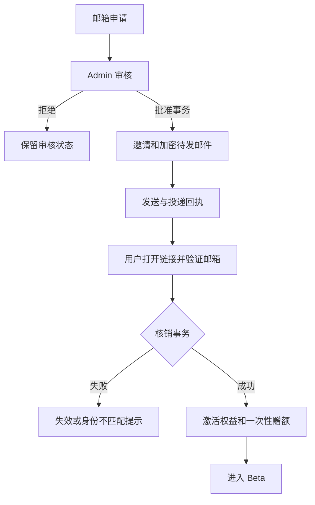

## Context

既有 Resend 和 Auth/Admin 能力继续复用。已有账务首次读/写时的隐式赠额需由 #164 分离，避免本 change 激活时二次赠送。所有下列新增类型为拟议契约。

## Goals / Non-Goals

最小路径是申请 → 批准 → 邮件 → 验证身份 → 激活 → 获得额度。不把 approved、邮件 delivered、registered 混成同一状态，不做第二套身份验证系统。

## Decisions

### 1. 模块与组件

| 模块 | 负责 | 不负责 |
| --- | --- | --- |
| beta/waitlist | 申请归一化、查重、审核、撤回 | 发放余额 |
| beta/invites | token 签发/核销/撤销/轮换 | 自建认证 |
| beta/entitlements | 账户状态、Beta/Pro、模型资格 | 计算模型成本 |
| 现有 email 模块 | 双语模板、发送、webhook、抑制 | 以投递成功替代注册 |
| admin/audit | 操作者、目标、原因、变更记录 | 普通产品分析 |

组件为 WaitlistForm、InviteLanding、BetaAccessNotice、AdminWaitlistTable、AdminUserEntitlement；复用 Base UI/shadcn Dialog、Drawer、表格与已有 Admin 框架。审批与撤销有明确状态，危险操作确认，不暴露后台邮箱列表给访客。

### 2. 类型与 DTO

```ts
type WaitlistStatus = 'pending' | 'approved' | 'registered' | 'rejected' | 'withdrawn';
type WaitlistEntry = {
  id: string;
  emailNormalized: string;
  locale: 'zh-CN' | 'en'; // 实现时 import Locale
  status: WaitlistStatus;
  createdAt: string;
  approvedAt: string | null;
  registeredUserId: string | null;
};
type BetaInvite = {
  id: string;
  waitlistId: string;
  tokenHash: string;
  expiresAt: string;
  usedAt: string | null;
  revokedAt: string | null;
};
type UserEntitlement = {
  userId: string;
  plan: 'beta' | 'pro';
  accountStatus: 'active' | 'suspended';
  planExpiresAt: string | null;
  grantSource: 'beta-invite' | 'owner' | 'admin';
};
type EmailDelivery = {
  id: string;
  inviteId: string;
  providerMessageId: string | null;
  status: 'queued' | 'sent' | 'delivered' | 'bounced' | 'complained' | 'failed';
  attempts: number;
};
type JoinWaitlistInput = { email: string; locale: 'zh-CN' | 'en' };
type RedeemInviteInput = { token: string };
type EntitlementDecision =
  | { allowed: true; userId: string; modelId: string }
  | { allowed: false; code: 'BETA_ACCESS_REQUIRED' | 'ACCOUNT_SUSPENDED' | 'MODEL_NOT_ALLOWED' };
```

Locale 导入 #163 的唯一类型，不保留示例内联枚举副本。User role 复用现有 USER/ADMIN，不与 plan 混合。拟议 POST /api/beta/waitlist 返回统一 accepted 响应，避免枚举是否已注册；POST /api/beta/invites/redeem 需已验证 session，邮箱从 session 获取，不能相信客户端 userId。Admin approve/resend/revoke 必须执行现有 admin guard、来源/CSRF 校验、原因和 requestId 审计。Zod 校验输入、长度和速率。

### 3. 数据与事务

waitlist(emailNormalized) 唯一；只去首尾空白和按现有认证一致的大小写策略归一化，不删除 +tag 或 Gmail 点。invites(tokenHash) 唯一；同一 waitlist 至多一个未使用且未撤销的有效邀请，重发事务先撤销旧 token 再签发。发放权益以 userId 唯一。

核销事务锁 invite + user/account，验证未使用/未撤销/未过期及已验证邮箱匹配，再写 usedAt、registeredUserId、entitlement、grantWelcomeOnce 和审计。欢迎额度唯一键 beta-welcome-v1:userId；重复回调只返回已激活状态。数据库失败则不核销、不赠额。旧用户迁移沿用余额/历史赠额标记，不能重新发送 ¥5。

批准只表示审核完成，生成 email_delivery/outbox 与邀请后提交；发邮件不在持有 DB 锁的事务中。复用现有 outbox 领取/重试约定，不把 feedback_score_outbox 内容混作邮件；不引入通用消息总线。

### 4. token 与邮件可靠性

邀请使用高熵随机 token，invite 表只存 hash；不能在日志、分析、referrer 或错误中输出 token。邀请落地页不加载可选第三方脚本，设置严格 referrer 策略。GET 仅展示，不核销，防止邮件安全扫描器消费链接；核销必须显式 POST 且身份邮箱匹配。

可靠邮件需要恢复链接明文：只在最短生命周期的加密 outbox payload 中保存待发送链接/token，使用专用服务端密钥、限制读取并在投递完成/失效后销毁。不能一边只存不可逆 hash 一边假定重试能还原 token。重发产生新 token，旧链接失效；加密失败时不批准为可投递成功。

Resend webhook 验签、按事件 ID 去重。delivered 后到来的旧 sent 事件不回退状态；bounce/complaint 单独保留事件事实并停止重复投递。sent 不是 delivered。配置有限次指数退避和人工重发；超出次数显式 failed，不能静默丢失。交易邮件关闭打开/点击追踪；邀请通知不隐式订阅营销。实际域名、SPF/DKIM/DMARC 和退信处理是上线检查项。

### 5. 准入与模型策略

默认无权益账号可登录并看到等待状态，但不能调用付费服务。新邮箱注册、OAuth 首次建号回调、老账号登录后、直接 API 都执行同一权益判断。对象访问仍逐 Project/Thread/Artifact/附件/Generation 校验所有权；通过登录不等于能访问任何 ID。

Beta 可用模型按已核验精确 modelId 的 allowlist 发布；目标系列为用户选定的 DeepSeek v4.1、GLM 5.3 Flash、GLM 5.3、GPT Luna。展示名称不能被当成真实 provider ID，未验证价格/渠道的条目保持关闭。其余新注册模型默认 Pro-only，未知模型拒绝。Pro 可用全已启用模型，但必须有有效权益与额度/预算，Owner 不绕过成本账。

暂停账号阻止新任务。现有任务不因普通 plan 变更或余额耗尽被硬停；明确安全事件可单独取消并记录原因。过期 Pro 的后续请求按 Beta 权益或拒绝处理，不能缓存永久全权限。管理员角色提升/Pro 配额/赠额都要审计，禁止用户自改 plan。

未完成隔离的个人 PAT、私有仓库与沙箱写入不向公众开放，保留 Owner-only feature flag。



### 6. 观测与验收

业务审计记录 waitlist/invite/user/request/actor/release，不记录明文 token。申请、批准、邮件送达、注册分别统计；可选漏斗遵守 #165。测试重复提交、approve、webhook、并发核销、邮箱不匹配、GET 扫描、旧链接、撤销、退信、OAuth 绕过、两账号 ID 替换、Pro 过期和历史赠额。

## Migration Plan

schema 增量可空，列出现有用户/Owner 授权名单并审计迁移；不能把所有旧账户自动变 Pro。先部署兼容 guard 与 Admin，再切换首页为 waiting list。数据库 migration 由 develop 统一生成验证。回滚暂停新的邀请/批准，不撤销已合法发放余额，不放开默认注册绕过。

## Risks / Trade-offs

邀请加密 outbox 增加一个必要秘密处理点，但避免不可恢复邮件。手工审核足以支持早期批次；不设计复杂邀请码市场。账号是否存在的回应和速率限制防止申请接口成为枚举/邮件轰炸工具。

## Open Questions

开放前填入邮件发件域名、支持邮箱、邀请有效期、明确的模型 ID/价格审批和 Owner 迁移名单。邀请有效期初始建议 7 天作为可配置产品值，不是服务商默认；未配置生产密钥/发件条件应保持批准发送关闭。
