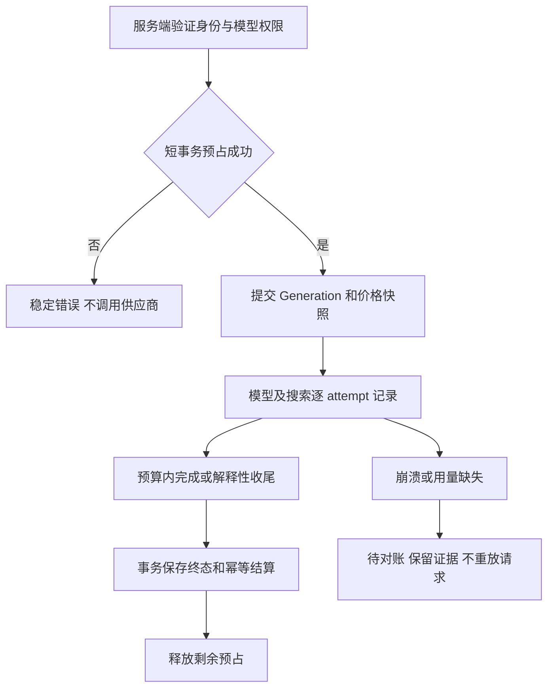

## Context

基线已存在微人民币余额、供应商成本/用户扣额、事务扣费及 appGenerationId 幂等。constants/pricing.ts 的缺价返回 0 必须改变；旧估值和网关成本来源保留可追溯含义。以下为拟议类型，Generation/UsageInput 优先扩展现有类型。

## Goals / Non-Goals

资金不重复、成本不遗漏、已受理任务有收尾空间、故障能对账。保持现有身份与账务边界；不把 Pro 视为无限成本。

## Decisions

### 1. 模块、组件与所有权

| 模块 | 职责 | 明确不负责 |
| --- | --- | --- |
| billing/pricing | 有效价格、汇率、扣额政策快照 | 抓取实时汇率/采购 |
| billing/admission | 账户/并发/供应商预算原子预占 | 判定用户是否 Pro |
| billing/metering | 逻辑 operation、真实 attempt、原始 usage | 判断回答是否满意 |
| billing/settlement | 幂等收取、释放、估算转核实、异常对账 | 盲目重放外部请求 |
| billing/ledger | 赠额、扣额、退款、调整与余额一致性 | 第二套余额表 |
| 现有服务端编排 | Auth/权益授权 → 预占 → Generation 执行 | 客户端传价格 |

UI 复用设置页、模型菜单、Admin 表格与确认弹窗，增加 CreditSummary、UsageBreakdown、AdminCreditAdjustment。拒绝启动不创建收费请求；错误有 requestId 和可重试说明。

### 2. 类型与服务接口

```ts
type CnyMicros = number;
type PricingSnapshot = {
  id: string;
  providerId: string;
  serviceId: string; // 精确模型/路由/搜索模式，不是展示名称
  currency: 'CNY' | 'USD';
  rates: Array<{ unit: string; decimalPrice: string; perUnits: number }>;
  fxToCny: string;
  chargingPolicyVersion: string;
  effectiveAt: string;
};
type UsageLine = {
  id: string;
  generationId: string;
  operationId: string;
  attemptId: string;
  providerRequestId: string | null;
  kind: 'llm' | 'search' | 'fetch';
  unit: 'uncached_input_token' | 'cached_input_token' | 'cache_write_token'
    | 'output_token' | 'request' | 'page' | 'credit';
  quantity: number;
  providerCostMicros: CnyMicros | null;
  userChargeMicros: CnyMicros | null;
  evidence: 'reported' | 'estimated' | 'unknown';
  pricingSnapshotId: string;
};
type RunReservation = {
  id: string;
  generationId: string;
  userId: string;
  customerReservedMicros: CnyMicros;
  supplierReservedMicros: CnyMicros;
  status: 'held' | 'settled' | 'released' | 'reconciliation_required';
  expiresAt: string;
};
type LedgerEntry = {
  id: string;
  userId: string;
  kind: 'opening_balance' | 'grant' | 'charge' | 'refund' | 'adjustment';
  amountMicros: CnyMicros; // 正数增加余额；负数扣款
  idempotencyKey: string;
  referenceId: string;
  reason: string;
  actorId: string | null;
  createdAt: string;
};
type AdmissionResult =
  | { allowed: true; reservationId: string; effectiveDeadlineAt: string }
  | { allowed: false; code: 'CREDIT_EXHAUSTED' | 'RUN_RESERVATION_INSUFFICIENT'
      | 'MODEL_PRICING_UNAVAILABLE' | 'TOO_MANY_ACTIVE_RUNS' | 'CAPACITY_UNAVAILABLE' };
interface BillingService {
  grantWelcomeOnce(tx: BillingTransaction, userId: string): Promise<void>;
  reserve(tx: BillingTransaction, input: ValidatedAdmissionInput): Promise<AdmissionResult>;
  settleOnce(tx: BillingTransaction, generationId: string): Promise<void>;
}
```

BillingTransaction 复用现有类型。ValidatedAdmissionInput 在实现时定义为服务端内部结构：verified userId、generationId、modelId、operation budget、policy version；不接受客户端 plan、price、balance。公开余额 DTO 只包含余额、预占、可用额度和状态；流水详情必须按 userId 授权。金额安全整数校验，乘除中间值使用十进制定点，明确逐账单行舍入；汇率和价格都存快照，不用更新后的价格反算旧账。

### 3. 数据与约束

复用 user_credits.balanceMicros 和 usage_records。增加 credit_ledger、billing_reservations、billing_usage_lines、billing_price_snapshots；供应商日/月预算采用可原子锁定的 account/bucket 记录。表名落地时与现有 schema 命名统一，不重复创建含义相同字段。

唯一约束：ledger.idempotencyKey；reservation.generationId；usage(attemptId, unit, pricingSnapshotId)；最终用户收费仍以现有 generation 幂等键保护。索引覆盖 userId/createdAt、pending 状态/updatedAt、provider/day。快照不可原地修改；调整追加分录。既有余额迁移为一次 opening_balance，旧 usage 作为历史明细保留，不再次记负数导致双扣。

### 4. 启动、锁与预算

授权检查在服务端编排执行，billing 不反向依赖 Beta。短事务按账户行 → 排序后的供应商预算桶固定顺序加锁；锁内核对扣除 held 后的可用额度、活跃预占和全局容量，创建 Generation/预占/价格绑定，一起提交后才调用供应商。

预占覆盖准备执行的受限任务，包括输入上界、输出上限、工具/重试上限和最后答复空间；不是固定 ¥0.01/¥0.10 的正余额判断。无法给出可信上界的模式不得对外启用，或使用明确有界的平台补贴额度。余额不足以预占时，在启动前给出降档/缩小上下文提示，禁止先启动再因用户余额硬停。

模型工具循环按启动时预算安排；在边界前停止发起新工具并生成最终说明，已在流式中的供应商调用不因其他并发任务扣款而中断。平台极端超额、上游断服、管理员安全停机和用户主动停止属于独立终止原因，必须明确记录，不能承诺无条件永不失败。



### 5. 计量与用户扣额政策

缓存输入与非缓存输入互斥。provider 总 input 已包含 cache 时先拆分，output 已包含 reasoning 时不再次相加。路由/标题/计划等辅助调用也记录供应商成本，是否向用户收费由快照政策决定，不能遗漏后假称完全成本。

保留现有成本 / 0.7 的历史扣额规则并命名版本；Beta 改为成本价需管理员显式发布新政策，禁止本次迁移静默改变。新用户赠额仍为 ¥5，不承诺对应固定 Token。

一次逻辑 operation 的技术重试/fallback 分别记真实成本，用户只收政策允许的交付用量，不把同一内容重复收费。平台故障且无交付结果时用户不收费，成本照记；部分交付按政策处理。用户主动停止按已经产生且可证实的使用结算。unknown 不等于 0；reported/estimated/unknown 分开展示。

### 6. 状态恢复、赠额与充值

held → settled/released/reconciliation_required。过期仅触发检查，不自动释放：核对 Generation lease、attempt 和供应商证据；未知成本保留有界预占并进入管理员对账队列。settle 重入、stop/complete 竞态通过现有 Generation 终态 CAS 和账务唯一键确保只收一次。恢复不得为补账重跑付费请求。

移除 ensureUserCredits 在读余额/普通扣款时隐式赠送的职责：开户与 grantWelcomeOnce 分开。邀请激活事务调用 grantWelcomeOnce；幂等键 beta-welcome-v1:userId。迁移标记既有赠额用户，不再送第二次。管理员调整要求权限、原因、前后余额和审计。

Beta 禁止创建新 checkout 和展示充值入口；已有已支付 webhook 仍验签/幂等履约，不能为了关闭充值吞掉真实款项。Pro 仅全模型权限，预算/有效期由准入记录，Owner 同样计费。

### 7. 观测、验收与配置

每个 attempt 可关联 Generation/trace/release；pending、unknown、余额对账差异和超预算有告警。第三方遥测失效不影响账务事务，账务准入失败则拒绝调用。价格完整性、并发上限、预算和政策版本是服务端可验证配置；缺价的模型不进入 Beta 可启动名单。

测试包括两实例争用最后余额、重复邀请/结算、价格热更新、缓存拆分、辅助调用、付费失败、usage 缺失、进程崩溃、负余额、Pro 和历史 webhook。新增表的实际升级在 develop 集成库验证，不在本分支生成 migration。

## Migration Plan

先增加兼容字段/表与历史 opening_balance，影子记录核对既有费用；双记账阶段只能有一个扣款写入者。对账通过后单开关切换新准入与结算，禁止旧入口仍绕过预占。回滚停止新准入并处理 held，不删除已发生流水或退回到缺价免费逻辑。

## Risks / Trade-offs

可信预占较保守，可能降低余额很少时的可启动任务规模；宁可开始前说明，也不接受无法履行的无限任务。数据库行锁只覆盖短事务，不能持锁流式调用。初期不引入 Redis。

## Open Questions

实际开放 modelId/渠道/缓存价格、商用权限、每模式预算和平台补贴上界由采购与样本验收填写；未填写时对应模型/模式保持关闭。不是允许 Agent 猜价格的占位授权。
