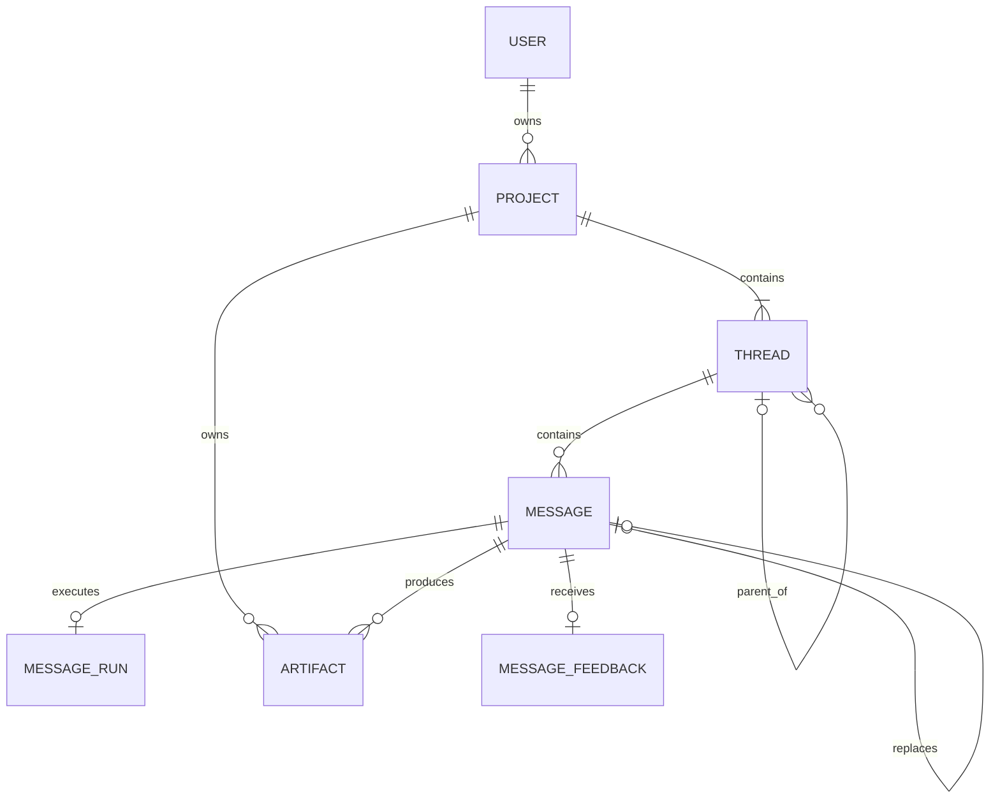

# Thread Chat 领域架构

本文记录已经落地的稳定目标架构。规范性行为以同目录 [spec.md](./spec.md) 的 Requirement/Scenario 为准；若二者冲突，以可验证规范为准。

## 聚合与关系



- `Project` 是 owner scope、共享资源范围、Thread 族群和永久删除边界；每个 Project 恰有一个 Root Thread。
- `Thread` 是统一实体。`parentThreadId = null` 表示 Root；非空表示 Branch。Branch 同时冻结 `sourceMessageId`、`forkSourceSnapshot` 和 `baseContext`。
- `Message` 属于一个 Thread，以服务端分配的唯一单调 `sequence` 排序。finalized 内容不可覆盖；Edit/Regenerate 追加 replacement 并 supersede 旧消息。
- `BaseContextV1` 只保存有序 `messageIds`。Fork 时由服务端计算并冻结，不复制 parts 或 Artifact 正文。
- 每条 assistant Message 恰有一条 `MessageRun`，user Message 没有 Run。状态为 `queued → running → completed | failed | stopped`，也允许 queued 直接进入 failed/stopped。
- `Artifact` 归属于 Project，并以 `sourceMessageId` 保留 provenance；跨 Project 默认隔离。
- `MessageFeedback` 仅属于合格的 assistant Message，值为 positive/negative，清除反馈会删除该记录。

## 核心不变量

1. Project、Parent Thread、source Message、Child Thread、Artifact 和反馈的 owner scope 必须一致；跨表关系在同一事务内锁定并校验。
2. Project 只能有一个 Root；Thread 拓扑无环；Root 不含 Fork facts，Branch 必须完整包含全部 Fork facts。
3. 相同 Thread 的 `sequence` 唯一且大于零；客户端时间和角色交替都不是排序事实。
4. finalized Message 的 role、parts、sequence 与来源关系不可变；单条 Message 不 hard delete。
5. replacement 必须同 Thread、同 role，旧 Message 最多有一个直接 replacement；默认时间线排除 superseded Message。
6. queued/running/failed/stopped assistant 不具备 Fork Prompt 资格；既有 BaseContext 对后来 superseded 的 Message ID 仍保持有效。
7. Run 的 checkpoint、`eventSequence`、heartbeat、stop request 和 terminal 时间均持久化；SSE 断开不等于 Stop。
8. Project 删除通过外键级联清理 Threads、Messages、Runs、Artifacts 与 Feedback；不迁移旧表、不双写。

## 最终 PostgreSQL Schema

| 表 | 关键字段与约束 |
|---|---|
| `projects` | `owner_user_id`；标题/Target/Instruction；`artifact_change_sequence >= 0`；owner + update 游标索引 |
| `threads` | `project_id`；自引用 parent；source、snapshot、baseContext 完整性 CHECK；每 Project 单一 Root 部分唯一索引 |
| `messages` | `thread_id + sequence` 唯一；role/positive sequence CHECK；replacement 唯一；有效时间线索引 |
| `message_runs` | `assistant_message_id` 唯一；状态 CHECK；checkpoint/eventSequence/heartbeat/stop/terminal；queued scanner 索引 |
| `artifacts` | `project_id`、`source_message_id`、kind/title/content；Project 与 source 索引 |
| `message_feedback` | `message_id` 唯一；`owner_user_id`；positive/negative CHECK |

数据库 CHECK/外键负责单行、存在性、唯一性和级联；同 Project、角色资格、无环、finalized 不可变等跨行规则由 Repository/Application 在事务内负责。空库 `db:push` 是 Schema 验收项。

## 模块边界

```text
lib/thread-chat/domain/                 纯实体、不变量、状态机、Prompt/BaseContext 规则
lib/thread-chat/application/            Commands、Queries、事务编排、MessageRun runner
lib/thread-chat/application/ports/      AI Runtime 等可替换端口
lib/thread-chat/infrastructure/         PostgreSQL repositories、真实/Fake AI adapter
lib/thread-chat/api/                    共享契约与服务端 transport（不重定义领域关系）
```

后续修改任何实体关系、Schema 或模块职责时，必须同时更新并验证正式 spec、本文、Drizzle Schema、Repository/Application 测试与 OpenSpec strict validation。
