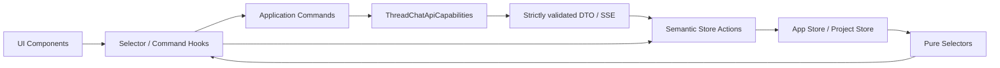

# Thread Chat 客户端架构

本文记录已经落地的稳定客户端边界。规范性行为以同目录 [spec.md](./spec.md) 为准；冲突时以可验证 Requirement/Scenario 为准。

## 数据流与依赖方向

客户端只保存一份服务端事实。组件不直接 fetch、不创建服务端实体 ID、不维护可写 ThreadTree，也不直接调用 Zustand `setState`。Transport 负责会话、编码、严格 Schema 校验和错误映射；Application Commands 编排异步操作；Store Actions 只做同步语义合并。

## Store

- `ThreadChatAppStore`：Provider-scoped；保存 Project Catalog、分页请求状态和 AppShell UI，不保存全局 `selectedProjectId`。
- `ThreadChatProjectStore`：以 `projectId` 隔离；保存 `entities`、`runs`、`requests`、`readModels` 与 `workbench.ui`。
- normalizer 维护 `messagesById + messageIdsByThreadId`，校验归属、去重并按服务端 `sequence` 排序；finalized 实体不可被旧 DTO 或乱序事件覆盖。
- Workbench UI 使用纯客户端 `ColumnSlotId`；列宽、折叠、焦点、placement、Canvas pin、overlay 和 Snapshot 都不进入领域 API。

## Runtime 与 Provider

- `ThreadChatAppRuntime` 组合 App Store、Catalog Commands、Transport、Navigation 与 `ProjectRuntimeRegistry`。
- Registry 保证一个 Provider 生命周期内同一 `projectId` 只有一个 `ThreadChatProjectRuntime`，并负责 seeded handoff、lease/release 与统一 destroy。
- `ThreadChatProjectRuntime` 组合 Project Store、Commands、ThreadMessageLoader、ArtifactLoader 和 GenerationCoordinator。
- `ThreadChatAppProvider`、`ThreadChatProjectProvider`、`NewProjectDraftProvider` 均按 React/Next.js 生命周期创建实例，禁止服务端模块级可变 Store 跨请求共享。

## 异步边界

| 组件 | 去重键 | 职责 |
|---|---|---|
| ThreadMessageLoader | `threadId` | Promise 去重、跨 Thread 并行、局部 loading/error、destroy Abort |
| ArtifactLoader | `artifactId` | 按需加载正文与缓存；Thread 加载不触发 Artifact 正文请求 |
| GenerationCoordinator | `assistantMessageId` | 单连接、snapshot 合并、严格 eventSequence、断线重连、取消订阅 |
| Workbench persistence | `projectId` | 防抖保存/校验 Snapshot；恢复列、焦点、折叠、列宽，不恢复草稿/滚动 |

刷新、路由切换或 Runtime destroy 只取消客户端订阅，不调用 Stop。只有显式 Stop Command 才请求服务端停止 Run。

## `/new` 与 Project 生命周期

`/thread-chat/new` 只持有无实体 draft。首次发送获得 CreationBundle 后，App Runtime 先把服务端 Project/Root/Messages/Run 合入 seeded Project Runtime并启动事件协调，再通过集中 route builder replace 到 `/thread-chat/{projectId}`。目标 Provider acquire 同一 Runtime 并跳过重复 Bootstrap，因此没有空白帧或第二条 Run。

已有 Project 页面先 acquire Runtime，再 Bootstrap 轻量 topology 与 Root bundle；其他 Branch Message 和 Artifact 正文按需并行加载。UI 继续复用原有组件、CSS、Header、多栏、Fork、breadcrumb、Artifact Drawer 与分割线交互。

后续修改 Store shape、Runtime 组合、Loader/Coordinator 或 UI 接缝时，必须同步更新正式 spec、本文、共享 DTO、接口注入测试、Testing Library 测试与 Ego Browser UI parity 验收。
